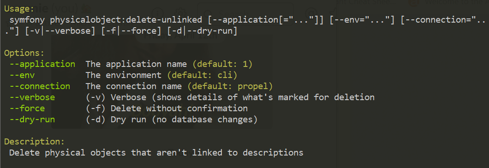

.. _maintenance-cli-tools:

==================
Command line tools
==================

There are a number of command line tools that can help you troubleshoot
various AtoM problems, as well as perform actions typically not supported in
the :term:`user interface`.

.. SEEALSO::

   * :ref:`maintenance-populate-search-index`
   * :ref:`maintenance-clear-cache`
   * :ref:`digital-object-load-task`
   * :ref:`cli-import-export`
   * :ref:`maintenance-webserver`
   * :ref:`maintenance-troubleshooting`
   * :ref:`common-atom-queries`

   We also have a slides of many of our command-line tasks. See:

   * https://www.slideshare.net/accesstomemory/atoms-command-line-tasks-an-introduction

.. _cli-get-version:

Find out what version of AtoM you're running
============================================

You can always find out what version of AtoM you have installed via the
:term:`user interface` by navigating to **Admin > Settings > Global** - the
application version is the first thing listed on the Settings page. See:
:ref:`application-version` for more information.

However, if you'd like to check the application version from the
command-line, you can run the following command from AtoM's root folder:

.. code:: bash

   php symfony tools:get-version

.. _cli-add-superuser:

Add a SuperUser (Admin) account
===============================

You can create a new :term:`administrator` account from the command-line
using the following command:

.. code:: bash

   php symfony tools:add-superuser --email="youremail@example.com" --password="MYSUPERPASSWORD" <username>

The username should not have any spaces in it.

If you'd like to quickly create a user for demonstration, diagnostic purposes,
you can use the following command:

   php symfony tools:add-superuser --demo

This will create a superuser with username "demo", email "demo@example.com",
and password "demo".

.. _cli-promote-user-admin:

Promote a user to an administrator
==================================

If you'd like to promote a user account in AtoM to have full
:term:`administrator` access privileges via the command-line, you can use the
following task. You will need to know the user name of the account.

.. code:: bash

   php symfony tools:promote-user-to-admin <username>

If the user doesn't exist you'll see the following error:

.. code:: bash

   Unknown user.

If the user is already an administrator:

.. code:: bash

   The given user is already an administrator.

If the operation succeeds:

.. code:: bash

   The user <username> is now an administrator.

.. SEEALSO::

   For more information on user permissions, user roles, and how to manage them,
   see:

   * :ref:`user-roles`
   * :ref:`manage-user-accounts`
   * :ref:`edit-user-permissions`

:ref:`Back to top <maintenance-cli-tools>`

.. _cli-change-password:

Change a password
=================

If you need to change the password on a :term:`user account` in AtoM, you can
do so via the command-line.

.. code:: bash

   php symfony tools:reset-password [--activate] username [password]

The :term:`username` is a required value, while the password is optional - if
no password is entered, AtoM will generate an 8-character temporary password
to be used for the user account. AtoM will return the new password in the
command-line.

.. warning::

   We strongly recommend that these auto-generated passwords ONLY be used
   temporarily! They are not strong passwords - users should generate longer
   passwords that include special characters. For more information, see:

   * `Wikipedia - Password strength <http://en.wikipedia.org/wiki/Password_strength>`__
   * `Wikipedia - Password cracking <http://en.wikipedia.org/wiki/Password_cracking>`__

If the user account is currently marked inactive in the system (see
:ref:`mark-user-inactive` for more information), you can also use the option
``--activate`` to mark that account as active again.

.. seealso::

   You can also manage user passwords through the :term:`user interface`. For
   more information, see:

   * :ref:`change-password`
   * :ref:`edit-user`

:ref:`Back to top <maintenance-cli-tools>`

.. _cli-delete-user:

Delete a user account from the command-line
===========================================

AtoM provides a method to delete a user account via the :term:`user interface`,
but you can also delete a user directly from the command-line interface. To do
so, you will need to know the username of the user you wish to delete. The
basic syntax for the command is:

.. code-block:: bash

   php symfony tools:delete-user <username>

By typing ``php symfony help tools:delete-user`` into the console, we can see
the help text and options associated with this task:

.. image:: images/cli-delete-user.*
   :align: center
   :width: 90%
   :alt: An image of the options available in the delete-user command

The ``--application``, ``--env``, and ``connection`` options **should not be
used** - AtoM requires the uses of the pre-set defaults for symfony to be
able to execute the task.

The command, when run, will normally prompt you for comfirmation before
proceeding. However, if you wish to skip the confirmation step, you can use the
``--force`` or ``-f`` option.

Additionally, if the user has added notes (e.g. General notes; RAD special
notes such as Accompanying material notes; Archivists' notes; etc.) to an
:term:`archival description`, then by default, the user ID of that user is
associated with the note in the database. Because of this, AtoM will not let you
delete a user without first removing the user association from the notes, and
the task will be aborted without delting the user account:

.. image:: images/cli-delete-user-notes.*
   :align: center
   :width: 90%
   :alt: An image of the options available in the delete-user command

To remove the user association with the notes so the task can proceed, you can use
the ``--update-notes`` (or ``-n`` for short) option. When this is used, any notes
associated with the user in the database will be updated so the user field is
``NULL``, and the user account can now be deleted. Any notes created by the user
will remain in the system, unaffected by the deletion.

.. IMPORTANT::

   The task will not allow you to delete a user account if it is the **only**
   :term:`administrator` account in the system. If you wish to do so, you can use
   the other available tasks to create a new user and/or promote an existing user
   to the administrator group. See:

   * :ref:`cli-add-superuser`
   * :ref:`cli-promote-user-admin`

Here is an example of running the task with both options (force and update-notes)
used together, where the user being deleted has a username of ``demo``:

.. code-block:: bash

   php symfony tools:delete-user -f -n demo

.. SEEALSO::

   * :ref:`Delete a user account via the user interface <delete-user>`

:ref:`Back to top <maintenance-cli-tools>`

.. _cli-search-status:

Check the status of your Elasticsearch index
============================================

This task will allow a system administrator to review the status of AtoM's
Elasticsearch index without having to access any configuration files. The task
output will include:

* Installed Elasticsearch version
* Search host
* Port
* Index name
* Document index status for all primary :term:`entity` types in AtoM (including
  Accession, Actor, AIP, Function, Information object, Repository, and Term)

The task should be run from AtoM's root installation directory. It will not
make any changes, but can provide useful information when troubleshooting
issues or seeking support. To run the task:

.. code-block:: bash

   php symfony search:status

Sample response:

.. image:: images/cli-search-status-response.*
   :align: center
   :width: 90%
   :alt: An image of a typical response to the search:status task

.. SEEALSO::

   * :ref:`maintenance-elasticsearch`
   * :ref:`maintenance-populate-search-index`
   * :ref:`maintenance-troubleshooting`

:ref:`Back to top <maintenance-cli-tools>`

.. _cli-search-output:

See the search index output for a description
=============================================

This task will output the full search index of a particular
:term:`archival description`, which can be useful for determining index mappings,
or troubleshooting why a search is not returning the expected results. The task
takes the :term:`slug` of a target description as input. Basic syntax:

.. code-block:: bash

   php symfony search:document your-slug-here

Where ``your-slug-here`` in the example above represents the :term:`slug` of the
target description. Sample output:

.. code-block:: bash

   {
       "findingAid": {
           "transcript": null,
           "status": null
       },
       "slug": "example-fonds",
       "parentId": "1",
       "identifier": "F1",
       "referenceCode": "F1",
       "referenceCodeWithoutCountryAndRepo": "F1",
       "levelOfDescriptionId": "2002760",
       "publicationStatusId": "160",
       "lft": "808",
       "alternativeIdentifiers": [
           {
               "label": "Alternate identifier label 1",
               "identifier": "ALT-ID1"
           },
           {
               "label": "Alternative identifer label 2",
               "identifier": "ALT-ID2"
           }
       ],
       "ancestors": [
           1
       ],
       "children": [
           "2013948"
       ],
       "digitalObject": {
           "mediaTypeId": "136",
           "usageId": "166",
           "filename": "cat.jpg",
           "thumbnailPath": "\/uploads\/r\/example-repository\/1\/4\/7\/14733117bf539c20ab6d4596b2842eeb9314d6cf48cabad809b90c455ef377b0\/cat_142.jpg",
           "digitalObjectAltText": null
       },
       "hasDigitalObject": true,
       "dates": [
           {
               "startDate": "2015-01-01",
               "startDateString": "2015-01-01",
               "endDate": "2016-12-31",
               "endDateString": "2016-12-31",
               "actorId": "2013941",
               "typeId": "111",
               "sourceCulture": "en",
               "i18n": {
                   "languages": [
                       "en"
                   ],
                   "en": {
                       "date": "January 1, 2015 - December 31, 2016"
                   }
               }
           },
           {
               "startDate": "2016-01-01",
               "startDateString": "2016",
               "endDate": "2016-12-31",
               "endDateString": "2016",
               "actorId": "2013943",
               "typeId": "118",
               "sourceCulture": "en",
               "i18n": {
                   "languages": [
                       "en"
                   ],
                   "en": {
                       "date": "2016"
                   }
               }
           }
       ],
       "startDateSort": "2015-01-01",
       "endDateSort": "2016-12-31",
       "repository": {
           "id": "2013921",
           "slug": "example-repository",
           "identifier": null,
           "i18n": {
               "languages": [
                   "en"
               ],
               "en": {
                   "authorizedFormOfName": "Example Repository"
               }
           }
       },
       "directPlaces": [
           "2013929",
           "2013930"
       ],
       "places": [
           {
               "id": "2013929",
               "slug": "place-access-point-1",
               "taxonomyId": "42",
               "isProtected": false,
               "numberOfDescendants": 0,
               "createdAt": "2020-05-29T13:58:10Z",
               "updatedAt": "2020-05-29T13:58:10Z",
               "sourceCulture": "en",
               "i18n": {
                   "languages": [
                       "en"
                   ],
                   "en": {
                       "name": "Place access point 1"
                   }
               }
           },
           {
               "id": "2013930",
               "slug": "place-access-point-2",
               "taxonomyId": "42",
               "isProtected": false,
               "numberOfDescendants": 0,
               "createdAt": "2020-05-29T13:58:10Z",
               "updatedAt": "2020-05-29T13:58:10Z",
               "sourceCulture": "en",
               "i18n": {
                   "languages": [
                       "en"
                   ],
                   "en": {
                       "name": "Place access point 2"
                   }
               }
           }
       ],
       "directSubjects": [
           "2013925",
           "2013926"
       ],
       "subjects": [
           {
               "id": "2013925",
               "slug": "subject-access-point-1",
               "taxonomyId": "35",
               "isProtected": false,
               "numberOfDescendants": 0,
               "createdAt": "2020-05-29T13:58:10Z",
               "updatedAt": "2020-05-29T13:58:10Z",
               "sourceCulture": "en",
               "i18n": {
                   "languages": [
                       "en"
                   ],
                   "en": {
                       "name": "Subject access point 1"
                   }
               }
           },
           {
               "id": "2013926",
               "slug": "subject-access-point-2",
               "taxonomyId": "35",
               "isProtected": false,
               "numberOfDescendants": 0,
               "createdAt": "2020-05-29T13:58:10Z",
               "updatedAt": "2020-05-29T13:58:10Z",
               "sourceCulture": "en",
               "i18n": {
                   "languages": [
                       "en"
                   ],
                   "en": {
                       "name": "Subject access point 2"
                   }
               }
           }
       ],
       "directGenres": [
           "2013933",
           "2013934"
       ],
       "genres": [
           {
               "id": "2013933",
               "slug": "genre-access-point-1",
               "taxonomyId": "78",
               "isProtected": false,
               "numberOfDescendants": 0,
               "createdAt": "2020-05-29T13:58:10Z",
               "updatedAt": "2020-05-29T13:58:10Z",
               "sourceCulture": "en",
               "i18n": {
                   "languages": [
                       "en"
                   ],
                   "en": {
                       "name": "Genre access point 1"
                   }
               }
           },
           {
               "id": "2013934",
               "slug": "genre-access-point-2",
               "taxonomyId": "78",
               "isProtected": false,
               "numberOfDescendants": 0,
               "createdAt": "2020-05-29T13:58:10Z",
               "updatedAt": "2020-05-29T13:58:10Z",
               "sourceCulture": "en",
               "i18n": {
                   "languages": [
                       "en"
                   ],
                   "en": {
                       "name": "Genre access point 2"
                   }
               }
           }
       ],
       "names": [
           {
               "id": "2013937",
               "i18n": {
                   "languages": [
                       "en"
                   ],
                   "en": {
                       "authorizedFormOfName": "Name access point 1"
                   }
               }
           },
           {
               "id": "2013939",
               "i18n": {
                   "languages": [
                       "en"
                   ],
                   "en": {
                       "authorizedFormOfName": "Name access point 2"
                   }
               }
           },
           {
               "id": "2013943",
               "i18n": {
                   "languages": [
                       "en"
                   ],
                   "en": {
                       "authorizedFormOfName": "Accumulator (ISAD 3.2.1)"
                   }
               }
           }
       ],
       "creators": [
           {
               "id": "2013941",
               "slug": "creator-isad-3-2-1",
               "entityTypeId": null,
               "hasDigitalObject": false,
               "descriptionIdentifier": null,
               "corporateBodyIdentifiers": null,
               "actorRelations": [],
               "createdAt": "2020-05-29T13:58:10Z",
               "updatedAt": "2020-05-29T13:58:10Z",
               "sourceCulture": "en",
               "i18n": {
                   "languages": [
                       "en"
                   ],
                   "en": {
                       "authorizedFormOfName": "Creator (ISAD 3.2.1)",
                       "history": "Example fonds Creator history (ISAD 3.2.2). Note that this will be added to the related authority record for Creator (ISAD 3.2.1)."
                   }
               }
           }
       ],
       "physicalObjects": [
           {
               "sourceCulture": "en",
               "i18n": {
                   "languages": [
                       "en"
                   ],
                   "en": {
                       "name": "Example Shelf",
                       "location": "Example Shelf Location"
                   }
               }
           }
       ],
       "generalNotes": [
           {
               "sourceCulture": "en",
               "i18n": {
                   "languages": [
                       "en"
                   ],
                   "en": {
                       "content": "Example fonds General note (ISAD 3.6.1)"
                   }
               }
           },
           {
               "sourceCulture": "en",
               "i18n": {
                   "languages": [
                       "en"
                   ],
                   "en": {
                       "content": "Example fonds General note 2"
                   }
               }
           }
       ],
       "archivistsNotes": [
           {
               "sourceCulture": "en",
               "i18n": {
                   "languages": [
                       "en"
                   ],
                   "en": {
                       "content": "Example fonds Archivist's notes (ISAD 3.7.1)"
                   }
               }
           }
       ],
       "actRights": [],
       "basisRights": [],
       "createdAt": "2020-05-29T13:58:10Z",
       "updatedAt": "2020-05-29T13:58:10Z",
       "sourceCulture": "en",
       "i18n": {
           "languages": [
               "en"
           ],
           "en": {
               "title": "Example fonds",
               "extentAndMedium": "Example fonds Extent and medium (ISAD 3.1.5)",
               "archivalHistory": "Example fonds Archival history (ISAD 3.2.3)",
               "acquisition": "Immediate source of acquisition or transfer (ISAD 3.2.4)",
               "scopeAndContent": "Example fonds Scope and content (ISAD 3.3.1)",
               "appraisal": "Example fonds Appraisal, destruction and scheduling (ISAD 3.3.2)",
               "accruals": "Example fonds Accruals (ISAD 3.3.3)",
               "arrangement": "Example fonds System of arrangement (ISAD 3.3.4)",
               "accessConditions": "Example fonds Conditions governing access (ISAD, 3.4.1)",
               "reproductionConditions": "Example fonds Conditions governing reproduction (ISAD 3.4.2)",
               "physicalCharacteristics": "Example fonds Physical characteristics and technical requirements (ISAD 3.4.4)",
               "findingAids": "Example fonds Finding aids (ISAD 3.4.5)",
               "locationOfOriginals": "Example fonds Existence and location of originals (ISAD 3.5.1)",
               "locationOfCopies": "Example fonds Existence and location of copies (ISAD 3.5.2)",
               "relatedUnitsOfDescription": "Example fonds Related units of description (ISAD 3.5.3)",
               "institutionResponsibleIdentifier": "Example fonds Institution identifier (Control area)",
               "rules": "Example fondsRules or conventions (ISAD 3.7.2)",
               "sources": "Example fonds Sources (Control area)",
               "revisionHistory": "Example fonds Dates of creation, revision and deletion (Control area)"
           }
       }
   }

.. SEEALSO::

   * :ref:`cli-search-status`
   * :ref:`maintenance-populate-search-index`
   * :ref:`es-fields-atom`

:ref:`Back to top <maintenance-cli-tools>`

.. _cli-regenerate-derivatives:

Regenerating derivatives
========================

If you are upgrading to AtoM 2 from ICA-AtoM, the :term:`digital object`
derivatives (i.e. the :term:`reference display copy` and the
:term:`thumbnail` generated by AtoM when a :term:`master digital object` is
uploaded) are set to be a different default size (i.e. they are larger in
AtoM) - consequently, after an upgrade, derivatives from ICA-AtoM may appear
blurry or pixellated. Alternatively, if you have changed the
:ref:`digital-object-derivatives` settings, you might want to regenerate your
derivatives so that the new setting is used for multi-page content such as PDF
derivatives.

As well, sometimes the ``digitalobject:load`` task used for importing digital
objects to existing :term:`descriptions  <archival description>` (see:
:ref:`digital-object-load-task`) won't generate the :term:`thumbnail` and
reference images properly for digital objects that were loaded (e.g. due to a
crash or absence of ``convert`` being installed, etc. - see under requirements,
:ref:`other-dependencies`). In this case, you can regenerate
these thumbsnail/reference images using the following command:

.. code:: bash

   php symfony digitalobject:regen-derivatives

By typing ``php symfony help digitalobject:regen-derivatives`` into the
command-line, you can see the options available for this task:

.. image:: images/cli-regen-derivs.*
   :align: center
   :width: 90%
   :alt: An image of the options available in the regen-derivatives command

The ``--application``, ``--env``, and ``connection`` options **should not be
used** - AtoM requires the uses of the pre-set defaults for symfony to be
able to execute the task.

The ``--index`` option is used to enable the rebuilding of the search index as
part of the regeneration task. When running this task via the command-line
interface, indexing is **disabled** by default to allow the task to progress
more quickly - generally, we recommend manually clearing the cache and
rebuilding the search index following the use of this task - to do so,
from AtoM's root directory, run:

.. code-block:: bash

   php symfony cc && php symfony search:populate

However, if you would like to re-index as the derivative regeneration progresses,
the ``--index`` option can be used to enable this. For more information on
populating the search index, see: :ref:`maintenance-populate-search-index`.

The ``--slug`` option can be used to target specific derivatives associated with
a description, using the description's :term:`slug` as criteria. Any
:term:`digital object` attached or linked to the description whose slug is
provided as criteria will have its derivatives regenerated. Example use:

.. code:: bash

   php symfony digitalobject:regen-derivatives --slug="the-jane-doe-fonds"

The ``--type`` option (or ``-d`` for derivative type) can be used if you only
want to regenerate one type of digital object derivative - either the
:term:`reference display copy` used on the :term:`view page` of related archival
descriptions, or the :term:`thumbnail` used in search and browse results. Supported
parameters are:

* reference
* thumbnail

So, for example, if you only wanted to regenerate your thumbnails, you could
execute the command like so:

.. code:: bash

   php symfony digitalobject:regen-derivatives --type="thumbnail"

Similarly, the ``--media-type`` (or ``-m``) option can be use to limit the
regeneration to a specific media type. AtoM uses 5 media types: audio, video,
image, text, and other; the application displays the media type for each digital object in
the Digital object metadata :term:`area <information area>` on the
:term:`view page` of the associated :term:`archival description`. This task will
**only** work with the first 4 types - currently "other" is not supported.

For example, if you only wanted to regenerate derivatives for your uploaded
videos, you could execute the command like so:

.. code:: bash

   php symfony digitalobject:regen-derivatives --media-type="video"

The ``--force`` or ``-f`` option can be used to skip the warning normally
delivered by the task when the command is entered. Because the task will delete
ALL previous derivatives - including those manually altered by editing the
:term:`thumbnail` or :term:`reference display copy` of a digital object via the
user interface (see: :ref:`edit-digital-object` for more information) - the task
will normally ask for confirmation when invoked:

.. image:: images/cli-regen-derivs-warning.*
   :align: center
   :width: 70%
   :alt: An image of the CLI warning when invoking the regen-derivatives command

However, experienced developers and system administrators can skip having to
manually confirm the procedure by using the ``--force`` (or ``-f`` for short)
option as part of the command.

The ``--only-externals`` (or ``-o`` for short) option can be used if you would
only like to attempt to regenerate the local derivatives for linked digital
objects - that is, those that have been linked via an external URI, rather than
by uploading a :term:`master digital object`. For more information on linking
digital objects, see: :ref:`link-digital-object`.

The ``--skip-to`` option is useful when the task is interrupted, such as when
an error is encountered mid-process that ends the task. As the task
progresses during normal execution, it will output information about the
current digital object filename it is working on. If the task interrupts
(for example, trying to fetch a large external digital object, the task might
time out), a system administrator can use this option to resume the task
where it interrupts. Example:

.. code-block:: bash

   $ php symfony digitalobject:regen-derivatives

   Regenerating derivatives for file1.jpg...
   Regenerating derivatives for file2.jpg...
   Regenerating derivatives for file3.jpg...

   <timeout error occurs>

   $ php symfony digitalobject:regen-derivatives --skip-to='file3.jpg'

   Regenerating derivatives for file3.jpg...
   <task continues where it left off>

The ``--json`` or ``-j`` option is for advanced users who would like to target
only a specific subset of digital objects for regeneration. With this option, a
user can supply the path to a JSON file that lists the internal
digital_object ID's associated with the digital objects targeted and stored in
AtoM's database. These digital_object ID's will first need to be determined
by crafting an SQL query designed to meet your specific criteria. Help crafting
these queries is not covered here (though see :ref:`common-atom-queries`, for a
basic introduction to SQL queries in AtoM) - in general, we only recommend this
task be used by experienced administators.

Once you have determined the IDs of the digital objects you would like to target
with the task, you can place them in square brackets in a JSON file, separated by
commas, like so:

.. code:: bash

   [372, 366, 423, 117]

*(etc)*

The criteria for the ``--json`` option then becomes the path to your JSON file:

.. code:: bash

   php symfony digitalobject:regen-derivatives --json="path/to/my.json"

.. WARNING::

   When running the ``regen-derivatives`` task, **all** of your current derivatives
   for the targeted digital objects will be deleted - meaning ALL of them if you
   provide no criteria such as a slug or a JSON file. They will be replaced
   with new derivatives after the task has finished running. If you have
   manually changed the :term:`thumbnail` or :term:`reference display copy`
   of a digital object via the user interface (see:
   :ref:`edit-digital-object`), these two will be replaced with digital
   object derivatives created from the :term:`master digital object`.

Finally, the ``--no-overwrite`` or ``-n`` option can be used if you only want to
generate derivatives where they are currently missing. All existing derivatives
will be left as-is in AtoM. When this option is used, no confirmation prompt is
given: the task will begin generating missing derivatives as soon as you enter
it in the console.

:ref:`Back to top <maintenance-cli-tools>`

.. _cli-re-index-pdf:

Re-indexing PDF text
====================

.. code:: bash

   php symfony digitalobject:extract-text

In rare situations you may want to to re-index all PDFs to make their text
searchable in AtoM without having to re-import them completely. This task
will go through each existing PDF imported into AtoM and re-index their
contents for searches.

For linked :term:`digital objects <digital object>` (e.g. PDFs that are linked
from a publicly accessible URI, instead of uploaded locally - see for example:
:ref:`link-digital-object`), this task will re-fetch a version of the external
PDF and store it in a temporary file, re-index the contents, and then purge the
local :term:`master <master digital object>` after the indexing is complete.

.. TIP::

      .. image:: images/app-yml-settings.*
         :align: right
         :width: 20%
         :alt: An image of the app.yml file in AtoM

   Large PDFs may cause 500 errors if you do not first adjust the download
   timeout limit. You can do this by changing the value in the ``app.yml`` file
   located in ``/config/app.yml``. The default timeout value in AtoM is 10s. You
   should also clear the cache after making changes to the ``app.yml`` file:

   .. code:: bash

      php symfony cc

.. _cli-rebuild-nested-set:

Rebuild the nested set
======================

AtoM generally uses a relational database to store its data (we recommend
MySQL). However, relational databases, which are comprised of flat tables,
are not particularly suited to handling hierarchical data. As developer
`Mike Hillyer <http://mikehillyer.com/articles/managing-hierarchical-data-in-mysql/>`__
notes, "Hierarchical data has a parent-child relationship that is not naturally
represented in a relational database table." One method of addressing this is
to employ a "Nested set model" (`Wikipedia <http://en.wikipedia.org/wiki/Nested_set_model>`__).
AtoM makes use of a nested set to manage hierarchical relationships, such as
between parent and child :term:`terms <term>` and
:term:`descriptions <archival description>`.

Sometimes, during operations that involve updates to large hierarchies, the
nested set can become corrupted - especially if the server times out during an
operation that reaches the execution limit settings. The following task will
rebuild all nested sets in AtoM:

.. code:: bash

   php symfony propel:build-nested-set

This task also includes one option that can be used to exclude certain
:term:`entity` types from the task's execution. The ``--exclude-tables`` option
supports the following options:

* information_object
* term
* menu

Multiple options can be passed by separating them with a comma. Example use - if
you only wanted to rebuild the nested set for information objects (AKA
:term:`archival descriptions <archival description>`), then you can exclude the
term and menu rebuilds like so:

.. code-block:: bash

   php symfony propel:build-nested-set --exclude-tables="term,menu"

Example output:

.. image:: images/cli-nested-set-exclude-types.*
   :align: center
   :width: 85%
   :alt:   An image of the nested set task being run when using exclude-tables

:ref:`Back to top <maintenance-cli-tools>`

.. _cli-generate-slugs:

Generate slugs
==============

In some cases, AtoM may time out in the middle of an operation that involves
the creation of new records - for example, if a user attempts to import a
very large CSV file through the :term:`user interface` (rather than the
command-line - see: :ref:`csv-import`). In such cases, it is possible that
AtoM has died after creating an :term:`information object`, but before having
a chance to create a :term:`slug` for the record. This can cause unexpected
errors in the application - most notably, 500 errors when trying to access the
records missing slugs through the application interface.

If you want to generate slugs for records in AtoM without them, you can use
the following command:

.. code:: bash

   php symfony propel:generate-slugs

This task will work for the following entities:

* information objects (e.g. :term:`archival descriptions <archival description>`)
* actors (e.g. :term:`authority records <authority record>`)
* :term:`terms <term>`
* :term:`taxonomies <taxonomy>`
* physical objects (e.g. :term:`storage <physical storage>` locations, etc)
* :term:`events <event>` (e.g. creation events, etc - usually the relationship
  between actors and information objects)
* :term:`accession records <accession record>`
* :term:`deaccession records <deaccession record>`
* :term:`digital objects <digital object>`
* :term:`functions <function>`
* :term:`rights records <rights record>`
* :term:`static pages <static page>`
* relations (e.g. relations between objects - i.e. relating two descriptions,
  relating an information object to a digital object, relating an information
  object to a physical storage location, relating two actors, etc)

If an error has left other areas in AtoM without slugs (for example, a donor
record, etc), this task will **not** resolve the issue - you will likely have
to manually insert a slug into the database for that entity.

For information objects, the generate slugs task will respect the global
settings for the source from which description permalinks are created. These
settings can be controlled by an :term:`administrator` via the user interface
- for more information, see:

* :ref:`description-permalinks`.
* :ref:`permissive-slugs`

Note that by default, existing slugs will **not** be replaced. If you want to
generate new slugs for existing objects, you will need to first delete the
existing slugs from the database. This can be useful for records in which a
random slug has been automatically assigned, because the default user data
used to generate the slug has not been provided (see
:ref:`below <slugs-in-atom>` for more information on how slugs are generated in
AtoM).

However, if you would like to replace **all** existing slugs with newly
generated slugs, you can use the ``--delete`` option, like so:

.. code:: bash

   php symfony propel:generate-slugs --delete

.. IMPORTANT::

   This will replace all custom slugs you may have created with the
   Rename module! For more information on the Rename module, see:
   :ref:`rename-title-slug`

Slugs can also be manually deleted via SQL queries. For further information on
deleting slugs from AtoM's database via SQL, see :ref:`common-atom-queries` -
particularly, :ref:`sql-delete-slugs`.

.. _slugs-in-atom:

Notes on slugs in AtoM
----------------------

A :term:`slug` is a word or sequence of words which make up the last part of a
URL in AtoM. It is the part of the URL that uniquely identifies the resource
and often is indicative of the name or title of the page (e.g.: in
*www.yourwebpage.com/about*, the slug is *about*). The slug is meant to
provide a unique, human-readable, permanent link to a resource.

In AtoM, all pages based on user data (such as :term:`archival descriptions
<archival description>`, :term:`archival institutions <archival institution>`,
:term:`authority records <authority record>`, :term:`terms <term>`, etc.) are
automatically assigned a slug based on the information entered into the
resource:

==================== =============================
Entity type          Slug derived from
==================== =============================
Archival description Title or Reference code
Authority record     Authorized form of name
Accession            Identifier (accession number)
Users, Groups        Automatically generated
Other entities       Name
==================== =============================

By default in new  installations, AtoM will "sanitize" slugs, removing spaces,
special characters, punctuation, and capital letters. However, this behavior can
be changed by an administrator to allow a more permissive slug generation
pattern, where any UTF-8 character allowed by
`RFC 3987 <https://tools.ietf.org/html/rfc3987>`__ in an Internationalized
Resource Identifier
(`IRI <https://en.wikipedia.org/wiki/Internationalized_Resource_Identifier>`__)
can be used. For more information, see:

* :ref:`permissive-slugs`

When this permissive mode is enabled, AtoM will allow the following to be used
in slugs:

* a-z, A-Z, and 0-9
* All unicode characters specified in `RFC 3987 <https://tools.ietf.org/html/rfc3987>`__,
  including characters with accents
* The following punctuation symbols: ``, - _ ~ : = * @``

Certain special characters are still reserved either as specified by IRI
requirements or based on how AtoM generates URLs. Consequently, even when
permissive mode is enabled, some sanitization will still take place. For
example:

* Spaces will still be replaced by dashes
* Special characters not listed above will be stripped - examples include:
  ``! ` " ' # $ / | \ + % ( ) { } [ ] . < > ?``

When the permissive setting is set to "No" and slugs are being more
comprehensively sanitized, generated slugs will only allow digits, letters,
and dashes. Sequences of unaccepted characters (e.g. accented or special
characters, etc.) are replaced with valid characters such as English alphabet
equivalents or dashes. This conforms to general practice around slug creation
- for example, it is "common practice to make the slug all lowercase, accented
characters are usually replaced by letters from the English alphabet,
punctuation marks are generally removed, and long page titles should also be
truncated to keep the final URL to a reasonable length"
(`Wikipedia <http://en.wikipedia.org/wiki/Clean_URL#Slug>`__).

In AtoM, all slugs are truncated to a maximum of 250 characters. Case matters
for the uniqueness of a slug - for example: ``my-slug`` is not considered the
same as ``My-slug`` or ``My-Slug``, which could all point to different records
in AtoM.

If a slug is already in use, AtoM will append a dash and an incremental number
(a numeric suffix) to the new slug - for example, if the slug "*correspondence*"
is already in use, the next record with a title of "correspondence" will
receive the slug "*correspondence-2*".

If a record is created without data in the :term:`field` from which the slug
is normally derived (e.g. an :term:`archival description` created without a
title), AtoM will assign it a randomly generated alpha-numeric slug. Once
assigned, slugs for archival descriptions can be changed through the
:term:`user interface`. Slugs for other entity types cannot be changed through
the user interface - either the record must be deleted and a new record created,
or you must manipulate the database directly, or use the :ref:`cli-generate-slugs`
task described above.

.. TIP::

   Users can edit the slug associated with an :term:`archival description`
   via the :term:`user interface`. For more information, see:

   * :ref:`rename-title-slug`

Finally, :term:`static pages <static page>`, or permanent links, include a
slug :term:`field` option, but only slugs for new static pages can be edited
by users; the slugs for the default :term:`Home page` and :term:`About page`
in AtoM **cannot** be edited. New static page slugs can either be customized
by users or automatically generated by AtoM if the field is left blank; AtoM
will automatically generate a slug that is based on the "Title" you have
indicated for the new static page. For more information on static pages in
AtoM, see: :ref:`manage-static-pages`.

.. NOTE::

   Slugs such as "search" and "browse" are reserved for use in AtoM by the
   Search and Browse modules - if you create a static page, or even a
   description, with the slug "search", it may interfere with your search
   results, redirecting to this new page instead of display your results! A
   simple workaround would be to iterate the slug (e.g. "search-1") or alter
   it in some meaningful way (e.g. for a static page with tips on searching,
   changing the slug to "search-help").

.. TIP::

   For developers interested in seeing the code where slugs are handled in
   AtoM, see ``/lib/model/QubitSlug.php``

.. _cli-normalize-taxonomy:

Taxonomy normalization
======================

A command-line tool will run through :term:`taxonomy` terms, consolidating
duplicate terms. If you've got two terms named "Vancouver" in the "Places"
taxonomy, for example, it will update term references to point to one of the
terms and will delete the others.

.. code:: bash

   php symfony taxonomy:normalize [--culture=<culture>] <taxonomy name>

**Task options**

.. image:: images/cli-taxonomy-normalize.*
   :align: center
   :width: 70%
   :alt: An image of the CLI options when invoking the taxonomy:normalize command

By entering ``php symfony help taxonomy:normalize`` into the command-line, you
see the options and descriptions available on this tool, as pictured above.

The ``--application``, ``--env``, and ``connection`` options **should not be
used** - AtoM requires the uses of the pre-set defaults for symfony to be
able to execute the import.

The ``--culture`` option on this command-line tool is optional - the default
value, if none is entered is *en* (English). The value you
enter for <culture> should be the default culture of the terms you wish to
normalize - in most cases this will be the default culture you set up when
installing AtoM (though depending on your imports and multi-lingual use of the
application, this may not always be true) The value, if needed, should be
entered using two-letter ISO  639-1 language code values - for example,
"en" for English; "fr" for French,  "it" for Italian, etc.
See `Wikipedia <http://en.wikipedia.org/wiki/List_of_ISO_639-1_codes>`__ for a
full list of ISO 639-1 language codes.

The taxonomy name value should be entered as it is seen in the
:term:`user interface` in **Manage > Taxonomies** for the culture you want to
normalize (i.e. if you are trying to normalize the French terms, then use the
French name of the related taxonomy). This value is case sensitive. If the
taxonomy name has spaces (i.e. if it is more than one word), use quotation
marks around the taxonomy name.

Below is an example of running this command on French terms in the Description
Details Level taxonomy:

.. code:: bash

   php symfony taxonomy:normalize --culture="fr" "Niveaux de détail de la description"

You might also run this command on English terms in the Places taxonomy like
so:

.. code:: bash

   php symfony taxonomy:normalize Places

.. _cli-normalize-physical-object:

Manage physical storage locations
=================================

AtoM currently provides two command-line tasks that enable system administrators
to manage physical object storage locations and to perform the following:

* Consolidate duplicated storage location information.
* Delete physical object storage locations not linked to any descriptions.

.. SEEALSO::

   * :ref:`csv-import-storage-cli`
   * :ref:`global-storage-report`

Normalize physical object data
------------------------------

The physical object normalization task aids in the management of containers
in AtoM's physical storage module. Specifically, this task identifies duplicate
storage locations that share identical values in the container name, location,
and type. When duplicates are identified, the oldest of this data (based on the
createdAt timestamp in the database) will be preserved, and then all relations
from the duplicate(s) are appended to that record before deletion. Running this
task essentially aids in the consolidation of duplicate storage locations.

.. code:: bash

   php symfony physicalobject:normalize

**Task options**

.. image:: images/cli-physical-obj-normalize.png
   :align: center
   :width: 70%
   :alt:   An image of the CLI options when invoking the physicalobject:normalize
           command

By entering ``php symfony help physicalobject:normalize`` into the command-line,
you see the options and descriptions available on this tool, as pictured above.

The ``--application``, ``--env``, and ``connection`` options **should not be
used** - AtoM requires the uses of the pre-set defaults for symfony to be
able to execute the import.

The ``--name-only`` option specifies that the task only should match and
consolidate based on the container's name.

The ``--verbose`` option shows details of what is marked for deletion.

The ``--force`` option will enable normalization without confirmation.

The ``--dry-run`` option makes no database changes. The output will be a list
of containers that will be affected in the console, without actually merging
and deleting.

Delete unlinked physical object locations
-----------------------------------------

Another tool that may be helpful for managing physical storage locations
is a task to identify containers in the physical storage module that are not
linked to any archival descriptions and then to delete them.

.. code:: bash

   php symfony physicalobject:delete-unlinked

**Task options**

           unlinked command

By entering ``php symfony help physicalobject:delete-unlinked`` into the
command-line, you see the options and descriptions available on this tool, as
pictured above.

The ``--application``, ``--env``, and ``connection`` options **should not be
used** - AtoM requires the uses of the pre-set defaults for symfony to be
able to execute the import.

The ``--name-only`` option specifies that the task only should match and
consolidate based on the container's name.

The ``--verbose`` option shows details of what is marked for deletion.

The ``--force`` option will enable normalization without confirmation.

The ``--dry-run`` option makes no database changes. The output will be a list
of containers that will be affected in the console, without actually merging
and deleting.

:ref:`Back to top <maintenance-cli-tools>`

.. _cli-update-publication-status:

Update the publication status of descriptions
=============================================

In AtoM, an :term:`archival description` can have :term:`publication status`
of either "Draft" or "Published". The publication status of a record, which
can be set to either :term:`draft <draft record>` or
:term:`published <published record>`, determines whether or not the associated
description is visible to unauthenticated (i.e., not logged in) users, such as
:term:`researchers <researcher>`. It can be changed via the
:term:`user interface` in the :term:`administration area` of a description's
:term:`edit page` by a user with edit permissions.
See :ref:`publish-archival-description` for instructions on changing this via
the user interface.

If you would like to change the publication status of a record via the
command-line, you can use the following command-line tool, run from the root
directory of AtoM. You will need to know the :term:`slug` of the description
whose publication status you wish to update.

You can also update the publication status of all descriptions associated with
an :term:`archival institution` by using the ``--repo`` option and providing a
:term:`repository` slug instead - details are included below. Here is the basic
syntax of the command with all options shown:

.. code:: bash

   php symfony tools:update-publication-status [--application[="..."]] [--env="..."] [--connection="..."] [-f|--force] [-i|--ignore-descendants] [-y|--no-confirm] [-r|--repo] publicationStatus slug

Notes on use
------------

AtoM requires two parameters to be able to execute the task: the publication
status you wish to use, and the :term:`slug` of a resource on which to perform
the task. For the publication status, you can use any term you have added to the
Publication status :term:`taxonomy` in AtoM - the default terms are Draft, and
Published. You **cannot** create a new publication status :term:`term` by using
this task - the term must already exist in AtoM, or the task will fail.

**Example use (no options)** - update a description with a slug of
``example-description`` to published:

.. code:: bash

   php symfony tools:update-publication-status published example-description

**Task options:**

.. image:: images/cli-pub-status.*
   :align: center
   :width: 70%
   :alt: The CLI options when invoking the publication status command

By entering ``php symfony help tools:update-publication-status`` into the
command-line, you see the options available on this tool, as pictured above.

The ``--application``, ``--env``, and ``connection`` options **should not be
used** - AtoM requires the uses of the pre-set defaults for symfony to be
able to execute the task.

In general and as in the user interface, if a :term:`parent <parent record>`
description is updated, it will also update the publication status of its
children. In some rare cases however, there may be legacy records in the
system with a publication status of NULL. The command-line option ``--force``,
or ``-f`` for short, will force the update of the target information object
and all of its :term:`children <child record>`, including legacy records that
might have a publication status of NULL. We recommend using this option any
time you want a publication status update to affect children as well.

The ``--ignore-descendents``, or ``-i``, option can be used to leave the
publication status of all :term:`children <child record>` unchanged. This is
useful if you have a mixture of publication statuses at lower levels - some
draft, and some published.

Normally when the command is run, AtoM will ask for a y/N confirmation before
proceeding. The ``--no-confirm`` or ``-y`` option was introduced so that
developers who are interested in using this task in a larger scripted action
can override the confirmation step.

If the ``--repo`` or ``-r`` option is used, AtoM will update the publication
status for **ALL** descriptions belonging to the associated
:term:`repository` (i.e. :term:`archival institution`). To use this option,
you must supply the :term:`slug` of the repository.

**Example use** - updating all the descriptions associated with "My archival
institution" (slug = ``my-archival-institution``) to published.

.. code:: bash

   php symfony tools:update-publication-status --repo published my-archival-institution

As the task proceeds, it will print a ``.`` period in the command-line for each
record that is updated, providing a visual indication of progress.

.. image:: images/cli-update-pub-repo.*
   :align: center
   :width: 70%
   :alt: The CLI output when updating all descriptions associated with a repository

.. WARNING::

   This task is NOT designed for scalability. If you are planning on updating
   the publication status of thousands of records, we recommend using SQL to
   do so instead. See:

   * :ref:`sql-update-publication-status`

:ref:`Back to top <maintenance-cli-tools>`

.. _cli-unlink-creators:

Unlink creators from child descriptions and reapply inheritance to hierarchy
============================================================================

By default in AtoM, :term:`creators <creator>` and :term:`repository` names
(aka :term:`archival institutions <archival institution>`) are automatically
inherited from :term:`parent <parent record>` levels in descendant records -
meaning if you add a creator name at a :term:`collection` level, it will be
inherited all the way down to the lowest level records if no alternative
creator name is manually added to an intermediate level.

This adheres to the International Council of Archives' multilevel description
rules , which encourage descriptive practices that move "from the general to
the specific" (:ref:`ISAD <isad-template>` 2.1), include only information
relevant to the level of description (2.2), and "do not repeat information at
a lower level of description that has already been given at a higher level"
(2.4). Additionally, this supports better scalability and performance in AtoM
when working with large hierarchies, as less descriptions need to be updated
if the creator is edited.

In some circumstances, an intermediate creator can be purposefully added at
intermediate levels (e.g. a different creator for a series). For scenarios
where users *unknowingly* add direct links to the same creator at some or all
lower levels of description, the following command-line task can be used to
automatically unlink that creator and reapply the default inheritance rules at
lower levels of description.

**Using the unlink creators task**

.. code:: bash

   php symfony tools:unlink-creators

.. image:: images/cli-unlink-creators.*
   :align: center
   :width: 90%
   :alt: An image of the help page for the unlink creators from description tool

By typing ``php symfony help tools:unlink-creators`` into the command-line, you
can see the options available on the unlink creators task, as pictured above.

The ``--application``, ``--env``, and ``connection`` options **should not be
used** - AtoM requires the uses of the pre-set defaults for Symfony to be
able to execute the task.

The ``--creator-slug`` option takes the :term:`slug` of an :term:`authority
record` (i.e. one linked to descriptions as a :term:`creator`) as input. When
used, it restricts the affected descriptions to those associated with a
specific creator.

The ``--description-slug`` option takes the :term:`slug` of an
:term:`archival description` as input, and when used, restricts the changes to
the specified :term:`archival unit` and its descendants.

An example of using the task to restrict the changes to a specific collection:

.. code-block:: bash

   php symfony tools:unlink-creators --description-slug="my-collection-slug"

:ref:`Back to the top <maintenance-cli-tools>`

.. _cli-move-actor-relations:

Move description relations from one authority record to another
===============================================================

This task allows a user to specify a source :term:`authority record`, and a
target. When run, the task will move all :term:`archival description` relations
from the source to the target, including event relations (i.e. :term:`creator`
and other event type relations) and name :term:`access points <access point>`.
Any existing description relations already associated with the target authority
record will be unaffected by the task.

This can be useful in scenarios such as:

* When performing a data migration or an update import, and you accidentally
  create duplicate authority records
* When attempting to update an authority causes timeouts (relations
  can be moved to a new authority with the correct information, or a temporary
  authority while the source record is updated)
* Manually cleaning up near-duplicates in a :term:`multi-repository system` (e.g.
  combining "John Smith" and "Smith, John" into a single authority record)

The task accepts two :term:`slugs <slug>` as input - the slug of the source
authority record (i.e. the one currently with the relations), and the slug of
the target (i.e. the authority to which you want to move your relations).

.. TIP::

   A :term:`slug` is a word or sequence of words which make up a part of a URL
   that identifies a page in AtoM. It is the part of the URL located at the
   end of the URL path and often is indicative of the name or title of the
   page (e.g.: in  ``www.youratom.com/this-description``, the slug is
   ``this-description``). For more information on slugs in AtoM, see:

   * :ref:`slugs-in-atom`

The basic syntax of this task is:

.. code-block:: bash

   php symfony actor:move-description-relations source-slug target-slug

Where ``source-slug`` is the :term:`slug` of the authority with the relations,
and ``target-slug`` represents the slug of the authority record where the
relations will be moved.

By default, this task will update AtoM's search index as it runs. However, if
you want to disable this behavior (for example, if you are moving hundreds or
thousands of relations and want to optimize for performance), you can prevent
this by using the ``--skip-index`` option. Example use with this option:

.. code-block:: bash

   php symfony actor:move-description-relations --skip-index source-slug target-slug

If you skip the search index update, you will need to manually update the search
index after:

.. code-block:: bash

   php symfony search:populate

See: :ref:`maintenance-populate-search-index`

.. IMPORTANT::

   **Task notes and limitations**

   * This task will **not** delete either authority record. That must be done
     manually after the task is run, if desired.
   * The task will **only** move description relations - not other relations,
     such as related actors.
   * This task does **not** attempt to merge actor metadata. Any metadata from
     the source that you want to see on the target must be manually added.

:ref:`Back to the top <maintenance-cli-tools>`

.. _cli-delete-description:

Delete a description
====================

You can delete a description from the command-line if you know the
description's :term:`slug`. A slug is a word or sequence of words which make
up a part of a URL that  identifies a page in AtoM. It is the part of the URL
located at the end of the URL path and often is indicative of the name or
title of the page (e.g.: in  *www.youratom.com/this-description*, the slug
is *this-description*). When a new information object is created in AtoM,
the slug for that page is generated based on the title, with spaces,
stopwords, and special characters stripped out.

If you know the slug of a description you'd like to delete, use the following
command to delete it from the command-line:

.. code:: bash

   php symfony tools:delete-description <slug>

AtoM will ask you for confirmation before you proceed giving you a count of
descriptions affected (e.g. the target description and its descendants):

.. image:: images/cli-delete-description.*
   :align: center
   :width: 70%
   :alt: The CLI warning when deleting a description

.. TIP::

   If you would like to proceed without having to confirm your actions, you
   can use the ``--no-confirmation`` option - or its shorthand, ``-B``, like
   so:

   .. code:: bash

      php symfony tools:delete-description -B <slug>

You can also delete all descriptions that are associated with a particular
:term:`repository`, by using the ``--repository`` option, and supplying the
:term:`slug` of the linked repository instead of the slug of a description. For
example, if your repository is called "Example Archives," with a slug in AtoM of
``example-archives``, then you could delete **all** :term:`archival description`
records linked to this repository with the following command:

.. code-block:: bash

   php symfony tools:delete-description --repository example-archives

:ref:`Back to top <maintenance-cli-tools>`

.. _cli-delete-drafts:

Delete all draft descriptions
=============================

If you want to remove all :term:`draft <draft record>` information object (e.g.
:term:`archival description`) records from AtoM, you can use the following
command-line tool to delete all records with a :term:`publication status` of
"Draft":

.. code:: bash

   php symfony tools:delete-drafts

The task will ask you to confirm the operation:

.. code:: bash

   >> delete-drafts Deleting all information objects marked as draft...
   Are you SURE you want to do this (y/n)?

Enter "y" if you are certain you would like to delete all draft records.

:ref:`Back to top <maintenance-cli-tools>`

.. _delete-digital-object-cli:

Delete a digital object
=======================

AtoM maintains a 1:1 relationship between a :term:`digital object` and an
:term:`information object` (AKA an :term:`archival description`) - this means
that every digital object in AtoM must have an associated description, and a
description cannot be linked to more than 1 digital object. For more general
information on digital objects in AtoM, see:

* :ref:`upload-digital-object`

You can delete a description's associated digital object from the command-line
if you know the related description's :term:`slug`, using the
``digitalobject:delete`` task. The task also includes an option to delete
digital objects from all descendant records, when a
:term:`parent <parent record>` description slug is provided. Alternatively, you
can delete **all** digital objects associated with a particular
:term:`archival institution` by prodiving the :term:`slug` of the associated
:term:`repository` instead of a description slug.

.. TIP::

   A slug is a word or sequence of words which make up a part of a URL that
   identifies a page in AtoM. It is the part of the URL located at the end of
   the URL path and often is indicative of the name or title of the page
   (e.g.: in  ``www.youratom.com/this-description``, the slug is
   ``this-description``). For more information on slugs in AtoM, see:

   * :ref:`slugs-in-atom`

The basic syntax for the task is:

.. code-block:: bash

    php symfony digitalobject:delete target-slug

Where ``target-slug`` represents the slug of the target record - either an
:term:`archival description` or an :term:`archival institution`.

By running ``php symfony help digitalobject:delete`` we can see the
command-line's help output for the task:

.. image:: images/cli-delete-object-help.*
   :align: center
   :width: 85%
   :alt: An image of the command-line's help text for the digital object delete task

The ``--application``, ``--env``, and ``connection`` options **should not be
used** - AtoM requires the uses of the pre-set defaults for Symfony to be
able to execute the task.

The ``--dry-run`` option can be used to test the effects of the task by
reviewing the console output. When used, no deletions will take place and your
data will be unchanged, but the console output will give you a count of affected
records to review. An example output:

.. image:: images/cli-delete-object-dry.*
   :align: center
   :width: 85%
   :alt: An image of the command-line's dry run output for the digital object delete task

**Deleting digital objects from a multi-level hierarchy**

The task also includes the ``--and-descendants`` option, which can be used to
delete all digital objects from all levels of an :term:`archival unit`. When
using the ``--and-descendants`` option, the slug you provide should be for the
top-level description in the hierarchy. Example use:

.. code-block:: bash

    php symfony digitalobject:delete --and-descendants slug-of-top-description

Where ``slug-of-top-description`` represents the slug of the top-level
:term:`parent <parent record>` description.

Additionally, the ``--media-types`` option can be used to target only a specific
type of digital object for deletion. Options supported are:

* audio
* video
* image
* text
* other

Example usage - deleting only video files from all levels of an archival
hierarchy:

.. code-block:: bash

   php symfony digitalobject:delete --media-type="video" --and-descendants slug-of-top-description

**Deleting all digital objects associated with a repository**

Instead of providing an :term:`archival description` slug, you can provide the
:term:`slug` of an :term:`archival institution` (AKA repository) record to
delete **all** digital objects linked to descriptions associated with a
particular repository. When a repository slug is used, the ``--and-descendants``
option will be ignored - by default, providing a repository slug means that ALL
associated digital objects at all levels will be deleted from the related
descriptions.

You can still use the ``--dry-run`` and ``--media-types`` options when providing
an archival institution slug.

.. IMPORTANT::

   This task will **not** automatically update the search index. You will need
   to manually run the ``search:populate`` task after using this task. For more
   information, see:

   * :ref:`maintenance-populate-search-index`

:ref:`Back to top <maintenance-cli-tools>`

.. _cache-xml-cli:

Generate and cache XML for all archival descriptions
====================================================

AtoM includes several options for exporting :term:`archival description`
metadata in XML format - for more information, see: :ref:`export-xml`.

Additionally, users can enable the OAI plugin to allow harvesters to collect
archival description metadata via the OAI-PMH protocol, in EAD 2002 or Dublin
Core XML - for more information, see: :ref:`oai-pmh`.

Normally, when exporting or exposing archival description metadata, the XML is
generated synchronously - that is, on request via the web browser. However,
many web browsers have a built-in timeout limit of approximately 1 minute, to
prevent long-running tasks and requests from exhausting system resources.
Because of this, attempts to export or harvest EAD 2002 XML for large
descriptive hierarchies can fail, as the browser times out before the document
can be fully generated and served to the end user.

To avoid this, AtoM includes a setting that allows users to pre-generate
XML exports via AtoM's job scheduler, and then cache them in the ``downloads``
directory. This way, when users attempt to download large XML files, they can
be served directly, instead of having to generate before the browser timeout
limit is reached. For more information, see: :ref:`cache-xml-setting`.

The XML generated will be cached in AtoM's ``downloads`` directory - 2
subdirectories named ``ead`` and ``dc`` will automatically be created, and the
XML will be stored by type in these two subdirectories.

.. image:: images/downloads-dir.*
   :align: center
   :width: 65%
   :alt: An image of the Downloads directory structure as seen in a file
         explorer

When users attempt to download XML from the :term:`view page` of an archival
description, AtoM will check if there is a cached copy of the requested XML
and if so, it will serve it. If there is no cached version available, then
AtoM will fall back to the default behavior of generating the XML on request.

In an OAI-PMH request, if a cached version of the EAD 2002 XML is available,
AtoM will serve it in response to ``oai_ead`` requests - if there is **not** a
cached version, then AtoM will return a "Metadata format unavailable" reponse.
In contrast, if no cached DC XML exists, the OAI Repository module will
generate DC XML on the fly to respond to the request.  For further information,
see: :ref:`oai-pmh`.

By default, cached XML files are generated for public users, meaning that
:term:`draft <draft record>` descriptions are **not** included in the XML.

When engaged, this setting will **not** retroactively generate and cache XML
for existing descriptions. Howeveer, this command-line task can be used to
generate and cache EAD 2002 and DC XML for all existing descriptions.

The basic syntax for the task is:

.. code-block:: bash

    php symfony cache:xml-representations

By running ``php symfony help cache:xml-representations`` we can see the
command-line's help output for the task:

.. image:: images/cli-cache-xml.*
   :align: center
   :width: 85%
   :alt: An image of the command-line's help text for the Cache XML task

The ``--application``, ``--env``, and ``connection`` options **should not be
used** - AtoM requires the uses of the pre-set defaults for Symfony to be
able to execute the task.

As the task progresses, the console will output the related ID of the current
:term:`information object`, followed by the number of the current information
object (aka :term:`archival description`) and the total count:

.. image:: images/cli-cache-xml-progress.*
   :align: center
   :width: 80%
   :alt: An example of the console's output when running the cache xml task

In some cases with very large hierarchies (for example, an
:term:`archival unit` with thousands or tens of thousands of descendants),
available system memory may be exhausted during this process, and the task may
crash before all XML can be generated. In that case, the ``--skip`` and
``--limit`` options can be useful for managing partial loads to avoid using all
system memory.

The ``--limit`` option can be used to limit the amount of XML files generated
when the task is executed - by default, without using this option, the task
will generate DC and EAD 2002 XML for all published descriptions in AtoM. The
``--limit`` option expects a whole number as a parameter, representing the
total number of descriptions to be exported as XML by the task. For example,
if you only want to generate XML for the first 10 descriptions in AtoM, you
could run the task like so:

.. code-block:: bash

   php symfony cache:xml-representations --limit="10"

The ``--skip`` option accepts as a parameter the number of information objects
to be skipped - so for example, if the task crashed while trying to generate
the XML for infomation object 2445 of 5528, then you could restart it on
information object 2445 again by skipping the first 2444, like so:

.. code-block:: bash

   php symfony cache:xml-representations --skip="2444"

Finally, the ``--format`` option can be used to limit the XML generated to
just one of the two supported options - EAD 2002 XML, or DC XML. By default, the 
task will generate and cache XML for both formats - however, by using the 
``--format`` option and passing either ``ead`` or ``dc`` as the option value, 
you can limit the XML to selected format. For example, to generate and cache only
EAD 2002 XML: 

.. code-block:: bash

   php symfony cache:xml-representations --format="ead" 

**Example usage**

Below is an example of using two options together. First, we use the
``--limit`` option to generate the XML for only the first 10 descriptions.
Then, in our second pass, we skip the first 10 with the ``--skip`` option, and
limit the next pass to 5 descriptions:

.. image:: images/cli-cache-xml-example.*
   :align: center
   :width: 85%
   :alt: An image of using the cache:xml task with the --skip and --limit options

.. NOTE::

   By default, cached XML files are generated for public users, meaning that
   :term:`draft <draft record>` descriptions are **not** included in the XML,
   and cached XML is not generated for any unpublished archival units.

The XML generated will be cached in AtoM's ``downloads`` directory - 2
subdirectories named ``ead`` and ``dc`` will automatically be created, and the
XML will be stored by type in these two subdirectories.

.. SEEALSO::

   * :ref:`cache-xml-setting`
   * :ref:`oai-pmh`
   * :ref:`export-xml`

:ref:`Back to top <maintenance-cli-tools>`

.. _cli-scrub-html:

Remove HTML content from archival description fields
====================================================

As of the 2.2 release, HTML added to atom's descriptive templates will be
automatically escaped for security purposes. This means that if you were
previously using HTML to style content added to an edit template, it may no
longer display correctly:

.. image:: images/escaped-content.*
   :align: center
   :width: 85%
   :alt: An image of how escaped HTML content will appear when saved in AtoM

To assist legacy users who have added HTML to records in AtoM, a command-line
task to strip the HTML from descriptions and other entities has been added. At
present, it will only remove HTML from the following :term:`entity` types:

* :term:`archival description`
* :term:`authority record`
* Notes (however, General notes are **not** affected currently)
* :term:`archival institution` (aka :term:`repository` records)
* :term:`rights record`

Other entities in AtoM (such as accessions, user and goup records, terms, etc.)
will not be affected.

.. IMPORTANT::

   There are also some fields in the information object (e.g.
   :term:`archival description`) that **do not** currently support this task -
   meaning HTML will **not** be removed from these fields by running this CLI
   task:

   * :ref:`RAD <rad-template>` title note (e.g. Source of title proper,
     Attributions and conjectures, etc)
   * General notes fields in any template

**To run the HTML scrub task:**

From the root directory of your AtoM installation, run the following command:

.. code-block:: bash

   php symfony i18n:remove-html-tags

The command-line interface will output information on how many fields within
each :term:`information object` were scrubbed, as well as a summary when the
task terminates:

.. image:: images/scrub-html-changes.*
   :align: center
   :width: 85%
   :alt: An image of the command-line output after executing the remove html
         tags task

The task will have the following effects on HTML elements:

* Links, including email ``mailto:`` links, will be replaced with AtoM's
  custom formatting for links - for more information, see:
  :ref:`formatting-links`. This means that after being run, links will now
  appear in AtoM's view pages as they were intended to when the HTML was
  added.
* Styling elements, such as ``<em>``, ``<b>``, ``<strong>``, ``<i>``, etc.
  will be removed with no substitutions (the text they wrap will be
  preserved).
* List elements (``<li>``) will be replaced with an asterix and a space -
  AtoM's edit templates already include a helper that will transform asterixes
  used this way into bullets. So, ``<ul><li>This item</li></ul>`` will become
  ``* This item``
* Definition list elements such as ``<dd>``, ``<dt>``, etc (which were briefly
  used in earlier versions of AtoM to structure physical description EAD
  import data) will be removed (the text they wrap will be preserved).
* Paragraph tags (``
``) will be removed, and substituted with 2 line breaks
  to preserve spacing (i.e. ``/n/n``)
* HTML escape characters (for example, ``&quot;``, ``&amp;``, ``&lt;``) will
  will be replaced with the character they represent (e.g. ``"``, ``&``,
  ``<``)

.. image:: images/scrub-html-example.*
   :align: center
   :width: 85%
   :alt: An example of HTML in a form, before and after running the script

:ref:`Back to top <maintenance-cli-tools>`

.. _cli-count-terms:

Export a list of terms linked to one or more descriptions from a taxonomy
=========================================================================

This task is useful when performing an administrative review of your AtoM
installation. If you have imported a large controlled vocabulary to one of
AtoM's taxonomies (such as :term:`subject`, :term:`place`, or genre access
point terms), you might want to be able to determine which terms are actually
in use (i.e. linked to descriptions) versus those which are currently not
linked to any descriptions.

This task, when run against a specific :term:`taxonomy`, will generate a CSV
with a list of terms that are linked to one or more archival descriptions
(information objects). The CSV includes a count of how many times a specific
term is used (e.g. a count of direct links to information objects - inherited
links from a hierarchy are *not* counted). It does not list terms that are in
the taxonomy but currently not used.

The CSV output for the task includes the following columns:

* **id**: the internal object ID of the term
* **parentId**: the object ID of the the parent to which the term is linked.

  * Even in a taxonomy that is not organized hierarchically, terms are linked
    to a root term object. If the terms are organized heirarchically, then the
    ``parentID`` value will be the objectID of the parent term.

* **taxonomy**: the ID of the taxonomy to which the terms belong. In AtoM,
  typically the Subjects taxonomy ID is 35; Places is 42, etc.
* **name**: the authorized/preferred form of name for the term in the
   current culture
* **sourceCulture**: the culture in which the term was created - generally a 2
  letter ISO language code value (e.g. en, fr, es, etc)
* **culture**: Generally the value of the default installation culture of your
  AtoM instance, returned as a 2 letter ISO language code value (e.g. en, fr,
  es, etc)
* **use_count**: a simple count of the number of times the term has been
  directly linked to an information object (archival description). Inherited
  relationships are not counted - e.g. in a hierarchy of
  ``Canada > Ontario > Toronto``, when Toronto is linked to an information
  object, Canada and Ontario do not also receive a count.

To see the help for the task:

.. code-block:: bash

   php symfony help csv:export-term-usage

.. image:: images/cli-count-terms-help.*
   :align: center
   :width: 85%
   :alt: The output of running the help options for the csv:export-term-usage
         task

You must specify a target destination for the export as a file path, including
the name of the csv, and ending in the ``.csv`` extension, for the command to
work as expected. See the examples below.

**Options**

The ``--application``, ``--env``, and ``connection`` options **should not be
used** - AtoM requires the uses of the pre-set defaults for symfony to be
able to execute the export.

The ``--items-until-update`` option accepts a whole integer value, and will
indicate the progress of the task every n items by printing a dot in the
console.

you can use either the ``--taxonomy-name`` or the ``--taxonomy-id`` options to
tell the command which taxonomy terms you wish to count in the resulting CSV.
By default, the ``--taxonomy-name`` option expects the English name of the
target taxonomy; however, you can use the ``--taxonomy-name-culture`` option
to give the name of a taxonomy in another culture - this option expects a
2-letter ISO language code (e.g. "en", "fr", "es", etc) as its value.

The ``--taxonomy-id`` option expects as its value the internal ID of the
target taxonomy. Below is a list of some of the more commonly used taxonomies
in AtoM, and their IDs. This list is NOT comprehensive - to see the full list,
navigate to ``/lib/model/QubitTaxonomy.php``, or see a full list in AtoM's
code on GitHub :at-gh:`here <lib/model/QubitTaxonomy.php#L20>`.

=================================== ===
Taxonomy name                       ID
=================================== ===
 Places                             42
 Subjects                           35
 Genres                             78
 Levels of description              34
=================================== ===

**Examples**

Sample command to return terms currently used in the Subjects taxonomy, using
the ``taxonomy-name`` option:

.. code-block:: bash

   php symfony csv:export-term-usage --taxonomy-name="Subjects" /path/to/my-subjects.csv

The same command, but using the French name of the taxonomy:

.. code-block:: bash

   php symfony csv:export-term-usage --taxonomy-name-culture="fr" --taxonomy-name="Sujets" /path/to/mes-sujets.csv

An example of using the ``taxonomy-id`` option to specify the Places taxonomy:

.. code-block:: bash

   php symfony csv:export-term-usage --taxonomy-id="42" /path/to/my-places.csv

Here is the sample CSV output of a command run against the Places taxonomy in
an English installation:

.. image:: images/cli-count-terms-example.*
   :align: center
   :width: 85%
   :alt: A sample CSV output from the Places taxonomy

:ref:`Back to top <maintenance-cli-tools>`

.. _repository-lat-long:

Auto-populate repository latitude and longitude values
======================================================

AtoM includes the ability for users to add dynamic Google maps to the
:term:`view page` of a repository. To do so, a user must first have a Google
`API Key <https://developers.google.com/maps/documentation/javascript/get-api-key>`__,
and the Google Maps Javascript API key setting in **Admin > Settings** must be
populated - see:

* :ref:`maps-api-key`

Once the key is added, then any time a user adds valid latitude and longitude
values to the Contact area of an :term:`archival institution`, AtoM will add a
Dynamic Google map to the top of the repository's :term:`view page`. See:

* :ref:`add-map`

However, you can also attempt to automatically populate existing latitude and
longitude fields, based on previously entered Contact area address data (e.g.
street address, city, region, postal or zip code, country, etc).

To do so, run the following command:

.. code-block:: bash

   php symfony tools:find-repository-latlng

AtoM will begin reviewing all available :term:`repository` contact information,
and where possible, it will populate the latitude and longitude fields based
on the address data. If any issues are encountered (such as incorrect or
insufficient contact information for a lookup), the console will print an
error message and move on to the next repository for lookup.

.. image:: images/cli-latlong-output.*
   :align: center
   :width: 75%
   :alt: A sample output from the console as the lat-long task runs

By default, the task will **not** overwrite existing latitude and longitude
information. However, if you would like to replace existing data with updated
values based on the task's lookup, you can use the ``--overwrite`` option like
so:

.. code-block:: bash

   php symfony tools:find-repository-latlng --overwrite

You may want to clear the application cache and repopulate the search index
after. See:

* :ref:`maintenance-clear-cache`
* :ref:`maintenance-populate-search-index`

.. SEEALSO::

   * :ref:`digital-object-map`
   * :ref:`add-map`
   * :ref:`maps-api-key`

:ref:`Back to top <maintenance-cli-tools>`

.. _cli-installer:

Installer
=========

Configure and initialize a new AtoM instance:

.. code:: bash

   php symfony tools:install

.. warning::

   This will delete configuration files and ALL DATA in your AtoM instance!
   Be sure this is what you want to do before you proceed. You may want to
   back up your database first - see :ref:`below <cli-backup-db>`

This task will prompt you for the following configuration details to connect to
the MySQL and Elasticsearch severs and initialize the database and the search
index:

* Database host *(default: localhost)*
* Database port *(default: 3306)*
* Database name *(default: atom)*
* Database user *(default: atom)*
* Database password
* Search host *(default: localhost)*
* Search port *(default: 9200)*
* Search index *(default: atom)*

It will also ask you for site information and administrator details:

* Site title *(default: AtoM)*
* Site description *(default: Access to Memory)*
* Site base URL *(default: http://127.0.0.1)*
* Admin email
* Admin username
* Admin password

Alternatively, the ``--demo`` option will avoid the prompts for the site
information and administrator details, using the following values:

* Site title: *Demo site*
* Site description: *Demo site*
* Site base URL: *http://127.0.0.1*
* Admin email: *demo@example.com*
* Admin username: *demo*
* Admin password: *demo*

To automate the task, there is an option for each of the configuration details
mentioned above, alongside a ``--no-confirmation`` option, so the task could be
executed as follows to avoid user interaction completely:

.. code:: bash

   php symfony tools:install \
     --database-host=localhost \
     --database-port=3306 \
     --database-name=atom \
     --database-user=atom \
     --database-password=12345 \
     --search-host=elasticsearch \
     --search-port=9200 \
     --search-index=atom \
     --site-title=AtoM \
     --site-description='Access to Memory' \
     --site-base-url=http://127.0.0.1 \
     --admin-email=demo@example.com \
     --admin-username=demo \
     --admin-password=demo \
     --no-confirmation

:ref:`Back to top <maintenance-cli-tools>`

.. _cli-purge-data:

Purging all data
================

If you're working with an AtoM installation and want to, for whatever reason,
purge all data you can do this with a command-line tool:

.. code:: bash

   php symfony tools:purge

.. warning::

   This will delete ALL DATA in your AtoM instance! Be sure this is what you
   want to do before you proceed. You may want to back up your database first
   - see :ref:`below <cli-backup-db>`

The tool will prompt you for the title and description of your site as well as
for details needed to create a new admin user. If a ``.gitconfig`` file is present
in your home directory purge will use your name and email, from that file, to
provide default values.

If you are a developer or system administrator using this task for testing purposes,
there is also a ``--demo`` option available:

.. code:: bash

   php symfony tools:purge --demo

.. IMPORTANT::

   Using the ``--demo`` option with the purge task will have the following
   consequences:

   * The task will NOT ask for confirmation before purging all data (the warning is skipped)
   * It will repopulate the database with a default demo user

     * Username: demo
     * Email: demo@example.com
     * Pass: demo

   * It will add a site title to the installation - "Demo site".
   * It will **NOT** clear the application cache. We recommend clearing the
     cache and restarting all services after running this task - e.g.

   .. code-block:: bash

      php symfony cc
      sudo systemctl restart php7.4-fpm

   Optionally, if you're using Memcached as cache engine:

   .. code-block:: bash

      sudo service memcached restart

   See :ref:`manage-user-accounts` for information on how to edit or delete the
   demo user account via the :term:`user interface`. See: :ref:`site-information`
   for instructions on how to edit the site title via the user interface. See
   :ref:`maintenance-clear-cache` for more information on clearing the cache.

:ref:`Back to top <maintenance-cli-tools>`

.. _cli-sitemap:

Generate an XML sitemap for search engine optimization
======================================================

This task will allow a system administrator with to generate an XML sitemap of
your AtoM instance, to enhance search engine optimization. It uses the sitemap
protocol, as described on sitemaps.org. From the site's home page:

    *Sitemaps are an easy way for webmasters to inform search engines about
    pages on their sites that are available for crawling. In its simplest
    form, a Sitemap is an XML file that lists URLs for a site along with
    additional metadata about each URL (when it was last updated, how often
    it usually changes, and how important it is, relative to other URLs in
    the site) so that search engines can more intelligently crawl the site.*

    *Web crawlers usually discover pages from links within the site and from
    other sites. Sitemaps supplement this data to allow crawlers that support
    Sitemaps to pick up all URLs in the Sitemap and learn about those URLs
    using the associated metadata. Using the Sitemap protocol does not
    guarantee that web pages are included in search engines, but provides
    hints for web crawlers to do a better job of crawling your site.*

    source: http://www.sitemaps.org/

This XML sitemap can then be passed to search index providers such as Google,
for better indexing of your AtoM instance. Multiple sitemaps can be generated
by the task to account for Google's limits on size and/or number of nodes. If
the sitemap file has more than 50,000 nodes, it will automatically be broken
into multiple sitemaps.

More information:

* On the protocol: http://www.sitemaps.org/protocol.html
* Google support: https://support.google.com/webmasters/answer/183668?hl=en&ref_topic=6080646&rd=1

The task will draw the default weighting for each :term:`level of description`
used in :term:`archival descriptions <archival description>` from a
configuration file found in ``config/sitemap.yml``. Here are the default
weightings (or priorities) for each level included:

====================  ==============
Level of description  Default weight
====================  ==============
Collection             0.9
Fonds                  0.9
Subfonds               0.8
Series                 0.7
Subseries              0.6
File                   0.5
Item                   0.4
====================  ==============

If a user adds a custom level of description to the Level of description
:term:`taxonomy` (see: :ref:`terms`), or if you wish to change the default
priorities, you can edit the ``sitemap.yml`` file found in the config directory.
see: :ref:`config-sitemap-yml` for more information.

.. IMPORTANT::

   There is currently no way to add custom weights for other
   :term:`entities <entity>` in AtoM such as :term:`authority records
   <authority record>`, :term:`archival institutions <archival institution>`,
   :term:`functions <function>`, or :term:`static pages <static page>`, etc.

   The **default weighting** for new :term:`archival description` levels of
   description added, without a custom entry into the ``config/sitemap.yml``
   file is **0.9**.

   By default, authority records receive a weight of **0.5** and static pages
   a weight of **1.0**.

When the command is run, at least 2 files are generated - by default they are
added to the root AtoM directory (though a specific location can be specified
using the task's options - see below). A ``sitemap.xml`` file acts as a
pointer file when multiple sitemaps are produced (e.g. if there are more than
50,000 nodes, the task will automatically break this up into 2 or more XML
files, as per Google's recommendations). If only 1 sitemap file is produced,
this pointer will still be generated, but will not be needed and can be
discarded if desired. The other file (or files) is the actual sitemap for your
AtoM instance - by default it is compressed using
`Gzip <https://www.gnu.org/software/gzip/>`__, although again there is also an
option to disable this if desired.

**Using the sitemap generation command-line task:**

Example use:

.. code-block:: bash

   php symfony tools:sitemap

.. image:: images/cli-sitemap-help.*
   :align: center
   :width: 70%
   :alt: An image of the help page for the sitemap CLI tool

By typing ``php symfony help tools:sitemap`` into the command-line, you can
see the options available on the ``export:bulk`` command, as pictured above.

The ``--application``, ``--env``, and ``connection`` options **should not be
used** - AtoM requires the uses of the pre-set defaults for symfony to be
able to execute the task.

the ``--output-directory`` (or ``-O`` for short) option is used to specify a
specific location for the sitemap XML files on output - by default, they are
added to AtoM's root directory.

The ``--base-url`` option can be used to specify a base URL for the AtoM
instance, used in the sitmap XML files generated. Note that AtoM will use the
value entered in the **Admin > Settings > Site information** page for the Base
URL by default, so if you've added the correct value there, you shouldn't need
this option. See: :ref:`site-information` for more on Base URLs.

The ``--indent`` is a boolean value - by default, the XML generated will be
indented and formatted to assist human readability (e.g. ``--indent=1``).
However, if desired, linebreaks and indentation can be removed, but adding
``--indent=0`` to the command

Also by default, the XML sitemap generated will be compressed using
`Gzip <https://www.gnu.org/software/gzip/>`__ - however, if desired, you can
prevent the compression by using the ``--no-compress`` option.

If an older sitemap already exists in the target directory when the task is
run, AtoM will ask you to confirm if you want the older versions to be
overwritten or not. If you don't want this interruption (e.g. if you are using
this task as part of an automated deployment, etc), you can skip the
confirmation step with ``--no-confirmation``, or ``-B`` for short.

Finally, if you would like the sitemap(s) to be submitted to Bing and Google
after generation, you can add the ``--ping`` option to the command.

.. SEEALSO::

   * :ref:`config-sitemap-yml`

:ref:`Back to top <maintenance-cli-tools>`

.. _cli-dip-upload:

Manually upload Archivematica DIP objects
=========================================

AtoM includes integration with the open source digital preservation system,
`Archivematica <https://www.archivematica.org/>`__. Using Archivematica, you can
generate Archival Information Packages (AIPs) for preservation, as well as
Dissemination Information Packages (DIPs) for use in an access system such as
AtoM. For more information, see:

* :ref:`archivematica:intro`
* :ref:`archivematica:upload-atom`
* :ref:`archivematica:store-dip`
* :ref:`Archivematica configuration for AtoM DIP upload <archivematica:admin-dashboard-atom>`

While a workflow that will automatically upload DIPs from Archivematica to
AtoM is supported (see the links above), there may be cases where an archivist
chooses to store a DIP, and then wishes to upload it later without having to run
it through the re-ingest process. In that case, a system administrator can use
this task to manually attach DIP objects to existing archival descriptions in
AtoM.

To execute the task requires several things. First, the task expects to find
DIP digital objects that have been modified by Archivematica in 2 key ways:

1. The original object file has been converted to a derivative with a corresponding
   file extension (e.g. ``.jpg``, ``.mp3``, etc)
2. A Unique Universal Identifier (UUID) as been pre-pended to the file name (for
   example, ``815da5cf-f49f-41f5-aa5d-c40d9d4dec3c-MARBLES.jpg``)

Additionally, the object names **without** the UUID must be unique for the
upload to succeed. If you have a number of files with the same name, we
suggest appending an incrementing number (e.g. ``correspondence-01``,
``correspondence-02``, etc).

For AtoM to know where to upload the objects, you will also need to prepare a
simple :term:`CSV` file. The CSV can be named anything, but must have the
extension ``.csv`` for the upload to work. The CSV must include a ``filename``
column, which specifies the full name of each object. Additionally, include
**either** an ``identifier`` column (if your identifier values in AtoM are
unique) or, preferrably, a ``slug`` column, so AtoM knows the description to
which each object will be attached.

.. image:: images/cli-dip-csv.*
   :align: center
   :width: 70%
   :alt: An image of a sample CSV accompanying a DIP objects import

.. IMPORTANT::

   Do not include both an identifier and a slug column in your CSV, or the
   upload may fail. You must choose one or the other - the final CSV should only
   have 2 columns.

The CSV should be placed in the ``objects`` directory of the DIP, with the
digital objects that will be imported. The basic syntax for the task is as
follows:

.. code-block:: bash

   php symfony import:dip-objects /path/to/my/dip

By running ``php symfony help import:dip-objects`` we can see the help page and
options included with the task:

.. image:: images/cli-dip-import.*
   :align: center
   :width: 70%
   :alt: An image of the help page for the DIP object import CLI tool

As a parameter, the task requires a file path. The path should point to the
top-level directory where you have added the DIP.

The ``--application``, ``--env``, and ``connection`` options **should not be
used** - AtoM requires the uses of the pre-set defaults for Symfony to be
able to execute the task.

The ``--undo-log-dir`` option can be used to log which information objects (aka
descriptions) have digital objects added to them as a result of running the task.
This log can be used, in event of an incomplete import, to either establish
where the import stopped or to manually remove the imported digital objects.
Undo logs contain two columns: the object ID of the :term:`information object`
to which objects have beem imported, and the DIP directory from which the objects
were imported. For more information object IDs, see :ref:`common-atom-queries` -
particularly, :ref:`cli-object-id`.

Similarly, the ``--audit`` option can be used to verify that all objects
specified in the CSV file were imported. If any are found to be missing, then the
object's filename will be output in the console.

:ref:`Back to top <maintenance-cli-tools>`

.. _cli-finding-aid-generate:

Generate a finding aid
======================

Generates a finding aid document in PDF or RTF format and attaches it to a
top-level archival description.

.. code:: bash

   php symfony finding-aid:generate top-level-description-slug

.. image:: images/cli-finding-aid-generate.*
   :align: center
   :width: 70%
   :alt: An image of the help page for the finding-aid:generate CLI tool

The ``slug`` parameter is required and must be the :term:`slug` of a top-level
archival description, usually a Fonds or Collection level description.

The ``--application``, ``--env``, and ``connection`` options **should not be
used** - AtoM requires the uses of the pre-set defaults for Symfony to be
able to execute the task.

The ``--format`` option determines the file format of the generated finding aid.
Two formats are supported: "pdf" (default) or "rtf" (rich text format).

The ``--model`` option selects the finding aid template used when generating the
finding aid.  The "inventory-summary" (default) model includes less descriptive
data for lower level descriptions (e.g. series, files, items) than the
"full-details" model.

The ``--verbose`` / ``-v`` option outputs additional debugging information to the
terminal.

.. SEEALSO::

   * :ref:`print-finding-aids`

:ref:`Back to top <maintenance-cli-tools>`

.. _cli-tools-run:

Run a generic PHP script
========================

For cases where you need to manipulate your data and there are no existing tasks
that will accomplish what you need, AtoM has the ability to execute generic PHP
scripts via the ``tools:run`` commmand. This task will accept the path to a PHP
file as input, and when run will execute the script. Example use:

.. code-block:: bash

   php symfony tools:run /path/to/my/php-script.php

.. IMPORTANT::

   We **strongly recommend** you make backups of your data before executing
   arbitrary PHP scripts in AtoM, and that you understand what the script will
   do. If you haven't written the script yourself, be sure you trust its source!

This task includes two additional options to support logging. The ``--log`` option
will capture information about the script's execution in AtoM's default log
location,  ``log/tools_run.log``. If a ``tools_run.log`` file already exists at
that location, AtoM will append new log data to it the existing file.

Alternatively, you can specify your own log name and location by using the
``--log_file`` option in conjunction with ``--log``. This option accepts a file
path and name as input, allowing you to specify a different location for the log
file.

Example usage:

.. code-block:: bash

   php symfony tools:run --log /path/to/my/php-script.php

This will execute the script at ``path/to/my/php-script.php``, and create the
file ``log/tools_run.log`` or append data to it if ``log/tools_run.log`` already
exists.

.. code-block:: bash

   php symfony tools:run --log --log_file="my-log-file.log" /path/to/my/php-script.php

This will execute the script at ``path/to/my/php-script.php``, and create the
file ``my-log-file.log`` in the current location, or append data to it if
``my-log-file.log`` already exists.

:ref:`Back to top <maintenance-cli-tools>`
