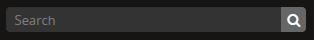

.. _search-atom:

======
Search
======

.. |gears| image:: images/gears.png
   :height: 18

.. |manage| image:: images/edit-sign.png
   :height: 18

To help users locate and manage content, AtoM includes powerful search
support, available anywhere in the application through the :term:`search box`
located in the AtoM :term:`header bar`, or through one of the many dedicated
search boxes for specific :term:`entities <entity>` or record types. AtoM uses
`Elasticsearch <http://www.elasticsearch.org/>`__ to power its search
functionality - Elasticsearch is an open source distributed search server
based on Apache Lucene, which acts as AtoM's search and analytic engine.

This section of the User Manual will cover the features available in the
:term:`search box` (including faceted typeahead results, institutional search
box delimiters, and filter tags), and it will walk users through how to
search for archival descriptions. Additionally, an outline of each of the
dedicated search bars available throughout the application is provided, with
instructions on how to search for different record types in each.

For more information on how the search in AtoM is configured, see
:ref:`advanced-search` - specifically, see:
:ref:`advanced-search-via-searchbox`.

**Below you will find an overview of:**

* :ref:`atom-search-box`

  * :ref:`search-typeahead`
  * :ref:`search-box-delimiters`
  * :ref:`search-results-facets`

* :ref:`search-archival-descriptions`
* :ref:`dedicated-search`

  * :ref:`dedicated-search-authority`
  * :ref:`dedicated-search-accessions`
  * :ref:`dedicated-search-institutions`
  * :ref:`dedicated-search-terms`
  * :ref:`dedicated-search-donors`
  * :ref:`dedicated-search-rights`
  * :ref:`dedicated-search-functions`
  * :ref:`dedicated-search-users`
  * :ref:`dedicated-search-storage`

.. SEEALSO::

   * :ref:`Advanced search <advanced-search>`
   * :ref:`navigate`
   * :ref:`recurring-page-elements`
   * :ref:`browse-result-limits`

.. _atom-search-box:

The AtoM Search box |searchbox|
===============================

The search box is the primary means to find descriptions in AtoM that contain
text matching a search query. The search box is located in the
:term:`header bar` on all AtoM pages, including the home page. By default,
when a user enters text and presses enter, the results returned are for
:term:`archival descriptions <archival description>`. However, other
record-type results can be discovered via the :term:`typeahead` results
presented in the search box (see: :ref:`below <search-typeahead>`).

Search terms entered in the search box are, by default, searched with an "AND"
operator - that is to say, searching for ``kitty cat`` would by default search
``kitty AND cat``. AtoM supports a number of :term:`Boolean <boolean search>`
operators - see: :ref:`Advanced search <advanced-search>`, specifically:

* :ref:`advanced-search-via-searchbox`
* :ref:`advanced-search-operators`

**Jump to:**

* :ref:`search-typeahead`
* :ref:`search-box-delimiters`
* :ref:`search-results-facets`

.. SEEALSO::

   * :ref:`browse-result-limits`
   * :ref:`recurring-page-elements`

.. _search-typeahead:

Typeahead and faceted search box results
-----------------------------------------

.. figure:: images/typeahead.*
   :align: right
   :figwidth: 40%
   :width: 100%
   :alt: Example of the typeahead in the search box

   As a user types, typeahead search suggestions appear below the search box.

Additionally, the AtoM search box also implements :term:`typeahead` - as a user
enters text into the search box, one or more possible matches are found and
presented to the user in a :term:`drop-down <drop-down menu>` below the search
box, which continue to narrow as the user enters further text. This allows a
user to dynamically view results and select a resource without necessarily
having to enter its full name or title. The search box :term:`typeahead`
results are organized into record-type categories (or :term:`facets <facet
filter>`), including:

* :term:`Archival description`
* :term:`Authority record`
* :term:`Archival institution`
* :term:`Subject` access points
* :term:`Place` access points

When multiple results for a record type exist, the :term:`typeahead`
drop-down includes an option to view all records for a particular record
type - clicking the "View all" link for a particular type of record will
redirect the user to a :ref:`browse page <page-type-browse>` of results.

The :term:`typeahead` is set by default to begin providing suggestions only
after at least three characters have been entered - for example, entering "a"
or "an" in the search box will not prompt suggestions, but entering "ant"
might produce suggestions such as an authority record for a person named
"Anthony," etc.

.. IMPORTANT::

   The :term:`typeahead` search results are intended as a navigational tool
   for quick searching of multiple :ref:`entity types <entity-types>`, but
   **by default pressing enter after entering a query in the search bar will
   load a results page for archival descriptions**. If you wish to search for
   an :term:`authority record` or :term:`archival institution` using the main
   search box, you must either click it when it appears in the drop-down, or
   alternately select it from a browse page when clicking the "all matching"
   option below each search facet in the typeahead. At this time, the main
   :term:`search box` cannot be configured to return other record types when
   pressing enter. However, there are also dedicated search bars for authority
   records and archival institutions -- see :ref:`below <dedicated-search>`.

.. _search-box-delimiters:

Institutional search box delimiters
-----------------------------------

.. figure:: images/search-delimiter.*
   :align: right
   :figwidth: 40%
   :width: 100%
   :alt: Example of the search delimiters below the search box

   When viewing an archival description linked to an archival institution, or
   the institution record, the option to limit your search to the current
   institution appears as a radio button in a drop-down beneath the search
   box.

To better support the use of AtoM as a :term:`multi-repository system`, AtoM
provides users with an institutional search box delimiter that can be toggled
between a global search setting and a setting restricted to the
:term:`holdings` of a particular :term:`archival institution`.

When a user has viewed an :term:`archival institution` record or an
:term:`archival description` related to an archival institution, clicking in
the search box (in Bootstrap 2 themes) or clicking the gear icon
(in Bootstrap 5 themes) will reveal a set of
:term:`radio buttons <radio button>` that allow the user to limit the search
results to the holdings of the most recently viewed
:term:`archival institution`, or to search globally
(i.e., across all records in the application).

When the delimiter is set to limit search results to a specific
:term:`archival institution`, :term:`typeahead` search results for
:term:`archival descriptions <archival description>` will also be limited to
the :term:`holdings` of that institution. However, other types head results,
such as :term:`authority record` and :term:`archival institution`
suggestions, will **not** be limited (instead AtoM will continue to make
suggestions from all records in the application for those types).

.. NOTE::

   If the :ref:`Institutional scoping <enable-scoping>` setting is turned on,
   then the the institutional search box delimiter is automatically turned off.
   Users can search the :term:`holdings` of an institution via the dedicated
   search box provided in the :term:`institution block` that will appear when
   the setting is engaged.

   For more information, see: :ref:`enable-scoping`.

.. _search-delimiter-filter-tag:

Filter tags
^^^^^^^^^^^

If a user enters a search query in the :term:`search box` while the delimiter
is set to a particular :term:`repository` and presses enter, the
:ref:`search results <page-type-search>` page will include a :term:`filter tag`
at the top of the results, to offer a visual cue to the user that the results
are limited to those of a specific :term:`archival institution`. Clicking the
"**X**" on the filter tag will remove it, and the results page will reload and
display global search results. This offers two advantages to the user:

* When a delimited search is performed, the user is given a clear visual
  indication (the filter tag bearing the :term:`repository` name)
* If a delimited search is performed *by accident* (i.e. the user meant to
  perform a global search), the filter can be removed without having to
  perform the search again.

.. figure:: images/search-filter-tag.*
   :align: center
   :figwidth: 80%
   :width: 100%
   :alt: Example of a filter tag on a search results page

   An example of a search results page with a filter tag visible - in this
   instance, the user has performed a search limited to top-level descriptions
   from the holdings of the Wilfrid Laurier University Archives

.. _search-using-delimiters:

Using the Institutional search box delimiters
^^^^^^^^^^^^^^^^^^^^^^^^^^^^^^^^^^^^^^^^^^^^^

1. Navigate to an :term:`archival description` linked to an :term:`archival
   institution`, or to an archival institution's page. You can do this either
   by searching for the name of the institution or description, or by
   :ref:`browsing <browse>`.
2. Place your cursor in the :term:`search box` located in the AtoM
   :term:`header bar`. A :term:`drop-down menu` will appear beneath the search
   box with two radio buttons.
3. By default, the radio button will be set to the related :term:`archival
   institution`. If you would like to search within the :term:`holdings` of
   that institution, you can begin typing your query.
4. If you would like to search all records held in AtoM (i.e. globally), click
   the "Global search" radio button in the :term:`drop-down <drop-down
   menu>`. Begin typing your query.
5. If you see the result you are looking for appear in the :ref:`typeahead
   <search-typeahead>`, you can click it to go straight to the record - AtoM
   will redirect you to the selected description's :term:`view page`.
6. You can use "quotations", :term:`Boolean operators <boolean search>` such
   as AND, OR, and NOT, or special characters such as the ``*`` wildcard, to
   broaden or narrow your search. For more information, see:
   :ref:`advanced-search`
7. When you have entered your search term(s), press enter to submit and begin
   your search. AtoM will redirect you to a :ref:`search results
   <page-type-search>` page with descriptions that contain data that match
   your search query.
8. If you have used the institutional search box delimiter, a :term:`filter
   tag` will appear at the top of your search results, indicating that these
   results have been limited to the current :term:`repository`. If you wish
   to broaden the search results to all records in AtoM (i.e., if you did not
   intend to use the institutional search delimiter), you can click the
   "**X**" on the :term:`filter tag` to remove it; AtoM will reload global
   search results.
9. The search results page includes a number :term:`facet filters <facet
   filter>`, to help you sort through the results and find the content you are
   looking for. For more information on working with facet filters, see:
   :ref:`recurring-facet-filters`.
10. Search results can be sorted either alphabetically, by most-recently
    updated, by reference code, or by date of creation using the
    :term:`sort button` available at the top-left side of the search results.
    For more information, see: :ref:`recurring-sort-button`.

:ref:`Back to top <search-atom>`

.. _search-results-facets:

Search results and facet filters
--------------------------------

AtoM's search and browse pages include a number of :ref:`facet filters
<recurring-facet-filters>` to enhance a user's ability to quickly sift
through results and find specific records.

**For more information on using the facet filters in AtoM, see:**

* :ref:`Facet filters in AtoM (overview) <recurring-facet-filters>`
* :ref:`facets-by-record-type`
* :ref:`using-facet-filters`

:ref:`Back to top <search-atom>`

.. _search-archival-descriptions:

|desc| Search for archival descriptions
=======================================

Searching for :term:`archival descriptions <archival description>` is
accomplished using the :term:`search box` located in the AtoM :term:`header
bar`, available anywhere in the application. Though other kinds of record
results can be found using the :term:`typeahead` features of the general
search box (see: :ref:`Typeahead <search-typeahead>`, above), when a user
enters a search term and presses enter, by default the search box will return
results for archival descriptions. The following will outline some of the
steps involved in searching for
:term:`archival descriptions <archival description>`.

.. IMPORTANT::

   Only authenticated (i.e. logged in) users with :term:`access privileges
   <access privilege>` to view drafts will be able to see draft descriptions
   in search and browse results. For more information on draft vs. published,
   and changing the publication status of an :term:`archival description`,
   see: :ref:`publish-archival-description`.

.. TIP::

   Trying to find a specific record inside a :term:`fonds`,
   :term:`collection`, or series? Check out the section below on our
   :ref:`treeview-search`.

**To search for archival descriptions in AtoM:**

1. Place your cursor in the :term:`search box` located in the
   :term:`header bar` at the top of the page.
2. A :term:`drop-down menu` will appear. If you were viewing an :term:`archival
   institution`, or an :term:`archival description` linked to an archival
   institution when you placed your cursor in the :term:`search box`, the
   :ref:`search box delimiter <search-box-delimiters>` will be set for the
   current related institution (otherwise, the only option will be "Global
   search"). If you wish to search **only** within the selected institution,
   leave the :term:`radio button` set to search the current institution. If
   you wish to search **all records** in AtoM (i.e. globally, across
   institutions), click the "Global search" radio button. The examples in
   these instructions will illustrate how to perform a global search - see
   :ref:`above <search-using-delimiters>` for further instructions on using the
   search box delimiters to search within a single institution in a
   :term:`multi-repository system`.

.. image:: images/search-box-dropdown.*
   :align: center
   :width: 70%
   :alt: An image of the search box delimiters

.. NOTE::

   When a user views a linked :term:`archival description` or an
   :term:`archival institution` record, the :term:`search box` delimiter will
   **default to search within that institution**. If you would like to
   perform a global search (i.e. across all records in the application),
   switch the radio button to **Global search** before proceeding. See
   :ref:`above <search-using-delimiters>` for further instructions on using the
   search box delimiters.

3. Begin to enter your search term. As you type, :term:`typeahead` results
   will begin to appear in the search box dropdown. For more information on
   typeahead in search, see above - :ref:`search-typeahead`. The results that
   appear as you type will be faceted by :term:`entity` - those with the
   |desc2| description icon next to them are :term:`archival descriptions
   <archival description>`.

.. image:: images/typeahead-desc.*
   :align: center
   :width: 70%
   :alt: An image typeahead results as a user types in the search box

4. If you see the record you are looking for in the faceted results provided
   by the :term:`typeahead`, click the title in the search box
   :term:`drop-down <drop-down menu>` to navigate to it. If you don't, or
   would like to see more results, finish entering your search term and press
   enter.
5. If you have pressed enter, AtoM will redirect you to a search results page.
   The following image has been annotated with letters (A-E in orange circles)
   to outline some of the features of the results page that will help you
   navigate, and narrow your search:

.. image:: images/search-results.*
   :align: center
   :width: 80%
   :alt: An image of an example search results page

* **A**: The number of relevant search results returned will be shown at the
  top of the screen, for context. Your search term(s) will be visible in the
  search bar - additionally, if you click to open the
  :term:`Advanced search panel`, your search query will be visible in the
  first Boolean field at the top of the panel. For more information on the
  advanced search panel and using the options it contains, see:
  :ref:`advanced-search`.
* **B**: This is the :term:`Advanced search panel`. Click to expand or
  collapse the panel. It contains a user interface for building
  :term:`Boolean search` queries, as well as a number of additional filters
  that can be used to refine search results. For more information, see:
  :ref:`advanced-search`.
* **C**: Results appear in the main column of the page - click on a result
  and AtoM will take you to a :term:`view page` for the related
  :term:`archival description`. Additionally, the results include helpful
  contextual information, including:

  * *Level of description* - i.e. fonds, series, file, item, etc. The
    :term:`level of description` will be displayed next to the orange identifier,
    below the title of the record.
  * *Publication status* - if a description's :term:`publication status` is
    "draft" (i.e. it is not visible to public users), the draft status will be
    indicated in the stub record. You must be logged in to see the draft
    status displayed. If no status is displayed, the record is published, and
    visible to public (i.e. not logged in) users.
  * *Description* - if a scope and content note has been included in the
    archival description, its first 2-3 lines will be visible here for greater
    context.
  * *Identifier* - if a reference code or other identifier has been added to
    the record, the results will display this in orange, beneath the title.
  * *Creation dates* - if dates of creation have been added to the record, these
    will display on the same line as the identifier and level of description.
  * *Part of* - if the record is the :term:`child <child record>` of a
    hierarchical :term:`archival unit` (e.g. a file in a fonds, etc), the title
    of the :term:`parent record` will be displayed as a hyperlink beneath the
    identifier, level of description, and creation dates.
  * *Creator name* - if a creator's :term:`authority record` has been linked
    to an archival description, the results stub will display the creator
    name below the scope and content summary.

.. image:: images/search-result-stub.*
   :align: center
   :width: 70%
   :alt: An image of a search results stub

* **D**: Search result pages include :term:`facet filters <facet filter>` to
  help you narrow your search further. For more information on facet filters
  and using them in AtoM, see :ref:`recurring-facet-filters`. By
  default, only those facets that relate to the results will be
  displayed - if a facet has 0 or only 1 result, it will not be shown. Facets
  available on archival description search/browse pages can include:

  * **Language:** Filters for content in a different available language (i.e.,
    if the content has been translated into more than one language)
  * **Part of:** Allows users to limit results to
    :term:`children <child record>` of the selected top-level description
  * **Archival institution:** Limits results to only the holdings of the
    selected institution
  * **Creator:** Limits results to only those where the :term:`name` matches
    that of the :term:`creator` associated with the :term:`archival description`
  * **Name:** Limits results to those with a matching :term:`name` added as a
    name :term:`access point` to an :term:`archival description`
  * **Place:** Limits results to those with a matching :term:`place` added as a
    place :term:`access point` to an :term:`archival description`
  * **Subject:** Limits results to those with a matching :term:`subject` added
    as a subject :term:`access point` to an :term:`archival description`
  * **Level of description:** Limits results to those that match the selected
    :term:`level of description` (e.g. fonds, collection, series, file, item,
    etc.). Also includes a top-level description filter, that will limit to
    all :term:`parent <parent record>` records regardless of level of description.
  * **Genre:** Limits results to those with a matching genre/documentary form
    term added as an :term:`access point` to an :term:`archival description`
  * **Media type:** Limits results to those with a :term:`digital object`
    attached that matches the selected media type (image, audio, text, video,
    or other)

* **E**: A count of the number of results with :term:`digital objects <digital
  object>` (i.e. an image, video, PDF, or other kind of attachment) is
  included at the top of the search results for context, and to help you sift
  through the results quickly. If you are searching for a description with a
  :term:`digital object`, you can limit the results to show only those with
  digital objects with this filter. Click the "Show results with digital
  objects" link in the results header, and AtoM will reload the page.
  Results with digital objects include a :term:`thumbnail` in the results
  stub for context. A :term:`filter tag` (reading "Only digital objects") is
  included for context - you can click the **X** on the filter tag to remove it
  and return to all results (see :ref:`above <search-delimiter-filter-tag>`
  for more on filter tags):

  .. image:: images/search-results-objects.*
     :align: center
     :width: 80%
     :alt: An image of an example search results page limited to digital
           objects

  .. TIP::

     You can limit the digital object to a specific type of digital object
     (Image, Audio, Video, Text, or Other) using the Media Type
     :term:`facet filter` available on the left-hand column of the search
     results page. For more information on Facet filters in AtoM, see:
     :ref:`recurring-facet-filters`. There is also a general digital object
     filter inclued in the :term:`Advanced search panel` - see
     :ref:`advanced-search`.

* **F**: The :term:`Clipboard` icon appears on all archival description
  search and browse results. Click on the |clipboard| paperclip icon, and the
  result will be added to the Clipboard. You can use the
  :term:`Clipboard menu` at the top of the page. For more information, see
  :ref:`clipboard`

6. If you are searching within the holdings of a particular :term:`archival
   institution`, consult the section above for guidance and tips on using the
   institutional search box delimiters: :ref:`search-using-delimiters`. There
   is also a Repository filter in the :term:`advanced search panel` that will
   allow you to limit the results to a specific institution - see
   :ref:`advanced-search`.
7. When you have found the :term:`archival description` you are looking for,
   click on its title, and AtoM will take you to the description's
   :term:`view page`.
8. Note that you can use :term:`Boolean search` operators such as AND, OR, or
   NOT, as well as Boolean special characters such as the ``*`` wildcard
   symbol to improve your search results, directly from the global search box
   in the AtoM :term:`header bar`. For more information on available
   special characters and boolean searching in AtoM, see:
   :ref:`advanced-search`.
9. If you do not see the record you are looking for, you can use the pager
   included at the bottom of the page to keep browsing the results. **NOTE:**
   whether or not there is a pager included will depend on the number of results
   returned, and the "Results per page" setting in **Admin > Settings >
   Global > Results per page**. If it is set at the default 10 results per
   page, and your search has returned more than 10 results, you will see a
   pager at the bottom of the page like so:

.. image:: images/results-pager.*
   :align: center
   :width: 50%
   :alt: An image of a pager at the bottom of a search results page

10. If you still have not found the description you are searching for, you can
    try using the options in the :term:`Advanced search panel` to further
    refine your results. For more information, see: :ref:`advanced-search`.

:ref:`Back to top <search-atom>`

.. _treeview-search:

Treeview quick search
----------------------

.. image:: images/quicksearch-tab.*
   :align: right
   :width: 25%
   :alt: An image of the treeview quick search tab on an archival description

In addition to AtoM's general search, the :term:`treeview` included in the
:term:`context menu` of an archival description :term:`view page` also
includes a "Quick search" tab, to help users quickly locate specific
descriptions in a deep hierarchy. This is especially useful when using AtoM for
archival arrangement and description over several sessions, to quickly return
to a specific record when a :term:`fonds` or :term:`collection` includes many
lower levels of description.

The treeview quick search can be accessed by navigating to an :term:`archival
description`, and clicking the "Quick search" tab above the :term:`treeview`
in the left-hand :term:`context menu` of the description's :term:`view page`.

.. SEEALSO::

   * :ref:`browse-hierarchy`

**TO USE THE TREEVIEW QUICK SEARCH:**

1. Navigate to a top-level :term:`archival description` (i.e. a :term:`fonds`,
   :term:`collection`, series, etc.) with many :term:`child records <child
   record>` (lower levels of description). You can do so by :ref:`searching
   <search-archival-descriptions>` or :ref:`browsing <browse>` - see
   :ref:`access-content` for more information on navigation in AtoM.

.. image:: images/quicksearch.*
   :align: right
   :width: 25%
   :alt: An image of the treeview quick search

2. Once you've arrived at an :term:`archival description`, locate the
   :term:`treeview` in the left-hand :term:`context menu` of the description's
   :term:`view page`. Click the "Quick search" tab.
3. The treeview will disappear, and a search box will be shown in its place
   (note: you can return to the treeview at any time by clicking the
   "Holdings" tab).

.. image:: images/quicksearch-results.*
   :align: right
   :width: 25%
   :alt: An image of the treeview quick search returning results

4. Type a search term and press enter. AtoM will look for matches in the
   titles and identifiers (reference codes) of descriptions in the collection.
5. Note that you can use :term:`Boolean search` operators such as AND, OR, or
   NOT, as well as Boolean special characters such as the ``*`` wildcard
   symbol to improve your search results. For more information on available
   special characters and boolean searching in AtoM, see:
   :ref:`advanced-search`.

.. image:: images/quicksearch-results-wildcard.*
   :align: right
   :width: 25%
   :alt: An image of the treeview quick search returning results

6. Matching results will be returned as blue hyperlinks. Click a results title
   to navigate to the related description - AtoM will redirect you to a
   :term:`view page` for the selected archival description.
7. If you are unable to find a description you are searching for, you can also
   try using the Advanced search interface, which includes filters to be able
   to limit by :term:`archival institution` and top-level description (e.g. by
   a particular :term:`fonds`, :term:`collection`, series, etc.). For more
   information, see: :ref:`advanced-search`.

.. TIP::

   If you'd like to view all the descriptive levels in a hierarchy in a
   :ref:`browse page <page-type-browse>`, click the "Browse all descriptions"
   button at the bottom of the Quick search results. AtoM will redirect you
   to a browse page, where you can use features such as the browse page's
   :ref:`sort button <recurring-sort-button>` and :ref:`facet filters
   <recurring-facet-filters>` to navigate the descriptions. See:
   :ref:`browse-hierarchy-quick-search`.

:ref:`Back to top <search-atom>`

.. _dedicated-search:

Dedicated search boxes
======================

In addition to the faceted results presented in the general search box (see
:ref:`above <search-typeahead>`), AtoM also includes several dedicated search
boxes for searching a specific :term:`entity` or record type. In general these
are included on the :ref:`browse pages <page-type-browse>` for the related
entity. Basic instructions for each are included below.

**Dedicated search boxes available in AtoM:**

* :ref:`dedicated-search-authority`
* :ref:`dedicated-search-accessions`
* :ref:`dedicated-search-institutions`
* :ref:`dedicated-search-terms`
* :ref:`dedicated-search-donors`
* :ref:`dedicated-search-rights`
* :ref:`dedicated-search-functions`
* :ref:`dedicated-search-users`
* :ref:`dedicated-search-storage`

.. IMPORTANT::

   Some of these searches will return results from all (or most) data entry
   :term:`fields <field>` in the related records (i.e. full-text search), while
   others are currently only configured to return title matches. Details on each
   are included below. Dedicated search boxes that return more than just title
   matches currently include: :term:`authority records <authority record>` and
   :term:`archival institutions <archival institution>`.  These full-text search
   results have **not** been `weighted
   <http://dictionary.reference.com/browse/weighted+search>`__ to favor title
   matches, etc., **except for accessions**. If you see results without matches
   in the title (or name), it means the search term(s) appears somewhere in the
   body of the record. Note: with the release of 2.5, an advanced search
   screen is provided for :term:`authority records <authority record>`.

.. _dedicated-search-authority:

|authicon| Authority records
----------------------------

When browsing :term:`authority records <authority record>` users have two
options for searching: the dedicated search box and the advanced search options
screen. All indexed fields can be searched in the dedicated search box
including:

* **All forms of name** in the Identity area as well as
* **All fields** in the Description area (Dates of existence, History, Places,
  Legal status, Functions occupations and activities, Mandates/sources of
  authority, General context)
* **Access points**: occupation and occupation notes, subjects, places
* **Dates of creation, revision, and deletion** and **Sources** in the Control
  area
* **Related authority records** filtered by relationship type

Further search options to filter results using the advanced search options:

* **Repository**
* **Digital object available**
* **Entity type**
* **Empty fields**

For more information on working with :term:`authority records <authority
record>` in AtoM, see: :ref:`authority-records`. For information on working
with particular fields in the authority record edit template, see:
:ref:`isaar-template`.

**To search for authority records in AtoM using the dedicated search box:**

1. Using the :term:`browse menu` (available as a :term:`drop-down menu` next
   to the :term:`search box` in the AtoM :term:`header bar` at the top of the
   page), navigate to **Browse > Authority records**

.. TIP::

   Depending on the default label and menu settings in your installation, the
   :term:`authority records <authority record>` in your browse menu may
   appear under a different name (such as "People & Organizations" or another
   more user-friendly name). :term:`Administrators <administrator>` can
   change the default labels via **Admin > Settings > User interface label**,
   and the default menu labels can be changed via **Admin > Menus**. See the
   :ref:`administer` section for more details.

.. image:: images/authority-search-options.*
   :align: center
   :width: 70%
   :alt: An image of the authority record browse page

2. Place your cursor in the :term:`authority record` search box at the top of
   the browse page. Type a search term and press enter, or use your mouse to
   click the |searchbutton| search button (represented by the magnifying
   glass icon to the right of the search box).

.. image:: images/authority-search-box.*
   :align: center
   :width: 70%
   :alt: An image of the authority record dedicated search box

3. AtoM will reload the page with results. If there are more than 10 results, a
   pager will be included at the bottom of the results page. Note that if an
   :ref:`image has been uploaded for an authority record <add-edit-content>`,
   the thumbnail will appear in the search results, as will the first few lines
   of the history.

.. NOTE::

   See :ref:`above <dedicated-search-authority>` for a list of :term:`fields
   <field>` that AtoM will search in an authority record. Results have not been
   weighted to favor title matches. If you see results without matches in the
   title (i.e. the authorized form of name), it means the search term(s) appears
   somewhere in the body of the record.

.. image:: images/authority-search-results.*
   :align: center
   :width: 70%
   :alt: An image of the authority record search results

4. The results page includes a :term:`sort button` (allowing you to sort
   results to show them in alphabetic order, or most recently created/updated)
   and a set of :term:`facet filters <facet filter>` to help you sift through
   results. For more information on these elements, see
   :ref:`recurring-sort-button` and :ref:`recurring-facet-filters`.

.. TIP::

   You can use :term:`Boolean search` operators such as AND, OR, or
   NOT, as well as Boolean special characters such as the ***** wildcard
   symbol to improve your search results. For more information on available
   special characters and boolean searching in AtoM, see:
   :ref:`advanced-search`.

5. You can click the |searchreset| button next to your search term in the
   dedicated search box to clear the field and begin a new search.
   Alternately, simply place the cursor in the search box and enter a new
   search term.
6. When you have found the record you are searching for, click on its title in
   the results, and AtoM will redirect you to the selected authority record's
   :term:`view page`.

**To search for authority records in AtoM using the advanced search options:**

Users can narrow their searches further using the Advanced search options. In
this search screen users can:

* Restrict results to certain specified fields
* Limit results by repository
* Find results that have digital objects attached
* Find results by entity type
* Find results in which specified fields are empty
* Find all related authority records
* Find all related authority records, filtered by a relationship type
* Find all authority records that have a specific relationship type

.. image:: images/authority-advanced-search.*
   :align: center
   :width: 70%
   :alt: Authority record advanced search options

.. _search-authority-record-relationships:

Search authority record relationships
^^^^^^^^^^^^^^^^^^^^^^^^^^^^^^^^^^^^^

Users can find related Authority records by searching on links that were made in
the :ref:`Relationships area <link-two-authority-records>` on the Authority
record create and edit templates.

You can find the Related Authority Record field on the last row of the Authority
record advanced search screen. When you begin to type in a value in this field,
AtoM will auto-complete names from existing Authority records in its database.

.. image:: images/authority-advanced-search-related-authority.*
   :align: center
   :width: 70%
   :alt: Related authority record auto-complete

The user selects a relationship type from the existing :term:`taxonomy` of
relations.AtoM comes with several pre-loaded :ref:`default terms in the Actor
relation type taxonomy <default-actor-relation-types>`. You can add more
relationship types by :ref:`editing this taxonomy <hierarchical-taxonomies>`.

.. image:: images/authority-advanced-search-relationship-type.*
   :align: center
   :width: 70%
   :alt: Select Authority record relationship type

This advanced search returned one hit where it found "an associate of"
Waterloo Lutheran University.

.. image:: images/authority-advanced-search-is-associate-of.*
   :align: center
   :width: 70%
   :alt: Select Authority record relationship type

You can also leave the Relationship field empty and select **Search**.

.. image:: images/authority-advanced-search-blank-relationship.*
   :align: center
   :width: 70%
   :alt: Empty value for Authority record relationship type

AtoM will then return hits for **all** the Authority records that have a
relationship record linked to the selected Authority record.

.. image:: images/authority-advanced-search-all-relationships.*
   :align: center
   :width: 70%
   :alt: All relationships for an Authority record

In this case, Waterloo Lutheran University was linked to two other Authority
records. You already know about the relationship to Waterloo Lutheran Seminary.
If you follow the link to the related Wilfrid Laurier University Authority
record and look in its relationship area, you see that it has a
predecessor/successor relationship with Waterloo Lutheran University.

.. image:: images/authority-advanced-search-predecessor-relationship.*
   :align: center
   :width: 70%
   :alt: A predecessor relationship with Wilfrid Laurier University

You can also do an advanced search on a Relationship type (such as "is the
associate of") and leave the Related Authority record field blank.

.. image:: images/authority-advanced-search-blank-related-authority.*
   :align: center
   :width: 70%
   :alt: A relationship search with just a relationship type

AtoM will then return **all** the Authority records that have this type
of relationship.

.. image:: images/authority-advanced-search-all-associative-relationships.*
   :align: center
   :width: 70%
   :alt: All is-the-associate-of relationships

.. _es-fields-actor:

Elasticsearch Authority record fields
^^^^^^^^^^^^^^^^^^^^^^^^^^^^^^^^^^^^^

Below is a list of all indexed :term:`authority record` field names as they
are found in Elasticsearch, the search index used in AtoM. Expert users can
use the information below to target search queries to specific indexed fields,
and implement search parameters otherwise not directly available via the
:term:`user interface`. For more introductory information on syntax and basic
use, see the Advanced search documentation - specifically,
:ref:`es-fields-intro`. These must be used in the relevant dedicated search
box to return results.

.. WARNING::

   Not all fields have been tested for their ability to be searched. In some
   cases, the parameter expected may be an internal ID value and not a string
   - for example, when searching for controlled terms that appear in a
   :term:`drop-down menu` in the AtoM :term:`edit pages <edit page>`.

.. code-block:: none

   corporateBodyIdentifiers
   createdAt
   descriptionIdentifier
   entityTypeId
   i18n.%LANG%.authorizedFormOfName
   i18n.%LANG%.datesOfExistence
   i18n.%LANG%.functions
   i18n.%LANG%.generalContext
   i18n.%LANG%.history
   i18n.%LANG%.institutionResponsibleIdentifier
   i18n.%LANG%.internalStructures
   i18n.%LANG%.legalStatus
   i18n.%LANG%.mandates
   i18n.%LANG%.places
   i18n.%LANG%.revisionHistory
   i18n.%LANG%.rules
   i18n.%LANG%.sources
   maintainingRepositoryId
   otherNames.i18n.%LANG%.name
   parallelNames.i18n.%LANG%.name
   slug
   sourceCulture
   standardizedNames.i18n.%LANG%.name
   updatedAt

:ref:`Back to top <search-atom>`

.. _dedicated-search-accessions:

Accession records
-----------------

.. |edit| image:: images/edit-sign.png
   :height: 18

A dedicated search box for :term:`accession records <accession record>` has
been provided on the accessions :ref:`browse page <page-type-browse>`.
In AtoM 2.1 and later, full-text searching has been returned to the accession
module, and for frequently-searched fields, weighting has been added to
increase the relevance of matching results. Below is a list of indexed fields
and their weighting:

====================================== ===========
Field name                             Weight
====================================== ===========
Accession number                       x10
Donor name                             x10
Title                                  x10
Scope and content                      x10
Location information                   x5
Processing notes                       x5
Immediate source of acquisition        x5
Archival/custodial history             x5
Appraisal, desctruction and scheduling
Physical condition
Primary contact name
Received extent units
====================================== ===========

For more information on working with accession records in AtoM, see:
:ref:`accession-records`. See also: :ref:`deaccessions`.

.. TIP::

   In order to search by accession number, please use the prefix "identifier:" before
   the accession date (i.e. identifier:2015-12-28). This will pull up all accessions
   that begin with the accession date 2015-12-28. Do not use the rest of the accession
   number, as the backslash will break the search. This issue has been marked for resolution
   in the 2.3 release of AtoM.

.. NOTE::

   To view and search for :term:`accession records <accession record>` in
   AtoM you must be :ref:`logged in <log-in>` to a user account with sufficient
   :term:`access privileges <access privilege>`, such as an :term:`editor` or
   an :term:`administrator`. For more information on user roles, see:
   :ref:`user-roles`. For information on default permissions for user roles,
   see: :ref:`default-permissions-by-role`. For information on changing edit
   permissions, see: :ref:`edit-user-permissions`. See also:
   :ref:`manage-user-accounts`.

**To search for accession records in AtoM:**

.. image:: images/manage-accessions.*
   :align: right
   :width: 15%
   :alt: An image of a user selecting Accessions in the Manage menu

1. Navigate to the accession record :ref:`browse page <page-type-browse>` by
   clicking on the |edit| :ref:`Manage menu <main-menu-manage>` (located in the
   :term:`main menu` for logged-in users, in the top-right of the AtoM
   :term:`header bar`) and choosing "Accessions" - i.e., **Manage >
   Accessions**.
2.  AtoM will redirect you to the :term:`accessions <accession record>` browse
    page. A list of your accessions will appear; if there are more than 10
    results, a pager will be included. To begin searching for an accession,
    place your cursor in the the :term:`dedicated search box` at the top of
    the Accessions browse page.

.. image:: images/browse-accessions.*
   :align: center
   :width: 70%
   :alt: An image of the Accessions browse page

.. TIP::

   An :term:`administrator` can change the number of results per page for
   browse and search result pages throughout AtoM via **Admin > Settings >
   Global > Results per page**. By default, the number is set to 10. For more
   information, see :ref:`settings`.

3. Type a search term into the :term:`dedicated search box` and press enter,
   or use your mouse to click the |searchbutton| search button (represented by
   the magnifying glass icon to the right of the search box).

.. image:: images/accessions-searchbox.*
   :align: center
   :width: 70%
   :alt: An image of the accession record dedicated search box

4. AtoM will reload the page with results. If there are more than 10 results,
   a pager will be included at the bottom of the results page. The results page
   also includes a :term:`sort button` (allowing you to sort results to show
   them in alphabetic order, or most recently created/updated). For more
   information, see :ref:`recurring-sort-button`.

.. image:: images/accessions-results.*
   :align: center
   :width: 70%
   :alt: An image of the accession record search results

5. You can click the |searchreset| button next to your search term in the
   dedicated search box to clear the field and begin a new search.
   Alternately, simply place the cursor in the search box and enter a new
   search term.
6. When you have found the record you are searching for, click on its title in
   the results, and AtoM will redirect you to the selected accession record's
   :term:`view page`.

.. _es-fields-accession:

Elasticsearch Accession record fields
^^^^^^^^^^^^^^^^^^^^^^^^^^^^^^^^^^^^^

Below is a list of all indexed :term:`accession record` field names as they
are found in Elasticsearch, the search index used in AtoM. Expert users can
use the information below to target search queries to specific indexed fields,
and implement search parameters otherwise not directly available via the
:term:`user interface`. For more introductory information on syntax and basic
use, see the Advanced search documentation - specifically,
:ref:`es-fields-intro`. These must be used in the relevant dedicated search
box to return results.

.. WARNING::

   Not all fields have been tested for their ability to be searched. In some
   cases, the parameter expected may be an internal ID value and not a string
   - for example, when searching for controlled terms that appear in a
   :term:`drop-down menu` in the AtoM :term:`edit pages <edit page>`.

.. code-block:: none

   alternativeIdentifiers.i18n.%LANG.name
   alternativeIdentifiers.i18n.%LANG.note
   createdAt
   date
   i18n.%LANG.appraisal
   i18n.%LANG.archivalHistory
   i18n.%LANG.locationInformation
   i18n.%LANG.physicalCharacteristics
   i18n.%LANG.processingNotes
   i18n.%LANG.receivedExtentUnits
   i18n.%LANG.scopeAndContent
   i18n.%LANG.sourceOfAcquisition
   i18n.%LANG.title
   identifier
   slug
   sourceCulture
   updatedAt

   Linked Creators - indexed fields
   --------------------------------

   creators.createdAt
   creators.descriptionIdentifier
   creators.i18n.%LANG.authorizedFormOfName
   creators.i18n.%LANG.datesOfExistence
   creators.i18n.%LANG.functions
   creators.i18n.%LANG.generalContext
   creators.i18n.%LANG.history
   creators.i18n.%LANG.institutionResponsibleIdentifier
   creators.i18n.%LANG.internalStructures
   creators.i18n.%LANG.legalStatus
   creators.i18n.%LANG.mandates
   creators.i18n.%LANG.places
   creators.i18n.%LANG.revisionHistory
   creators.i18n.%LANG.rules
   creators.i18n.%LANG.sources
   creators.otherNames.i18n.%LANG.dates
   creators.otherNames.i18n.%LANG.name
   creators.otherNames.i18n.%LANG.note
   creators.otherNames.sourceCulture

   creators.parallelNames.i18n.%LANG.name
   creators.parallelNames.i18n.%LANG.note
   creators.parallelNames.sourceCulture
   creators.slug
   creators.standardizedNames.i18n.%LANG.dates
   creators.standardizedNames.i18n.%LANG.name
   creators.standardizedNames.i18n.%LANG.note
   creators.standardizedNames.id
   creators.standardizedNames.sourceCulture
   creators.updatedAt

   Linked Donors - indexed fields
   ------------------------------

   donors.contactInformations.contactPerson
   donors.contactInformations.countryCode
   donors.contactInformations.createdAt
   donors.contactInformations.i18n.%LANG.authorizedFormOfName
   donors.contactInformations.i18n.%LANG.city
   donors.contactInformations.i18n.%LANG.contactType
   donors.contactInformations.postalCode
   donors.contactInformations.sourceCulture
   donors.contactInformations.streetAddress
   donors.contactInformations.updatedAt
   donors.slug

:ref:`Back to top <search-atom>`

.. _dedicated-search-institutions:

|repoicon| Archival institutions
--------------------------------

A dedicated search box for :term:`archival institutions <archival institution>`
has been provided on the archival institution
:ref:`browse page <page-type-browse>`. All fields are indexed, but no weighting
has been added to specific fields.

The archival institution browse page has 2 different views - a "card" based
view, and a table view. Users can switch quickly between these two views via
the view toggle button located next to the archival institution
:term:`dedicated search box`:

.. image:: images/view-toggle-repository.*
   :align: center
   :width: 80%
   :alt: An image of the view toggle button on the repository browse page

For more information on navigating the archival institution browse page, see:
:ref:`Browse archival institutions <browse-institutions>`.

For more information on working with :term:`archival institution` records in
AtoM, see: :ref:`archival-institutions`. For information on working with
particular fields in the archival institution record edit template, see:
:ref:`isdiah-template`.

**To search for archival institutions in AtoM:**

1. Using the :term:`browse menu` (available as a :term:`drop-down menu` next
   to the :term:`search box` in the AtoM :term:`header bar` at the top of the
   page), navigate to **Browse > Archival institutions**. The way the page
   will appear may depend on the default view set by an :term:`administrator`
   - there is a table view, and a card view, and users can toggle between the
   two:

.. image:: images/repo-views.*
   :align: center
   :width: 70%
   :alt: An comparison of the card and table views of the repository browse page

.. TIP::

   Depending on the default label and menu settings in your installation, the
   :term:`archival institution` label in your :term:`browse menu` may
   appear under a different name (such as "Repositories," "Archives," or another
   more user-friendly name). :term:`Administrators <administrator>` can
   change the default labels via **Admin > Settings > User interface label**,
   and the default menu labels can be changed via **Admin > Menus**. See the
   :ref:`administer` section for more details.

2. Place your cursor in the :term:`dedicated search box` at the top of
   the :term:`archival institution` browse page. Type a search term and press
   enter, or use your mouse to click the |searchbutton| search button
   (represented by the magnifying glass icon to the right of the search box).

.. image:: images/repository-searchbox.*
   :align: center
   :width: 70%
   :alt: An image of the archival institution dedicated search box

.. TIP::

   You can use :term:`Boolean search` operators such as AND, OR, or NOT, as
   well as Boolean special characters such as "quotations" or the *****
   wildcard symbol to improve your search results. For more information on
   available special characters and boolean searching in AtoM, see:
   :ref:`advanced-search`.

3. AtoM will reload the page with results. If there are more than 10 results,
   a pager will be included at the bottom of the results page.

.. NOTE::

   In the current release, results have not been weighted to favor title
   matches. If you see results without matches in the title (i.e. the
   authorized form of name), it means the search term(s) appears somewhere in
   the body of the record.

.. image:: images/repository-searchresults.*
   :align: center
   :width: 70%
   :alt: An image of the archival institution search results, card view

4. Users can toggle between the table view and card view at any time during
   the search process, using the view toggle button to the right of the search
   box:

.. image:: images/repository-searchresults-table.*
   :align: center
   :width: 70%
   :alt: An image of the archival institution search results, table view

5. You can further refine your search with the advanced filters - click the
   "Advanced" button below the search box to display the advanced filters.
   Select the desired filters from the
   :term:`drop-down menus <drop-down menu>`, then click the "Set filters"
   button to refine the results:

.. image:: images/repository-searchfilters.*
   :align: center
   :width: 70%
   :alt: An image of the archival institution search filters

6. AtoM will reload the page, with the results refined based on the Advanced
   search filters.

.. image:: images/repository-searchfilters-results.*
   :align: center
   :width: 70%
   :alt: An image of the archival institution results after a search with
         filters

.. NOTE::

   After a search, the advanced search filters will reset. You will have to
   re-apply them to perform the same search again.

7. Results in the table view can be sorted based on column - click on the
   column header to sort the results; click again to reverse the sort order.
   The results page also includes a :term:`sort button` (allowing you to sort
   results to show them in alphabetic order, by identifier, or by most
   recently created/updated), and a set of :term:`facet filters <facet filter>`
   to help you sift through results. For more information on these elements, see
   :ref:`recurring-sort-button` and :ref:`recurring-facet-filters`.

8. You can click the |searchreset| button next to your search term in the
   dedicated search box to clear the field and begin a new search.
   Alternately, simply place the cursor in the search box and enter a new
   search term.
9. When you have found the record you are searching for, click on its title in
   the results, and AtoM will redirect you to the selected archival
   institution's :term:`view page`.

.. _es-fields-repository:

Elasticsearch Archival institution record fields
^^^^^^^^^^^^^^^^^^^^^^^^^^^^^^^^^^^^^^^^^^^^^^^^

Below is a list of all indexed :term:`repository` field names as they
are found in Elasticsearch, the search index used in AtoM. Expert users can
use the information below to target search queries to specific indexed fields,
and implement search parameters otherwise not directly available via the
:term:`user interface`. For more introductory information on syntax and basic
use, see the Advanced search documentation - specifically,
:ref:`es-fields-intro`. These must be used in the relevant dedicated search
box to return results.

.. WARNING::

   Not all fields have been tested for their ability to be searched. In some
   cases, the parameter expected may be an internal ID value and not a string
   - for example, when searching for controlled terms that appear in a
   :term:`drop-down menu` in the AtoM :term:`edit pages <edit page>`.

.. code-block:: none

   contactInformations.contactPerson
   contactInformations.countryCode
   contactInformations.createdAt
   contactInformations.i18n.%LANG%.authorizedFormOfName
   contactInformations.i18n.%LANG%.city
   contactInformations.i18n.%LANG%.contactType
   contactInformations.location
   contactInformations.postalCode
   contactInformations.streetAddress
   contactInformations.updatedAt
   createdAt
   geographicSubregions
   i18n.%LANG%.accessConditions
   i18n.%LANG%.authorizedFormOfName
   i18n.%LANG%.buildings
   i18n.%LANG%.city
   i18n.%LANG%.collectingPolicies
   i18n.%LANG%.contactType
   i18n.%LANG%.datesOfExistence
   i18n.%LANG%.descInstitutionIdentifier
   i18n.%LANG%.descRevisionHistory
   i18n.%LANG%.descRules
   i18n.%LANG%.descSources
   i18n.%LANG%.disabledAccess
   i18n.%LANG%.findingAids
   i18n.%LANG%.functions
   i18n.%LANG%.generalContext
   i18n.%LANG%.geoculturalContext
   i18n.%LANG%.history
   i18n.%LANG%.holdings
   i18n.%LANG%.institutionResponsibleIdentifier
   i18n.%LANG%.internalStructures
   i18n.%LANG%.legalStatus
   i18n.%LANG%.mandates
   i18n.%LANG%.note
   i18n.%LANG%.openingTimes
   i18n.%LANG%.places
   i18n.%LANG%.publicFacilities
   i18n.%LANG%.region
   i18n.%LANG%.reproductionServices
   i18n.%LANG%.researchServices
   i18n.%LANG%.revisionHistory
   i18n.%LANG%.rules
   i18n.%LANG%.sources
   identifier
   otherNames.i18n.%LANG%.name
   otherNames.sourceCulture
   parallelNames.i18n.%LANG%.name
   slug
   sourceCulture
   updatedAt

:ref:`Back to top <search-atom>`

.. _dedicated-search-terms:

Terms
-----

.. |pencil| image:: images/edit-sign.png
   :height: 18
   :width: 18

A dedicated search box for :term:`terms <term>` is available on the
:ref:`browse page <page-type-browse>` for each :term:`taxonomy`.

In the following example, the :term:`Places <place>` taxonomy has been used to
demonstrate the search functionality, because it is one of the modules (along
with Subjects) where the search box is available to both authenticated and
public users. However, the same search box has been included on all
:term:`taxonomy` pages (available to authenticated users with the proper
permissions via |pencil| :ref:`Manage <main-menu-manage>` **> Taxonomies**,
and then selecting a taxonomy).

.. TIP::

  A place is a geographic location registered in a :term:`taxonomy` and used as
  an :term:`access point` in :term:`archival descriptions <archival description>`.
  For more information on managing places in AtoM, see: :ref:`terms`. For
  information on adding access points to an :term:`archival description`,
  see: :ref:`add-term-fly`.

**To search for terms in AtoM:**

1. First, navigate to the relevant taxonomy. For **Places** and **Subjects**,
   use the :term:`browse menu` (available as a :term:`drop-down menu` next
   to the :term:`search box` in the AtoM :term:`header bar` at the top of the
   page), navigate to **Browse > Places** or **Browse > Subjects**. For all
   other taxonomies (available only to authenticated (i.e. logged in) users
   with the proper :term:`access privleges <access privilege>`), open the
   |pencil| :ref:`Manage <main-menu-manage>` menu located in the AtoM
   :term:`header bar`, select "Taxonomies", and then choose the taxonomy you
   would like to search.

2. AtoM will redirect you to the related terms browse page. A list of your
   :term:`terms <term>` will appear; if there are more than 10 results,
   a pager will be  included.

.. image:: images/places.*
   :align: center
   :width: 70%
   :alt: An image of the places main page

3. If desired, you can search either only for the preferred label (e.g. the
   formal name of the :term:`term` entered into the "Name" :term:`field` on
   the term :term:`edit page`), or for only the "Use for" (e.g. alternate,
   non-preferred names) labels associated with the term, using the
   :term:`drop-down menu` located on the left of the
   :term:`dedicated search box`. By default, AtoM will search All labels
   (e.g. both the preferred and 'Use for' labels) associated with a term.

.. NOTE::

   At the moment, only the labels associated with a term (e.g. its name, and any
   "Use for" names added) are searchable. Content in other fields (e.g. scope
   note, source note, etc) will not return results.

.. image:: images/search-term-label-dropdown.*
   :align: center
   :width: 70%
   :alt: An image of the dropdown available on the terms search box

4. Place your cursor in the :term:`dedicated search box` at the top of
   the browse page. Type a search term and press enter, or use your mouse to
   click the |searchbutton| search button (represented by the magnifying glass
   icon to the right of the search box).

.. image:: images/places-searchbox.*
   :align: center
   :width: 70%
   :alt: An image of the places dedicated search box

5. AtoM will reload the page with results. If there are more than 10 results,
   a pager will be included at the bottom of the results page.

.. image:: images/places-searchresults.*
   :align: center
   :width: 70%
   :alt: An image of the places search results

6. The results page includes :term:`sort buttons <sort button>` (allowing you to
   sort results to show them in alphabetic order or most recently
   created/updated) and a set of :term:`facet filters <facet filter>` to help
   you sift through results. For more information on these elements, see
   :ref:`recurring-sort-button` and :ref:`recurring-facet-filters`.

   For more information on the :term:`user interface` elements available on term
   search and browse pages, see: :ref:`browse-subjects-places`

.. TIP::

   You can use :term:`Boolean search` operators such as AND, OR, or NOT, as
   well as Boolean special characters such as "quotations" or the ``*``
   wildcard symbol to improve your search results. For more information on
   available special characters and boolean searching in AtoM, see:
   :ref:`advanced-search`.

7. You can click the |searchreset| button next to your search term in the
   dedicated search box to clear the field and begin a new search.
   Alternately, simply place the cursor in the search box and enter a new
   search term.

8. When you have found the record you are searching for, click on its title in
   the results, and AtoM will redirect you to the selected term's
   :term:`view page`. The view page will include any further information
   available about the term (such as scope and source notes, related terms, etc),
   as well as tabs showing related :term:`archival description` and
   :term:`authority record` results that have been linked to the term.

.. image:: images/term-view-page.*
   :align: center
   :width: 70%
   :alt: An image of a term view page, with related results tabs at the top

.. _es-fields-term:

Elasticsearch term fields
^^^^^^^^^^^^^^^^^^^^^^^^^

Below is a list of all indexed :term:`term` field names as they
are found in Elasticsearch, the search index used in AtoM. Expert users can
use the information below to target search queries to specific indexed fields,
and implement search parameters otherwise not directly available via the
:term:`user interface`. For more introductory information on syntax and basic
use, see the Advanced search documentation - specifically,
:ref:`es-fields-intro`. These must be used in the relevant dedicated search
box to return results.

.. WARNING::

   Not all fields have been tested for their ability to be searched. In some
   cases, the parameter expected may be an internal ID value and not a string
   - for example, when searching for controlled terms that appear in a
   :term:`drop-down menu` in the AtoM :term:`edit pages <edit page>`.

.. code-block:: none

   createdAt
   i18n.%LANG%.name
   numberOfDescendants
   scopeNotes.i18n.%LANG%.content
   slug
   sourceCulture
   taxonomyId
   updatedAt
   useFor.i18n.%LANG%.name
   useFor.id

:ref:`Back to top <search-atom>`

.. _dedicated-search-donors:

Donors
------

A :term:`dedicated search box` for donor records has
been provided on the Donors :ref:`browse page <page-type-browse>`.
In AtoM 2.0, this search box will **only return title (i.e. Authorized form
of name) matches** However, the search box is configured to return partial
matches, so for example, a search for "ju" would return names such as Jules,
Julie, June, Jude, etc. This allows the dedicated search box to be used as a
navigational aid, allowing a user to quickly locate a specific record when
there are many donor records saved in the system.

For more information on working with donor records in AtoM, see:
:ref:`donors`.

.. NOTE::

   To view and search for Donor records in AtoM you must be
   :ref:`logged in <log-in>` to a user account with sufficient
   :term:`access privileges <access privilege>`, such as an :term:`editor` or
   an :term:`administrator`. For more information on user roles, see:
   :ref:`user-roles`. For information on default permissions for user roles,
   see: :ref:`default-permissions-by-role`. For information on changing edit
   permissions, see: :ref:`edit-user-permissions`. See also:
   :ref:`manage-user-accounts`.

**To search for donor records in AtoM:**

.. image:: images/manage-donors.*
   :align: right
   :width: 15%
   :alt: An image of a user selecting Donors in the Manage menu

1. Navigate to the donor record :ref:`browse page <page-type-browse>` by
   clicking on the |edit| :ref:`Manage menu <main-menu-manage>` (located in the
   :term:`main menu` for logged-in users, in the top-right of the AtoM
   :term:`header bar`) and choosing "Donors" - i.e., **Manage >
   Donors**.
2. AtoM will redirect you to the Donors browse page. A list of your donor
   records will appear; if there are more than 10 results, a pager will be
   included. To begin searching for a donor record, place your cursor in the
   the :term:`dedicated search box` at the top of the Donors browse page.

.. image:: images/browse-donors.*
   :align: center
   :width: 70%
   :alt: An image of the Donors browse page

.. TIP::

   An :term:`administrator` can change the number of results per page for
   browse and search result pages throughout AtoM via **Admin > Settings >
   Global > Results per page**. By default, the number is set to 10. For more
   information, see :ref:`settings`.

3. Type a search term into the :term:`dedicated search box` and press enter,
   or use your mouse to click the |searchbutton| search button (represented by
   the magnifying glass icon to the right of the search box).

.. image:: images/donors-searchbox.*
   :align: center
   :width: 70%
   :alt: An image of the donor record dedicated search box

.. TIP::

   In 2.0.0, AtoM will **only** search on the title (i.e. authorized form of
   name) of the donor record, but it will provide fuzzy matching - that is,
   instead of requiring an exact match on a title, it will return partial
   matches as well - so a search for "way" would return donor names such as
   Wayson, Wayne, and even Galloway, instead of failing to return any (as in an
   exact match search).

4. AtoM will reload the page with results. If there are more than 10 results,
   a pager will be included at the bottom of the results page. The results page
   also includes a :term:`sort button` (allowing you to sort results to show
   them in alphabetic order, or most recently created/updated). For more
   information, see :ref:`recurring-sort-button`.

.. image:: images/donor-searchresults.*
   :align: center
   :width: 70%
   :alt: An image of the donor record search results

5. You can click the |searchreset| button next to your search term in the
   dedicated search box to clear the field and begin a new search.
   Alternately, simply place the cursor in the search box and enter a new
   search term.
6. When you have found the record you are searching for, click on its title in
   the results, and AtoM will redirect you to the selected donor record's
   :term:`view page`.

:ref:`Back to top <search-atom>`

.. _dedicated-search-rights:

Rights holders
--------------

A :term:`dedicated search box` for Rights holder records has
been provided on the Rights holders :ref:`browse page <page-type-browse>`.
In AtoM 2.0.0, this search box will **only return title (i.e. Authorized form
of name) matches** However, the search box is configured to return partial
matches, so for example, a search for "un" would return terms such as
Underwood, United, and University, as well as Munn. This allows the dedicated
search box to be used as a navigational aid, allowing a user to quickly locate
a specific record when there are many rights holder records saved in the system.

For more information on working with Rights and Rights holder records in AtoM,
see: :ref:`rights`.

.. NOTE::

   To view and search for Rights holder records in AtoM you must be
   :ref:`logged in <log-in>` to a user account with sufficient
   :term:`access privileges <access privilege>`, such as an :term:`editor` or
   an :term:`administrator`. For more information on user roles, see:
   :ref:`user-roles`. For information on default permissions for user roles,
   see: :ref:`default-permissions-by-role`. For information on changing edit
   permissions, see: :ref:`edit-user-permissions`. See also:
   :ref:`manage-user-accounts`.

**To search for rights holder records in AtoM:**

.. image:: images/manage-rights.*
   :align: right
   :width: 15%
   :alt: An image of a user selecting Rights holders in the Manage menu

1. Navigate to the rights holder record :ref:`browse page <page-type-browse>` by
   clicking on the |edit| :ref:`Manage menu <main-menu-manage>` (located in the
   :term:`main menu` for logged-in users, in the top-right of the AtoM
   :term:`header bar`) and choosing "Rights holders" - i.e., **Manage >
   Rights holders**.
2. AtoM will redirect you to the Rights holders browse page. A list of your
   rights holder records will appear; if there are more than 10 results, a
   pager will be included. To begin searching for a rights holder record,
   place your cursor in the the :term:`dedicated search box` at the top of the
   Rights holder browse page.

.. image:: images/browse-rightsholders-all.*
   :align: center
   :width: 70%
   :alt: An image of the Rights holders browse page

.. TIP::

   An :term:`administrator` can change the number of results per page for
   browse and search result pages throughout AtoM via **Admin > Settings >
   Global > Results per page**. By default, the number is set to 10. For more
   information, see :ref:`settings`.

3. Type a search term into the :term:`dedicated search box` and press enter,
   or use your mouse to click the |searchbutton| search button (represented by
   the magnifying glass icon to the right of the search box).

.. image:: images/rightsholders-searchbox.*
   :align: center
   :width: 70%
   :alt: An image of the rights holder records dedicated search box

.. TIP::

   In 2.0.0, AtoM will **only** search on the title (i.e. authorized form of
   name) of the rights holder record, but it will provide fuzzy matching -
   that is, instead of requiring an exact match on a title, it will return
   partial matches as well - so a search for "way" would return donor names
   such as Wayson, Wayne, and even Galloway, instead of failing to return any
   (as in an exact match search).

4. AtoM will reload the page with results. If there are more than 10 results,
   a pager will be included at the bottom of the results page. The results page
   also includes a :term:`sort button` (allowing you to sort results to show
   them in alphabetic order, or most recently created/updated). For more
   information, see :ref:`recurring-sort-button`.

.. image:: images/rightsholders-results.*
   :align: center
   :width: 70%
   :alt: An image of the rights holder record search results

5. You can click the |searchreset| button next to your search term in the
   dedicated search box to clear the field and begin a new search.
   Alternately, simply place the cursor in the search box and enter a new
   search term.
6. When you have found the record you are searching for, click on its title in
   the results, and AtoM will redirect you to the selected rights holder
   record's :term:`view page`.

:ref:`Back to top <search-atom>`

.. _dedicated-search-functions:

|functicon| Functions
---------------------

A dedicated search box for :term:`functions <function>` has
been provided on the functions :ref:`browse page <page-type-browse>`.
In AtoM 2.0.0, this search box will **only return title (i.e. authorized form
of name) matches** However, the search box is configured to return partial
matches, so for example, a search for "sing" would return terms such as
Singing, Singe, and Singular, as well as Licensing, Browsing, etc. This allows
the dedicated search box to be used as a navigational aid, allowing a user to
quickly locate a specific record when there are many function records
saved in the system.

For more information on working with :term:`functions <function>` in AtoM, see:
:ref:`functions`. For information on working with particular fields in the
functions edit template, see: :ref:`isdf-template`.

**To search for functions in AtoM:**

1. Navigate to the functions :ref:`browse page <page-type-browse>` by
   clicking on the :term:`browse menu` (located in the AtoM :term:`header
   bar`, next to the general :term:`search box`) and selecting "Functions"
   from the :term:`drop-down menu` that appears.

.. image:: images/browsemenu-functions.*
   :align: center
   :width: 50%
   :alt: An image of the browse menu, in which a user is selecting Functions

2.  AtoM will redirect you to the :term:`functions <function>` browse
    page. A list of your functions will appear; if there are more than 10
    results, a pager will be included. To begin searching for an accession,
    place your cursor in the the :term:`dedicated search box` at the top of
    the Accessions browse page.

.. image:: images/browse-functions.*
   :align: center
   :width: 70%
   :alt: An image of the Functions browse page

.. TIP::

   An :term:`administrator` can change the number of results per page for
   browse and search result pages throughout AtoM via **Admin > Settings >
   Global > Results per page**. By default, the number is set to 10. For more
   information, see :ref:`settings`.

3. Type a search term into the :term:`dedicated search box` and press enter,
   or use your mouse to click the |searchbutton| search button (represented by
   the magnifying glass icon to the right of the search box).

.. image:: images/functions-searchbox.*
   :align: center
   :width: 70%
   :alt: An image of the functions dedicated search box

.. TIP::

   In 2.0.0, AtoM will **only** search on the title (i.e. authorized form of
   name) of the function, but it will return partial matches - so a search
   for "reg" would return Regular, Registration, and Regulation, as well as
   Deregulation and Desegregation.

4. AtoM will reload the page with results. If there are more than 10 results,
   a pager will be included at the bottom of the results page. The results page
   also includes a :term:`sort button` (allowing you to sort results to show
   them in alphabetic order, or most recently created/updated). For more
   information, see :ref:`recurring-sort-button`.

.. image:: images/functions-searchresults.*
   :align: center
   :width: 70%
   :alt: An image of the function search results

5. You can click the |searchreset| button next to your search term in the
   dedicated search box to clear the field and begin a new search.
   Alternately, simply place the cursor in the search box and enter a new
   search term.
6. When you have found the record you are searching for, click on its title in
   the results, and AtoM will redirect you to the selected function's
   :term:`view page`.

:ref:`Back to top <search-atom>`

.. _dedicated-search-users:

Users
-----

A :term:`dedicated search box` for managing Users and user accounts has been
added to the user :ref:`browse page <page-type-browse>`. This search box will
**only return user name and email matches** However, the search box is
configured to return partial matches, so for example, a search for "ca" would
return Names such as Cameron, Cal, and also Bianca, as well as returning any
user with an email that ends with ".ca". This allows the dedicated search box
to be used as a navigational aid, allowing an :term:`administrator` to quickly
locate a specific user when there are many user accounts saved in the system
(particularly in a :term:`multi-repository system` such as a :term:`network`
or portal site).

For more information on working with User accounts in AtoM, see:
:ref:`manage-user-accounts`. See also: :ref:`edit-user-permissions`.

**To search for user account records in AtoM:**

.. image:: images/admin-users.*
   :align: right
   :width: 15%
   :alt: An image of the Admin menu, where Users is being selected.

1. Navigate to the Users :ref:`browse page <page-type-browse>` by
   clicking on the |gears| :ref:`Admin menu <main-menu-admin>` (located in the
   :term:`main menu` for logged-in :term:`administrators <administrator>`, in
   the top-right of the AtoM :term:`header bar`) and choosing "Users" - i.e.,
   **Admin > Users**.
2. AtoM will redirect you to the Users browse page. A list of the user accounts
   in your AtoM installation will appear;  if there are more than 10 results, a
   pager will be included. To begin searching for a specific user,
   place your cursor in the the :term:`dedicated search box` at the top of the
   page.

.. TIP::

   An :term:`administrator` can change the number of results per page for
   browse and search result pages throughout AtoM via **Admin > Settings >
   Global > Results per page**. By default, the number is set to 10. For more
   information, see :ref:`settings`.

3. Type a search term (such as a name or email) into the :term:`dedicated
   search box` and press enter, or use your mouse to click the |searchbutton|
   search button (represented by the magnifying glass icon to the right of the
   search box).

.. IMPORTANT::

   .. image:: images/user-tabs.*
      :align: right
      :width: 40%
      :alt: An image of the Active/inactive tabs in Users

   Users marked "Inactive" will **not** be included in search results. To
   locate an inactive user, you will have to browse through the list of users
   who have been marked inactive. Use the blue tabs (sometimes called  "pills"
   due to their rounded shape) to switch from "Show active only" to "Show
   inactive only". For more information on users, see
   :ref:`manage-user-accounts`. For specific information on marking a user
   inactive, see: :ref:`mark-user-inactive`.

.. TIP::

   In 2.0.1, AtoM will **only** search on the title (i.e. authorized form of
   name) of the rights holder record, but it will return partial matches -
   for example, a search for "way" would return donor names
   such as Wayson, Wayne, and even Galloway, instead of failing to return any
   (as in an exact match search). Similarly, a search for "es" would return
   names such as Esther and Reeves, as well as any email address ending in
   ".es".

4. AtoM will reload the page with results. If there are more than 10 results,
   a pager will be included at the bottom of the results page.

.. image:: images/user-searchresults.*
   :align: center
   :width: 70%
   :alt: An image of search results being returned on the User browse page.

5. You can click the |searchreset| button next to your search term in the
   dedicated search box to clear the field and begin a new search.
   Alternately, simply place the cursor in the search box and enter a new
   search term.
6. When you have found the user record you are searching for, click on its
   title (i.e. user name) in the results, and AtoM will redirect you to the
   selected user's :term:`profile <user profile>`.

:ref:`Back to top <search-atom>`

.. _dedicated-search-storage:

Physical storage
----------------

As of AtoM 2.1, a **basic** search of physical storage containers has been
added to the physical storage module's :ref:`browse page <page-type-browse>`.
Note that special characters for :term:`Boolean search` (e.g. the ``*``
wildcard or ``~`` fuzzy search characters) are **not** supported in this
search box. However, the  search box is configured to return partial matches,
so for example, a search for  "Box 1" would return container names such as Box
10, Box 11, and Box 100, etc. This allows the dedicated search box to be used
as a navigational aid, allowing an :term:`administrator` to quickly locate a
specific container when there are many containers saved in the system.

For more information on working with the Physical storage module in AtoM, see:
:ref:`physical-storage`.

**To search for physical storage containers in AtoM:**

.. image:: images/manage-menu.*
   :align: right
   :width: 15%
   :alt: An image of the Manage menu in the AtoM header bar

1. Navigate to the Physical storage :ref:`browse page <page-type-browse>` by
   clicking on the |manage| :ref:`Manage menu <main-menu-manage>` (located in the
   :term:`main menu` for logged-in :term:`administrators <administrator>`, in
   the top-right of the AtoM :term:`header bar`) and choosing "Physical
   storage" - i.e., **Manage > Physical storage**.
2. AtoM will redirect you to the Physical storage browse page. A list of the
   containers you have created in your AtoM installation will appear;  if there
   are more than 10 results, a pager will be included. To begin searching for
   a specific container, place your cursor in the the
   :term:`dedicated search box` at the top of the page.

.. TIP::

   An :term:`administrator` can change the number of results per page for
   browse and search result pages throughout AtoM via **Admin > Settings >
   Global > Results per page**. By default, the number is set to 10. For more
   information, see :ref:`settings`.

3. Type a search term (i.e. a whole or partial container name) into the
   :term:`dedicated search box` and press enter, or use your mouse to click the
   |searchbutton| search button (represented by the magnifying glass icon to
   the right of the search box).

4. AtoM will reload the page with results. If there are more than 10 results,
   a pager will be included at the bottom of the results page.

.. image:: images/search-storage.*
   :align: center
   :width: 70%
   :alt: An image of search results being returned in Physical storage.

5. You can click the |searchreset| button next to your search term in the
   dedicated search box to clear the field and begin a new search.
   Alternately, simply place the cursor in the search box and enter a new
   search term.
6. When you have found the user record you are searching for, click on its
   title (i.e. user name) in the results, and AtoM will redirect you to the
   selected container's :term:`view page`.

:ref:`Back to top <search-atom>`
