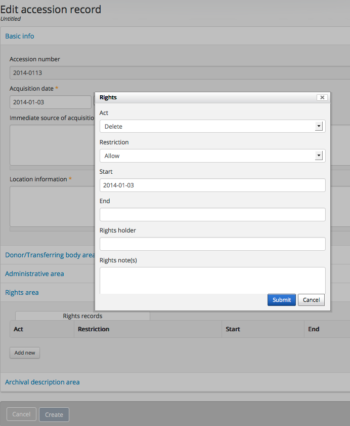

.. _rights:

======
Rights
======

.. |edit| image:: images/edit-sign.png
   :height: 18
   :width: 18

.. |plus| image:: images/plus-sign.png
   :height: 18
   :width: 18

As discussed in the section on :ref:`entity types <entity-types>`,
:term:`Rights records <rights record>` provide rights related restrictions
that can be linked to :term:`accession records <accession record>`,
:term:`archival descriptions <archival description>` and
:term:`digital objects <digital object>`. AtoM Rights metadata elements use
`PREMIS rights elements <http://www.loc.gov/standards/premis/>`__. In AtoM
restrictions can be based on Copyright(s), License, Statute(s) and Policy.
You can also include rights restrictions based on guidelines set by the
Donor of the records. Rights are inherited in AtoM, which means that rights
added at a higher level (e.g., fonds level) are inherited by the lower levels
(e.g., item level). If you add rights to an
:term:`accession record`, all
:term:`archival descriptions <archival description>` created from that
accession will inherit the same rights. If you add rights to an
:term:`archival description` at the :term:`fonds` or
:term:`collections <collection>` level, all lower levels (aka
:term:`child records <child record>`) such as the file or item-level will
inherit those rights.

Add a new rights record
=======================

This section describes how to add a new :term:`rights record` by using the
rights dialog provided through the add/edit template. You can add rights to
an existing record, or create a new record and add rights as you proceed. The
following instructions will cover both scenarios.

.. NOTE::

   You must be logged in and have the appropriate privileges, such as
   :term:`editors <editor>` and :term:`administrators <administrator>` to be
   able to add/edit content in AtoM, which includes creating a
   :term:`rights record`. See: :ref:`Log in <log-in>`.

.. _add-rights-accession:

Add rights to an Accession record
---------------------------------

**IF YOU ARE ADDING RIGHTS TO A NEW ACCESSION RECORD**

1. Navigate to the :term:`main menu` located in the :term:`header bar`, click
   the |plus| :ref:`"Add" <main-menu-add>` menu and select
   :term:`accession record` from the :term:`drop-down menu`. AtoM takes you to
   a blank :term:`edit page` for data entry for an :term:`accession record`.

.. image:: images/manage-accessions.*
   :align: center
   :width: 30%
   :alt: An image of the Manage menu

2. On loading, the :term:`edit page` displays the accession record with the
   first :term:`information area` open, Basic info.
3. You can begin entering information about your new accession. For more
   information on working with :term:`accession records <accession record>` in
   AtoM, see: :ref:`accession-records` When you are ready to add a related
   rights record to your new accession, proceed to **step 4**, below.

-------

**IF YOU ARE ADDING RIGHTS TO AN EXISTING ACCESSION RECORD**

1. Navigate to the :term:`accession record` you want to edit. You can do this
   via the :term:`main menu` in the AtoM :term:`header bar`, by clicking on
   **Manage > Accessions**. For more information on navigation in AtoM,
   see: :ref:`Access content <access-content>`.

.. image:: images/manage-accessions.*
   :align: center
   :width: 30%
   :alt: An image of the Manage menu

2. AtoM will redirect you to the accession record :ref:`browse page
   <page-type-browse>`. Select the record you want by clicking on the
   hyperlink Identifier. You can also search for an :term:`accession record`
   with the accession records :term:`search box` located at the bottom of the
   browse page. For more information on searching for :term:`accession records
   <accession record>` in AtoM, see: :ref:`Searching for accession records
   <dedicated-search-accessions>`.

.. image:: images/accession-search-wildcard.*
   :align: center
   :width: 65%
   :alt: An image of searching for an accession

3. When you have arrived at the record to which you wish to add rights, Click
   on the "Edit" button located in the :term:`button block` located at the
   bottom of the page to enter :term:`edit mode`; alternately, you can click
   on on of the :term:`information area` headers to open the :term:`edit page`
   directly in that section. Proceed to **step 4** below.

-------

4. To enter Rights information, scroll down the page until you see the
   :term:`information area` titled, "Rights area". If the section is collapsed,
   click on area header to expand and access the :term:`rights record` dialogue.

.. image:: images/rights-area.*
   :align: center
   :width: 75%
   :alt: An image of the Rights area in an accession record

5. Click on the "Add new" button and the default :term:`rights record`
   dialogue box will pop up.

   Rights record dialogue box in edit accession record page.

6. The "Act" data entry field is a drop-down list. You can select: Delete,
   Discover, Display, Disseminate, Migrate, Modify, and Replicate.

7. The "Restriction" data entry field provides two choices: Allow or
   Disallow.

8. You can add a Rights holder name, or select an existing one using the
   auto-complete action provided by AtoM.

9. You can add a Rights note, describing any additional information about the
   Rights holder that might not already exist in their Rights holder record.

10. The "Basis" data entry field is a drop-down list. You can select:
    Copyright, License, Statute, Policy, or Donor.

.. TIP::

   Depending upon your selection, the AtoM Right record dialogue may provide
   additonal data entry fields. Be sure you scroll down in the dialogue to
   see all of the available fields!

   .. figure:: images/rights-dialog-more-fields.*
      :align: center
      :figwidth: 60%
      :width: 100%
      :alt: Rights record dialogue box in edit accession record page

      In this example, a user has selected "Statute" as the Rights basis,
      and more fields have appeared in the rights dialog.

11. Once you complete adding information to the rights record, click on the
    blue Submit button and then click on the blue Create button to save the
    new accession record. If you have already created the accession record,
    and you are editing the rights information, you will click on the blue
    Save button.

.. image:: images/donor-dialog-submit.*
   :align: center
   :width: 65%
   :alt: An image of the submit button in the Rights dialog

.. _rights-archival-description:

Add rights to an Archival description
-------------------------------------

**TO ADD RIGHTS TO A NEW ARCHIVAL DESCRIPTION:**

1. Navigate to the :term:`main menu` located in the :term:`header bar`,
   click the |plus| :ref:`"Add" <main-menu-add>` menu and select
   :term:`archival description` from the :term:`drop-down menu`.

.. image:: images/add-description.*
   :align: center
   :width: 30%
   :alt: An image of the Add menu in the AtoM header bar

2. AtoM takes you to a blank :term:`edit page` for data entry for an
   :term:`archival description`.

.. image:: images/description-collapsed.*
   :align: center
   :width: 75%
   :alt: An image of a blank Archival description in the ISAD template

3. On loading, the :term:`edit page` displays the archival description with
   all the :term:`information areas <information area>`, closed. The name of
   the first :term:`information area` will vary according to the archival
   content standard you are using. In the example above, ISAD(G) is shown.
   You can begin entering information about your archival description. For
   more information on working with archival descriptions in AtoM, see:
   :ref:`archival-descriptions`. When you are ready to add rights to your new
   :term:`archival description`, proceed to **step 4** below.

-------

**TO ADD RIGHTS TO AN EXISTING ARCHIVAL DESCRIPTION:**

1. First, navigate to the :term:`archival description` you wish to edit. You
   can do this by :ref:`browsing <browse>` or :ref:`searching <search-atom>`
   for the :term:`archival description` - see :ref:`access-content` for more
   information on navigation in AtoM.

2. Switch from :term:`view mode` to :term:`edit mode` by clicking the
   :term:`"Edit" button <Edit button>` in the :term:`button block`, or by
   clicking on one of the :term:`information area` headings; this takes you
   to the record's :term:`edit page`.

.. image:: images/button-block-description.*
   :align: center
   :width: 75%
   :alt: An image of the button block on an archival description

3. On loading, the :term:`edit page` displays the record with all
   :term:`information areas <information area>` closed; click on an
   information area to access the :term:`fields <field>` grouped under it.
   You can edit any data as required; when you are ready to add a new rights
   statement to your :term:`archival description`, proceed to **step 4**
   below.

.. image:: images/description-collapsed.*
   :align: center
   :width: 75%
   :alt: An image of an Archival description in the ISAD template

-------

4. To enter Rights information, scroll down the page until you see the
   :term:`information area` titled, Rights area, click on it to access the
   :term:`rights record` dialogue.

.. image:: images/rights-area.*
   :align: center
   :width: 75%
   :alt: An image of the Rights area in an archival description

5. Click on the "Add new" button and the default :term:`rights record`
   dialogue box will pop up.

.. image:: images/rights-dialog.*
   :align: center
   :width: 55%
   :alt: An image of the Rights dialog

6. The "Act" data entry field is a drop-down list. You can select: Delete,
   Discover, Display, Disseminate, Migrate, Modify, and Replicate.

7. The "Restriction" data entry field provides two choices: Allow or
   Disallow.

8. You can add a new Rights holder name, or select an existing one using the
   auto-complete action provided by AtoM.

9. You can add a Rights note, describing any additional information about the
   Rights holder that might not already exist in their Rights holder record.

10. The "Basis" data entry field is a drop-down list. You can select:
    Copyright, License, Statute, Policy, or Donor.

.. TIP::

   Depending upon your selection, the AtoM Right record dialogue may provide
   additonal data entry fields. Be sure you scroll down in the dialogue to
   see all of the available fields!

   .. figure:: images/rights-dialog-more-fields.*
      :align: center
      :figwidth: 60%
      :width: 100%
      :alt: Rights record dialogue box in edit accession record page

      In this example, a user has selected "Statute" as the Rights basis,
      and more fields have appeared in the rights dialog.

11. Once you complete adding information to the rights record, click on the
    blue Submit button and then click on the blue Create button to save the
    new archival description. If you have already created the archival
    description, and you are editing the rights information, you will click
    on the blue Save button. Save the archival description as well.

.. image:: images/donor-dialog-submit.*
   :align: center
   :width: 65%
   :alt: An image of the submit button in the Rights dialog

12. In the example provided below, you are viewing the completed
    archival description and can see that a rights record (copyright) has
    been added.

.. figure:: images/recordrights.*
   :align: center
   :figwidth: 80%
   :width: 100%
   :alt: Disseminate rights added to an archival description

   Disseminate rights added to an archival description.

.. _rights-digital-object:

Add rights to a Digital object
------------------------------

1. If you have a :term:`digital object` (e.g., JPEG, PDF, MP3 etc.) associated
   with an :term:`archival description`, you can apply Rights information to a
   single digital object and / or its :term:`master <master digital object>`,
   :term:`reference copy <reference display copy>`, and :term:`thumbnail`
   versions. For more information on adding digital objects to archival
   descriptions, see: :ref:`upload-digital-object`.

2. After you have imported or linked a :term:`digital object` to an
   :term:`archival description`, click on the digital object metadata
   :term:`information area` header to edit (note: do not click on
   the edit button in the button block).

.. image:: images/digital-object-metadata-area.*
   :align: center
   :width: 75%
   :alt: An image of the digital object metadata area on a description

3. AtoM will open the digital object :term:`edit page` and present the
   :term:`Master <master digital object>`,
   :term:`Reference <reference display copy>` and :term:`Thumbnail` versions of
   the :term:`digital object`. Each version has its own Rights records module.
   To access the :term:`rights record` for each version, you must click on the
   "Add new" button and the :term:`rights record` dialogue box will pop up.

.. figure:: images/digitalobject-rights.*
   :align: center
   :figwidth: 75%
   :width: 100%
   :alt: Rights record dialogue box in the Edit digital object page

   Rights record dialogue box in the Edit digital object page.

4. In the example provided above, you are viewing the rights dialogue
   for the :term:`master <master digital object>` of a digital image.

5. The "Act" data entry field is a :term:`drop-down <drop-down menu>` list.
   You can select: Delete, Discover, Display, Disseminate, Migrate, Modify,
   and Replicate.

6. The "Restriction" data entry field provides two choices: Allow or
   Disallow.

7. You can add a Rights holder name, or select an existing one using the
   auto-complete action provided by AtoM.

8. You can add a Rights note, describing any additional information about the
   Rights holder that might not already exist in their Rights holder record.

9. The "Basis" data entry field is a drop-down list. You can select:
   Copyright, License, Statute, Policy, or Donor. Depending upon your
   selection, the AtoM Right record dialogue provides additonal data entry
   fields.

.. TIP::

   Depending upon your selection, the AtoM Right record dialogue may provide
   additonal data entry fields. Be sure you scroll down in the dialogue to
   see all of the available fields!

   .. figure:: images/rights-dialog-more-fields.*
      :align: center
      :figwidth: 60%
      :width: 100%
      :alt: Rights record dialogue box in edit accession record page

      In this example, a user has selected "Statute" as the Rights basis,
      and more fields have appeared in the rights dialog.

10. Once you complete adding information to the rights record, click on the
    blue Submit button. You will see that a rights record has been added to
    the reference representation.

.. image:: images/donor-dialog-submit.*
   :align: center
   :width: 65%
   :alt: An image of the submit button in the Rights dialog

11. Click on the save button at the bottom of the page. AtoM will take you to
    the archival description :term:`view page` and you can  see that a
    Digital object rights area has been added below the Digital object metadata
    section.

.. image:: images/digital-object-rights-view.*
   :align: center
   :width: 75%
   :alt: An image of the digital object rights area

Manage Rights holders records
-----------------------------

1. Users with :term:`editor` and :term:`administrator` access permissions can
   navigate to the :term:`main menu` located in the AtoM :term:`header bar` and
   click on the |edit| :ref:`Manage <main-menu-manage>` menu, then select
   Rights holders from the drop-down list. AtoM will take you to a browse page
   for Rights holders.

.. image:: images/manage-rightsholders.*
   :align: center
   :width: 30%
   :alt: An image of the Manage menu in the AtoM header bar

.. TIP::

   For general information on navigation in AtoM, see:
   :ref:`Access content <access-content>`. For general information on browse
   menus in AtoM, see: :ref:`browse`. See also our section on the
   :ref:`Manage menu <main-menu-manage>`

   An :term:`administrator` can also customize the elements that appear in
   the :ref:`main-menu` via **Admin > Menus**. For more information, see:
   :ref:`manage-menus`.

2. When you have arrived at the Rights holders records browse page, AtoM
   provides a dedicated search box for searching existing rights holders in the
   system. For more information on using the Rights holders dedicated search
   box, see: :ref:`dedicated-search-rights`. The list of rights holders can be
   browsed by "most recent" or "alphabetic" via the :ref:`recurring-sort-button`
   on the page.

.. image:: images/browse-rightsholders.*
   :align: center
   :width: 75%
   :alt: An image of the Rights holders browse page

3. If you click on the hyper-link name of a rights holder, AtoM takes you to
   the View rights holder page.

.. image:: images/rightsholder-view-page.*
   :align: center
   :width: 75%
   :alt: An image of a Rights holder view page

4. The View rights holder page lets the authorized user edit and delete the
   existing rights holder record, or add a new rights holder.

5. If you click on the edit button, AtoM takes you to the Edit rights holder
   template. There are two areas: the Identity area and the Contact area. In
   the Identity area there is one data entry field, authorized form of name.
   In the Contact area there is add new button, which allows you to add a new
   contact person. If you click on the add new button, AtoM opens a contact
   information dialogue with three tabs, Main, Physical location and Other
   details. Add as much information into the Related contact information
   dialogue and click on the Submit button.

.. image:: images/edit-rights-holder.*
   :align: center
   :width: 75%
   :alt: An image of editing a Rights holder record

6. Remember to click on the Save button at the bottom of the rights holder
   page to save all the new information you have added to the rights holder
   record. AtoM will reload the Rights holder record in :term:`view mode`.

.. image:: images/button-block-save.*
   :align: center
   :width: 65%
   :alt: An image of button block when in edit mode

7. If you click on the :term:`Delete button` located at the bottom of the
   Rights holder record when in :term:`view mode`, AtoM will ask you to confirm
   that you want to delete the Rights holder record. Click the "Delete" button
   to delete, or the "Cancel" button to return to Rights holder record
   :term:`view page`. If you click "Delete," the Rights holder record will be
   permanently deleted.

.. image:: images/rightsholder-delete-confirm.*
   :align: center
   :width: 75%
   :alt: An image of a deletion confirmation message on a Rights holder record

:ref:`Back to top <rights>`
