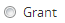

.. _edit-user-permissions:

================
Edit permissions
================

User permissions define levels of access to functions in AtoM, ranging from
view-only access to full administration rights. These :term:`access privileges
<access privilege>`, or *Permissions*, can be navigated by :ref:`user-roles`,
which are defined by "Groups" that an authenticated (i.e. logged-in)
:term:`administrator` can add and edit (see :ref:`manage-user-accounts`). When a
specific user is assigned to a "Group", he/she automatically inherits the
access privileges of that user group. However, administrators can also edit the
access privileges of a specific user if they wish. Each access privilege can
be edited either by **User** or by **Group**; the sections below have been
drafted in a way that reflects these options.

**Below you'll find instructions on how to:**

* :ref:`Default user permissions settings in AtoM <default-user-permissions>`

  * :ref:`Default access privileges <default-access-privileges>`
  * :ref:`Default user role <default-permissions-by-role>`

* :ref:`Setting permissions by archival description <description-permissions>`

  * :ref:`For a user <user-info-object-permissions>`
  * :ref:`For a group <group-description-permissions>`

* :ref:`Setting permissions by authority record <authority-record-permissions>`

  * :ref:`For a user <user-actor-permissions>`
  * :ref:`For a group <group-authority-record-permissions>`

* :ref:`Setting permissions by term and taxonomy <taxonomy-permissions>`

  * :ref:`For a user <user-taxonomy-permissions>`
  * :ref:`For a group <group-taxonomy-permissions>`

* :ref:`Setting permissions by archival institution <institution-permissions>`

  * :ref:`For a user <user-institution-permissions>`
  * :ref:`For a group <group-institution-permissions>`

* :ref:`Remove specific user or group permissions <remove-user-group-permissions>`

.. seealso::

   * :ref:`manage-user-accounts`
   * :ref:`user-roles`

.. _default-user-permissions:

Default user permissions settings in AtoM
=========================================

When a new user or user group is created in AtoM, they are automatically
assigned default user permission settings. These permissions will affect the way
they can view, edit, and interact with different :doc:`Entity types
<../overview/entity-types>` in the system: for example, by default, a
:term:`researcher` or public user of the system can only Read archival
descriptions, authority records, archival institutions and terms. In AtoM,
default user permissions consist of both default :ref:`access privileges
<default-access-privileges>` and default :ref:`permissions based on user roles
<default-permissions-by-role>`: in the previous example, "Read" is the access
privilege and the "Researcher" is the user role. These permissions can only be
edited (i.e. Granted or Denied) by an authenticated (i.e. logged-in)
:term:`administrator`.

.. _default-access-privileges:

Default access privileges
-------------------------

An authenticated (i.e. logged-in)
:term:`administrator` can view and edit :term:`access privileges <access
privilege>` of either a group or a user by navigating between 4 different
:term:`permissions tabs <permissions tab>`:

* :ref:`Archival description permissions <description-default-actions>`
* :ref:`Authority record permissions <authority-default-actions>`
* :ref:`Taxonomy permissions <taxonomy-default-actions>`
* :ref:`Archival institution permissions <institution-default-actions>`

Clicking on a specific :term:`permissions tab` will direct you to the
:term:`view page` of that permission, where the :term:`access privileges <access
privilege>` for that permission will be displayed under a :term:`field` labeled
as *Action*. An authenticated (i.e. logged-in) :term:`administrator` can edit
access privileges by switching from :term:`view mode` to :term:`edit mode`;
simply click the :term:`"Edit" button <Edit button>` in the :term:`button
block`.

.. NOTE::

   An authenticated (i.e. logged-in) :term:`administrator` must be in
   :term:`edit mode` in order to be able to view and edit *all* :term:`access
   privileges <access privilege>` that are available for a specific
   :term:`permissions tab` In :term:`view mode`, only those actions which
   are not indicated as "Inherit", or in default, will be displayed.

Access privileges, or *Actions* will vary according to the permission type (i.e.
the :term:`permissions tab`) that has been selected. Because each permission
type has a different list of default *Actions*, permission-specific instructions
have been included below.

.. IMPORTANT::

   By default, **all** users can view the :term:`master digital object` of an
   uploaded PDF, regardless of the "View master" settings in the Archival
   description permissions tab. This is because the reference display copy is
   not large enough to be useful without access to the full PDF, while the
   reference copy might be perfectly serviceable for an image (and restricting
   access to the master may be part of the required copyright conditions).
   Note that users could still restrict public access to uploaded PDFs using
   the PREMIS actionable rights module - for more information, see:
   :ref:`rights`.

.. _description-default-actions:

Archival description privileges
^^^^^^^^^^^^^^^^^^^^^^^^^^^^^^^

.. image:: images/description-actions.*
   :align: right
   :width: 25%
   :alt: An image of default actions in Archival description permissions

The "Archival description permissions" :term:`tab <permissions tab>` will
display the specific :term:`access privileges <access privilege>` that can be
maintained for users interacting with an :term:`archival institution's <archival
institution>` :term:`archival descriptions <archival description>`. Specific
privileges can be set with regards to reading, creating, updating, deleting,
viewing drafts, publishing, accessing master copies and/or accessing reference
copies of either *all* archival descriptions, specific archival descriptions, or
*all* archival descriptions of a specific institution.

.. NOTE::

   In order to fully test the option of setting specific :term:`access
   privileges <access privilege>` for *all* :term:`archival descriptions
   <archival description>` linked to a specific :term:`archival institution`,
   you should have two or more archival institutions in your system, with
   several hierarchical descriptions attached and some digital objects uploaded.

A authenticated (i.e. logged-in) :term:`administrator` can **Grant** or **Deny**
a user's access privileges to a specific *Action*, or administrators can rely on
the default permissions as they are established by AtoM by selecting a default
user "Group". For more information on default access settings, see:
:ref:`below <default-permissions-by-role>`.

.. _authority-default-actions:

Authority record privileges
^^^^^^^^^^^^^^^^^^^^^^^^^^^

.. image:: images/authority-actions.*
   :align: right
   :width: 25%
   :alt: An image of default actions in Authority record permissions

The "Authority record permissions" :term:`tab <permissions tab>` will display
the specific :term:`access privileges <access privilege>` that can be maintained
for users interacting with an :term:`archival institution's <archival
institution>` :term:`authority records <authority record>`. Specific privileges
can be set with regards to reading, creating, updating, and deleting either
*all* authority records or specific authority records
belonging to an archival institution. A authenticated (i.e. logged-in)
:term:`administrator` can **Grant** or **Deny** a user's access privileges to a
specific *Action*, or administrators can rely on the default permissions as
they are established by AtoM by selecting a default user "Group". For more
information on default access settings, see: :ref:`below
<default-permissions-by-role>`.

.. _taxonomy-default-actions:

Taxonomy privileges
^^^^^^^^^^^^^^^^^^^

.. image:: images/taxonomy-actions.*
   :align: right
   :width: 25%
   :alt: An image of default actions in Taxonomy permissions

The "Taxonomy permissions" :term:`tab <permissions tab>` will display the
specific :term:`access privileges <access privilege>` that can be maintained for
users interacting with :term:`terms <term>` and :term:`taxonomies <taxonomy>`.
Specific privileges can be set with regards to creating, updating, and deleting
either *all* terms, or specific taxonomies. A authenticated (i.e. logged-in)
:term:`administrator` can **Grant** or **Deny** a user's access privileges to
a specific *Action*, or administrators can rely on the default permissions as
they are established by AtoM by selecting a default user "Group". For more
information on default access settings, see: :ref:`below
<default-permissions-by-role>`.

.. _institution-default-actions:

Archival institution privileges
^^^^^^^^^^^^^^^^^^^^^^^^^^^^^^^

.. image:: images/institution-actions.*
   :align: right
   :width: 25%
   :alt: An image of default actions in Archival institution permissions

.. NOTE::

   In order to fully test the scenarios in this section, you should have two or
   more archival institutions in your system, with several hierarchical
   descriptions attached and some digital objects uploaded.

The "Archival institution permissions" :term:`tab <permissions tab>` will
display the specific :term:`access privileges <access privilege>` that can be
maintained for users interacting with an :term:`archival institution's <archival
institution>` settings. Specific privileges can be set with regards to reading,
creating, updating, and deleting the settings for either *all* the archival
institutions linked to one system, or a specific archival institution linked to
one system. A authenticated (i.e. logged-in) :term:`administrator` can **Grant**
or **Deny** a user's access privileges to a specific *Action*, or administrators
can rely on the default permissions as they are established by AtoM by selecting
a default user "Group". For more information on default access settings, see:
:ref:`below <default-permissions-by-role>`.

:ref:`Back to top <edit-user-permissions>`

.. _default-permissions-by-role:

Default permissions by user role
--------------------------------

When creating a new user in AtoM, the user account can be tied to one of 5
default "User groups":

* :ref:`Researcher <researcher-default>`
* :ref:`Administrator <administrator-default>`
* :ref:`Editor <editor-default>`
* :ref:`Contributor <contributor-default>`
* :ref:`Translator <translator-default>`

Each user group contains default :term:`access privileges <access privilege>`,
or *Actions* that define levels of access to functions in AtoM, ranging from
view-only access to full administration rights. Each *Action* includes the
option to select one of the following three :term:`access privileges
<access privilege>`, or *Permission*, displayed as radio buttons:

* Grant |grant|
* Deny |deny|
* Inherit |inherit|

Access privileges, or *Actions* will vary according to the permission type
(i.e. the :term:`permissions tab`) that has been selected. Because each
permission type has a different list of default *Permissions*,
this section lists permission-specific instructions have been included below.

.. NOTE::

   Default permission settings will be displayed in 2 ways in AtoM: when viewing
   permission settings in :term:`edit mode`, "Inherit" |inherit-select| will
   automatically be selected when the default setting has been chosen by an
   :term:`administrator` for a specific action; when viewing permission settings
   in :term:`view mode`, AtoM will simply display a dash |dash| in place of
   "Inherit" when the default setting has been chosen by an
   :term:`administrator` for a specific action.

For more information on user roles, see: :ref:`user-roles`.

.. _researcher-default:

Default settings: Anonymous
^^^^^^^^^^^^^^^^^^^^^^^^^^^

An anonymous user, also known as a :term:`researcher`, is any user who is not
logged-in (a.k.a an unauthenticated user) and therefore has view-only access
to the application. A researcher can search and browse descriptions (published
:term:`archival descriptions <archival description>`,
:term:`authority records <authority record>`,
:term:`archival institutions <archival institution>`) and access points such
as :term:`subjects <subject>` and :term:`places <place>`.

By default, an anonymous user **cannot** access the
:term:`master digital object` - except for PDFs, where permission is
automatically granted to all users. Note that the default settings can be
changed by an :term:`administrator`.

*Archival descriptions*

+-------------------+---------------+
| **Permissions**   |  **Granted?** |
+===================+===============+
| Read              |       Yes     |
+-------------------+---------------+
| Create            |       No      |
+-------------------+---------------+
| Update            |       No      |
+-------------------+---------------+
| Delete            |       No      |
+-------------------+---------------+
| View Draft        |       No      |
+-------------------+---------------+
| Publish           |       No      |
+-------------------+---------------+
| Access Manager    |       No      |
+-------------------+---------------+
| Access Reference  |       Yes     |
+-------------------+---------------+
| Translate         |       No      |
+-------------------+---------------+

*Authority records*

+-------------------+---------------+
| **Permissions**   |  **Granted?** |
+===================+===============+
| Read              |       Yes     |
+-------------------+---------------+
| Create            |       No      |
+-------------------+---------------+
| Update            |       No      |
+-------------------+---------------+
| Delete            |       No      |
+-------------------+---------------+
| Translate         |       No      |
+-------------------+---------------+

*Taxonomy*

+-------------------+---------------+
| **Permissions**   |  **Granted?** |
+===================+===============+
| Read              |       Yes     |
+-------------------+---------------+
| Create            |       No      |
+-------------------+---------------+
| Update            |       No      |
+-------------------+---------------+
| Delete            |       No      |
+-------------------+---------------+
| Translate         |       No      |
+-------------------+---------------+

*Archival institutions*

+-------------------+---------------+
| **Permissions**   |  **Granted?** |
+===================+===============+
| Read              |       Yes     |
+-------------------+---------------+
| Create            |       No      |
+-------------------+---------------+
| Update            |       No      |
+-------------------+---------------+
| Delete            |       No      |
+-------------------+---------------+
| Translate         |       No      |
+-------------------+---------------+

Creating a new user, or a new user group of "Researchers" will automatically
assign the above default :term:`access privileges <access privilege>` to that
group. However, the access privileges of individual users in that user group
can still be edited without it altering the overall privileges of that group
as a whole.

.. _administrator-default:

Default settings: Administrator
^^^^^^^^^^^^^^^^^^^^^^^^^^^^^^^

An :term:`administrator` is a type of user who has a wide range of :term:`access
privileges <access privilege>` in AtoM; by default, they are also granted
permission for almost all access privileges. They can install or uninstall AtoM,
and import, export, create, read, update, publish, and delete any record in the
system. Administrators can customize AtoM to institution-specific requirements
or themes (e.g.: change or edit the theme for a :term:`repository`), set upload
limits, and can manage :term:`user accounts <user account>` and :term:`profiles
<user profile>` for both groups and individual users. They can also create new
user roles, set granular permissions for that role, and then assign or unassign
users from the new role. For more information on creating a new user role, see
:ref:`Add a new group <add-group>`.

*Archival descriptions*

+-------------------+---------------+
| **Permissions**   |  **Granted?** |
+===================+===============+
| Read              |       Yes     |
+-------------------+---------------+
| Create            |       Yes     |
+-------------------+---------------+
| Update            |       Yes     |
+-------------------+---------------+
| Delete            |       Yes     |
+-------------------+---------------+
| View Draft        |       Yes     |
+-------------------+---------------+
| Publish           |       Yes     |
+-------------------+---------------+
| Access Manager    |       Yes     |
+-------------------+---------------+
| Access Reference  |       Yes     |
+-------------------+---------------+
| Translate         |       No      |
+-------------------+---------------+

*Authority records*

+-------------------+---------------+
| **Permissions**   |  **Granted?** |
+===================+===============+
| Read              |       Yes     |
+-------------------+---------------+
| Create            |       Yes     |
+-------------------+---------------+
| Update            |       Yes     |
+-------------------+---------------+
| Delete            |       Yes     |
+-------------------+---------------+
| Translate         |      No       |
+-------------------+---------------+

*Taxonomy*

+-------------------+---------------+
| **Permissions**   |  **Granted?** |
+===================+===============+
| Read              |       Yes     |
+-------------------+---------------+
| Create            |       Yes     |
+-------------------+---------------+
| Update            |       Yes     |
+-------------------+---------------+
| Delete            |       Yes     |
+-------------------+---------------+
| Translate         |       No      |
+-------------------+---------------+

*Archival institutions*

+-------------------+---------------+
| **Permissions**   |  **Granted?** |
+===================+===============+
| Read              |       Yes     |
+-------------------+---------------+
| Create            |       Yes     |
+-------------------+---------------+
| Update            |       Yes     |
+-------------------+---------------+
| Delete            |       Yes     |
+-------------------+---------------+
| Translate         |       No      |
+-------------------+---------------+

Adding a new user to the "Administrators" group will automatically assign the
above default :term:`access privileges <access privilege>` to that group. However,
the access privileges of individual users,in that user group can still be
edited without it altering the overall privileges of that group as a whole,
and an administrator can edit the default permissions of the administrator
group if desired.

.. _editor-default:

Default settings: Editor
^^^^^^^^^^^^^^^^^^^^^^^^

By default an editor can search, browse, create, edit/update, view draft, delete
and export descriptions and edit :term:`controlled vocabulary`
:term:`terms <term>`. However, editors do not have access to the administror
tab. An editor can change the :term:`publication status` of an
:term:`information object`. An editor can access the :term:`reference
<reference display copy>` and :term:`master digital object`.

*Archival descriptions*

+-------------------+---------------+
| **Permissions**   |  **Granted?** |
+===================+===============+
| Read              |       Yes     |
+-------------------+---------------+
| Create            |       Yes     |
+-------------------+---------------+
| Update            |       Yes     |
+-------------------+---------------+
| Delete            |       Yes     |
+-------------------+---------------+
| View Draft        |       Yes     |
+-------------------+---------------+
| Publish           |       Yes     |
+-------------------+---------------+
| Access Manager    |       Yes     |
+-------------------+---------------+
| Access Reference  |       Yes     |
+-------------------+---------------+
| Translate         |       No      |
+-------------------+---------------+

*Authority records*

+-------------------+---------------+
| **Permissions**   |  **Granted?** |
+===================+===============+
| Read              |       Yes     |
+-------------------+---------------+
| Create            |       Yes     |
+-------------------+---------------+
| Update            |       Yes     |
+-------------------+---------------+
| Delete            |       Yes     |
+-------------------+---------------+
| Translate         |       No      |
+-------------------+---------------+

*Taxonomy*

+-------------------+---------------+
| **Permissions**   |  **Granted?** |
+===================+===============+
| Read              |       Yes     |
+-------------------+---------------+
| Create            |       Yes     |
+-------------------+---------------+
| Update            |       Yes     |
+-------------------+---------------+
| Delete            |       Yes     |
+-------------------+---------------+
| Translate         |       No      |
+-------------------+---------------+

*Archival institutions*

+-------------------+---------------+
| **Permissions**   |  **Granted?** |
+===================+===============+
| Read              |       Yes     |
+-------------------+---------------+
| Create            |       Yes     |
+-------------------+---------------+
| Update            |       Yes     |
+-------------------+---------------+
| Delete            |       Yes     |
+-------------------+---------------+
| Translate         |       No      |
+-------------------+---------------+

Creating a user group of "Editors" will automatically assign the above
default :term:`access privileges <access privilege>` to that group. However,
the access privileges of individual users in that user group can still be
edited without it altering the overall privileges of that group as a whole.

.. _contributor-default:

Default settings: Contributor
^^^^^^^^^^^^^^^^^^^^^^^^^^^^^

By default a :term:`contributor` can search, browse, create, edit/update, view
draft and export descriptions (published :term:`archival descriptions
<archival description>`, :term:`authority records <authority record>`,
:term:`archival institutions <archival institution>`). The contributor
cannot change the :term:`publication status` of an :term:`information object`. A
contributor can access the :term:`reference <reference display copy>` and
:term:`master digital object`.

*Archival descriptions*

+-------------------+---------------+
| **Permissions**   |  **Granted?** |
+===================+===============+
| Read              |       Yes     |
+-------------------+---------------+
| Create            |       Yes     |
+-------------------+---------------+
| Update            |       Yes     |
+-------------------+---------------+
| Delete            |       No      |
+-------------------+---------------+
| View Draft        |       Yes     |
+-------------------+---------------+
| Publish           |       No      |
+-------------------+---------------+
| Access Manager    |       Yes     |
+-------------------+---------------+
| Access Reference  |       Yes     |
+-------------------+---------------+
| Translate         |       No      |
+-------------------+---------------+

*Authority records*

+-------------------+---------------+
| **Permissions**   |  **Granted?** |
+===================+===============+
| Read              |       Yes     |
+-------------------+---------------+
| Create            |       Yes     |
+-------------------+---------------+
| Update            |       Yes     |
+-------------------+---------------+
| Delete            |       No      |
+-------------------+---------------+
| Translate         |       No      |
+-------------------+---------------+

*Taxonomy*

+-------------------+---------------+
| **Permissions**   |  **Granted?** |
+===================+===============+
| Read              |       Yes     |
+-------------------+---------------+
| Create            |       No      |
+-------------------+---------------+
| Update            |       No      |
+-------------------+---------------+
| Delete            |       No      |
+-------------------+---------------+
| Translate         |       No      |
+-------------------+---------------+

*Archival institutions*

+-------------------+---------------+
| **Permissions**   |  **Granted?** |
+===================+===============+
| Read              |       Yes     |
+-------------------+---------------+
| Create            |       No      |
+-------------------+---------------+
| Update            |       No      |
+-------------------+---------------+
| Delete            |       No      |
+-------------------+---------------+
| Translate         |       No      |
+-------------------+---------------+

Creating a user group of "Editors" will automatically assign the above
default :term:`access privileges <access privilege>` to that group. However,
the access privileges of individual users in that user group can still be
edited without it altering the overall privileges of that group as a whole.

.. _translator-default:

Default settings: Translator
^^^^^^^^^^^^^^^^^^^^^^^^^^^^

Unlike other user types, a translator is a type of user who has permission to
edit the content in your AtoM system. Their :term:`access privileges <access
privilege>`, however, are limited to translating and viewing records. A
translator can search and browse :term:`published <published record>`
descriptions and can translate :term:`user interface` elements and
:term:`database content`.

A translator should be able to view :term:`draft descriptions <draft record>`,
but not edit them.

*Archival descriptions*

+-------------------+---------------+
| **Permissions**   |  **Granted?** |
+===================+===============+
| Read              |       Yes     |
+-------------------+---------------+
| Create            |       No      |
+-------------------+---------------+
| Update            |       No      |
+-------------------+---------------+
| Delete            |       No      |
+-------------------+---------------+
| View Draft        |       No      |
+-------------------+---------------+
| Publish           |       No      |
+-------------------+---------------+
| Access Manager    |       No      |
+-------------------+---------------+
| Access Reference  |       Yes     |
+-------------------+---------------+
| Translate         |       Yes     |
+-------------------+---------------+

*Authority records*

+-------------------+---------------+
| **Permissions**   |  **Granted?** |
+===================+===============+
| Read              |       Yes     |
+-------------------+---------------+
| Create            |       No      |
+-------------------+---------------+
| Update            |       No      |
+-------------------+---------------+
| Delete            |       No      |
+-------------------+---------------+
| Translate         |       Yes     |
+-------------------+---------------+

*Taxonomy*

+-------------------+---------------+
| **Permissions**   |  **Granted?** |
+===================+===============+
| Read              |       Yes     |
+-------------------+---------------+
| Create            |       No      |
+-------------------+---------------+
| Update            |       No      |
+-------------------+---------------+
| Delete            |       No      |
+-------------------+---------------+
| Translate         |       Yes     |
+-------------------+---------------+

*Archival institutions*

+-------------------+---------------+
| **Permissions**   |  **Granted?** |
+===================+===============+
| Read              |       Yes     |
+-------------------+---------------+
| Create            |       No      |
+-------------------+---------------+
| Update            |       No      |
+-------------------+---------------+
| Delete            |       No      |
+-------------------+---------------+
| Translate         |       Yes     |
+-------------------+---------------+

Creating a user group of "Translators" will automatically assign the above
default :term:`access privileges <access privilege>` to that group. However,
the access privileges of individual users in that user group can still be
edited without it altering the overall privileges of that group as a whole.

:ref:`Back to top <edit-user-permissions>`

.. _description-permissions:

Setting permissions by archival description
===========================================

:term:`Access privileges <access privilege>` for :term:`archival descriptions
<archival description>` and :term:`archival institutions <archival institution>`
can be edited according to both users and groups;
they can be granted, denied, or :term:`administrators <administrator>` can rely
on the default (i.e."Inherit") setting as set by AtoM. Specific permissions can
be set for *all* archival descriptions, or edited based on specific archival
descriptions and/or archival institutions.

.. IMPORTANT::

   Only an authenticated (i.e. logged-in) :term:`administrator` can modify a
   user's or a group's :term:`access privileges <access privilege>` or
   *Permissions*. After the desired changes have been made, the administrator
   can log out and log back in as that specific user in order to verify the
   results of the modifications.

For more information, jump to the following sections:
  * :ref:`Edit permissions for a user <user-info-object-permissions>`
  * :ref:`Edit permissions for a group <group-description-permissions>`

.. _user-info-object-permissions:

Edit archival description permissions by user
---------------------------------------------

You may want to edit a specific user's access privilege with regards to
archival descriptions: for example, you may wish to give a user the ability to
translate to specified language; or in a multi-repository, you may want to
enable a user to create, update, edit, delete and publish only *one* archival
description belonging to the archival institution. Follow the instructions below
to edit user permissions by archival description.

.. NOTE::

   When navigating AtoM by user profiles, the "Archival description permissions"
   :term:`tab <permissions tab>` will appear as an "Information object
   permissions" tab.

.. |gears| image:: images/gears.png
   :height: 18
   :width: 18

1. First, navigate to an existing user in AtoM. You can do this by clicking the
   |gears| :ref:`Admin <main-menu-admin>` menu in the :term:`main menu` located
   in the :term:`header bar` and selecting "Users" from the
   :term:`drop-down menu`. This will take you to a list of
   current users accounts (i.e. the "List users" page).
2. By default, the list that appears will be of all "Active" users (i.e. "Show
   Active only"). Select whether you wish to view "Active" users or "Inactive"
   users (i.e. "Show Inactive only"). All :term:`usernames <username>` will
   appear in alphabetical order.
3. You can find the user you wish to edit by using the "Search users" box
   located at the top of the "List users" page, or by navigating through the
   list by scrolling to the bottom of the page and clicking through the page
   numbers. Click on the user's user name to be redirected to that
   :term:`user's profile <user profile>` :term:`view page`.
4. By clicking on the "Information object permissions" :term:`information area`,
   you will be directed to the :term:`permissions tab` :term:`view page` where
   the "Archival description permissions" for that particular user will be
   displayed.
5. To edit user permissions, click the :term:`"Edit" button <Edit button>` in
   the :term:`button block`. On loading, the :term:`edit page` will display the
   :ref:`Actions <description-default-actions>` and :ref:`Permissions
   <default-permissions-by-role>` for that user with regards to *All archival
   descriptions* belonging to your archival institution. *Permissions* can
   be edited (i.e. **Grant** or **Deny**) as required.

   If you wish to **only** edit the user's permissions for *All archival
   descriptions*, please skip steps 6 through 9 and **proceed to step 10**.

.. NOTE::

   Changes made in the "Permissions for all archival description"
   :term:`information area` will be applied to *all* archival descriptions
   belonging to your institution. Follow **steps 6 through 9** below if you wish
   to edit a user's :term:`access privileges <access privilege>` based on a
   specific :term:`archival description <archival description>` and/or
   :term:`archival institution <archival institution>`.

6. A user's :term:`access privileges <access privilege>` can also be edited
   according to a specific *archival description* or *archival institution*. To
   do this, click on either the "Permissions by archival description"
   or "Permisisons by archival institution" :term:`information area` to access
   the :term:`fields <field>` under them.
7. To specify a user's access privileges for one or
   more specific :term:`archival descriptions <archival description>`, click on
   "Add archival description".

   To specify a user's access privileges for one or
   more specific :term:`archival institutions <archival institution>`, click on
   "Add archival institution".

.. IMPORTANT::

   To limit a user's access privileges to one or more specific archival
   institutions, the user must **not** be in one of the predefined user groups
   (i.e. editor or contributor). Instead, ensure that the user's group is listed
   as *authenticated*.

8. A separate window will appear. An :term:`archival description` can be added
   via a :term:`value list` that appears in a :term:`drop-down menu` - as you
   type, the value list will narrow its options to present related suggestions.

   An :term:`archival institution` can be added via the same means, under the
   "Permissions by archival institution" :term:`information area`.
9. Once you've added an *archival description* or an *archival institution*, the
   page will load the :ref:`default *Actions* and *Permissions*
   <description-default-actions>` for that user with regards to the archival
   description or the archival institution you have selected. Permissions can be
   edited as required.

.. NOTE::

   In order to fully test the scenarios in this section, you should have two or
   more :term:`archival institutions <archival institution>` in your system,
   with several hierarchical
   :term:`descriptions <archival description>` attached and some digital objects
   uploaded.

10. You can quit the process at any time by clicking the "Cancel" button
    in the :term:`button block`; any changes made will not be saved. Note that
    simply navigating away from the page by any other means, **without first
    clicking "Save"** will also result in no changes being saved to the user
    profile.
11. To save your edits, click the "Save" button located in the :term:`button
    block`.

You will be redirected to the :term:`view page` for the edited user where
you can review your work.

.. _group-description-permissions:

Edit archival description permissions by group
----------------------------------------------

You may want to edit a specific group's access privilege with regards to
archival descriptions: for example, you may wish to give a group the ability to
*only* Read the archival descriptions of your institution; or in a multi-
repository, you may want to update only the archival descriptions belonging to
one specific archival institution. Follow the instructions below to edit group
permissions by archival description.

1. Navigate to an existing group in AtoM. You can do this by clicking the
   |gears| :ref:`Admin <main-menu-admin>` menu in the :term:`main menu` located
   in the :term:`header bar` and selecting "Groups" from the
   :term:`drop-down menu`. This will take you to a list of current user groups.
2. Select a group from the list that appears on the page by clicking on the
   group name. AtoM will direct you to that user group's :term:`view page`.
3. Click on the "Archival description permissions" :term:`information area`.
   AtoM will direct you to the "Archival description permissions" :term:`view
   page`.
4. To switch from :term:`view mode` to :term:`edit mode`, click the
   :term:`"Edit" button <Edit button>` in the :term:`button block`; this takes
   you to the group's :term:`edit page` for this :term:`access privilege`.
5. On loading, the :term:`edit page` will display the default *Actions* and
   *Permissions* for that group as "Inherit" for *All archival descriptions*
   belonging to your archival institution. *Permissions* can be edited (i.e.
   **Grant** or **Deny**) as required.

   If you wish to **only** edit the group's permissions for *All archival
   descriptions*, please skip steps 6 through 9 and **proceed to step 10**.

.. NOTE::

   Changes made in the "Permissions for all archival description"
   :term:`information area` will be applied to *all* archival descriptions
   belonging to your institution. Follow **steps 6 through 9** below if you wish
   to edit a group's :term:`access privileges <access privilege>` based on a
   specific :term:`archival description <archival description>` and/or
   :term:`archival institution <archival institution>`.

6. A group's :term:`access privileges <access privilege>` can also be edited
   according to a specific *archival description* or *archival institution*. To
   do this, click on either the "Permissions by archival description"
   or the "Permisisons by archival institution" :term:`information area` to
   access the :term:`fields <field>` under them.

.. IMPORTANT::

   To limit a group's access privileges to one or more specific archival
   institutions, you need to create a **new group** (or edit an exisiting custom
   group), rather than edit one of the default user groups (e.g. editor or
   contributor). See: :ref:`add-group`

7. To specify a group's access privileges for one or
   more specific :term:`archival descriptions <archival description>`, click on
   "Add archival description".

   To specify a group's access privileges for one or
   more specific :term:`archival institutions <archival institution>`, click on
   "Add archival institution".
8. A separate window will appear. An :term:`archival description` can be added
   via a :term:`value list` that appears in a :term:`drop-down menu` - as you
   type, the value list will narrow its options to present related suggestions.

   An :term:`archival institution` can be added via the same means, under the
   "Permissions by archival institution" :term:`information area`.
9. Once you've added an *archival description* or an *archival institution*, the
   page will load the default *Actions* and *Permissions* (i.e. "Inherit")
   for that user with regards to the archival description or
   the archival institution you have selected. *Permissions* can be edited as
   required.

.. NOTE::

   In order to fully test the scenarios in this section, you should have two or
   more :term:`archival institutions <archival institution>` in your system,
   with several hierarchical :term:`descriptions <archival description>`
   attached and some digital objects uploaded.

10. You can quit the process at any time by clicking the "Cancel" button
    in the :term:`button block`; any changes made will not be saved. Note that
    simply navigating away from the page by any other means, **without first
    clicking "Save"** will also result in no changes being saved to the group
    profile.
11. To save your edits, click the "Save" button located in the :term:`button
    block`.

You will be redirected to the :term:`view page` for the edited group where
you can review your work.

:ref:`Back to top <edit-user-permissions>`

.. _authority-record-permissions:

Setting permissions by authority record
=======================================

In AtoM, :term:`authority records <authority record>` are collections of
information about actors - corporate bodies, persons, or families - who interact
with archival materials. By default, only an authenticated (i.e. logged-in)
:term:`administrator` or :term:`editor` can fully edit authority records.
:term:`Access privileges <access privilege>` for other users or groups with
regards to authority records, such as reading, creating, updating and
deleting authority records, can be edited according to both users and
groups; they can be granted, denied, or administrators can choose to rely on
the default (i.e."Inherit") setting as set by AtoM. Specific permissions can be
set for *all* authority records, or edited based on a specific authority record.

.. IMPORTANT::

   Only an authenticated (i.e. logged-in) :term:`administrator` can modify a
   user's or a group's :term:`access privileges <access privilege>` or
   *Permissions*. After the desired changes have been made, the administrator
   can log out and log back in as that specific user in order to verify the
   results of the modifications.

For more information, jump to the following sections:
  * :ref:`Edit permissions for a user <user-actor-permissions>`
  * :ref:`Edit permissions for a group <group-authority-record-permissions>`

For more information on authority records, see :ref:`authority-records`

.. _user-actor-permissions:

Edit authority record permissions by user
-----------------------------------------

You may want to edit a specific user's :term:`access privileges <access
privilege>` with regards to :term:`authority records <authority record>`: for
example, you may wish to remove a user's ability to Create authority records for
your institution; or you may want to enable a user to create, update, edit,
delete only *one* authority record belonging to the archival institution. Follow
the instructions below to edit user permissions by authority record.

.. NOTE::

   When navigating AtoM by user profiles, the "Authority record permissions"
   :term:`tab <permissions tab>` will appear as an "Actor permissions" tab, but
   will default back to "Permissions for all authority record" when in
   :term:`edit mode`.

1. First, navigate to an existing user in AtoM. Do this by clicking the
   |gears| :ref:`Admin <main-menu-admin>` menu in the :term:`main menu` located
   in the :term:`header bar`. Select "Users" from the
   :term:`drop-down menu`. This will take you to a list of
   current users accounts (i.e. the "List users" page).
2. By default, the list that appears will be of all "Active" users (i.e. "Show
   Active only"). Select whether you wish to view "Active" users or "Inactive"
   users (i.e. "Show Inactive only"). All :term:`usernames <username>` will
   appear in alphabetical order.
3. Find the user you wish to edit by either using the "Search users" box or by
   navigating through the list of users by clicking through the page numbers
   located at the bottom of the page. Click on the :term:`username` of the user
   you wish to edit to be directed to that :term:`user's profile <user profile>`
   :term:`view page`.
4. Click on the "Actor permissions" :term:`information area`.
   AtoM will direct you to the "Actor permissions" :term:`view page`.
5. To switch from :term:`view mode` to :term:`edit mode`, click the
   :term:`"Edit" button <Edit button>` in the :term:`button block`; this takes
   you to the user's :term:`edit page` for this :term:`access privilege`.
6. On loading, the :term:`edit page` will display the
   :ref:`Actions <authority-default-actions>` and :ref:`Permissions
   <default-permissions-by-role>` for that user for *All authority record*
   belonging to your archival institution. *Permissions* can be edited
   (i.e. **Grant** or **Deny**) as required.

   If you wish to **only** edit the user's permissions for *All authority
   record*, please skip steps 7 through 9 and **proceed to step 10**.

.. NOTE::

   Changes made in the "Permissions for all authority record"
   :term:`information area` will be applied to *all* authority records
   under to your institution. Follow **steps 7 through 9** below if you wish
   to edit a user's :term:`access privileges <access privilege>` based on a
   specific :term:`authority record`.

7. A user's :term:`access privileges <access privilege>` can also be edited
   according to a specific *authority record*. To do this, click on "Add
   authority record" under the "Add permissions by authority record"
   :term:`information area`.
8. A separate window will appear. One or more :term:`authority records
   <authority record>` can be added via a
   :term:`value list` that appears in a :term:`drop-down menu` - as you type,
   the value list will narrow its options to present related suggestions.
9. Once you've added an authority record, the page will load the default
   *Actions* and *Permissions* (i.e. "Inherit") for that user with regards to
   the authority record you have selected. *Permissions* can be edited as
   required.

.. NOTE::

   In order to fully test the scenarios in this section, you should have two or
   more :term:`authority records <authority record>` in your system.

10. You can quit the process at any time by clicking the "Cancel" button
    in the :term:`button block`; any changes made will not be saved. Note that
    simply navigating away from the page by any other means, **without first
    clicking "Save"** will also result in no changes being saved to the user
    profile.
11. To save your edits, click the "Save" button located in the :term:`button
    block`.

You will be redirected to the :term:`view page` for the edited user where
you can review your work.

.. _group-authority-record-permissions:

Edit authority record permissions by group
------------------------------------------

You may wish to edit a group's :term:`access privileges <access privilege>` with
regards to :term:`authority records <authority record>`: for example, you may
wish to give a group of "Researchers" the ability to Read as well as Update the
authority records in your repository; or you may want to enable a group of
"Translators" to translate certain authority records into a specific language.
Follow the instructions below to edit user permissions by authority record.

1. Navigate to an existing group in AtoM. You can do this by clicking the
   |gears| :ref:`Admin <main-menu-admin>` menu in the :term:`main menu` located
   in the :term:`header bar` and selecting "Groups" from the
   :term:`drop-down menu`. This will take you to a list of current user groups.
2. Select a group from the list that appears on the page by clicking on the
   group name. AtoM will direct you to that user group's :term:`view page`.
3. Click on the "Authority record permissions" :term:`information area`.
   AtoM will direct you to the "Authority record permissions" :term:`view
   page`.
4. To switch from :term:`view mode` to :term:`edit mode`, click the
   :term:`"Edit" button <Edit button>` in the :term:`button block`; this takes
   you to the group's :term:`edit page` for this :term:`access privilege`.
5. On loading, the :term:`edit page` will display the default *Actions*
   and *Permissions* as "Inherit" for that group for *All
   authority record* belonging to your archival institution. *Permissions* can
   be edited (i.e. **Grant** or **Deny**) as required.

   If you wish to **only** edit the group's permissions for *All authority
   record*, please skip steps 6 through 8 and **proceed to step 9**.

.. NOTE::

   Changes made in the "Permissions for all authority record"
   :term:`information area` will be applied to *all* authority records
   under to your institution. Follow **steps 6 through 8** below if you wish
   to edit a group's :term:`access privileges <access privilege>` based on one
   or more specific :term:`authority records <authority record>`.

6. A group's :term:`access privileges <access privilege>` can also be edited
   according to a specific *authority record*. To do this, click on "Add
   authority record" under the "Add permissions by authority record"
   :term:`information area`.
7. A separate window will appear. One or more :term:`authority records
   <authority record>` can be added via a
   :term:`value list` that appears in a :term:`drop-down menu` - as you type,
   the value list will narrow its options to present related suggestions.
8. Once you've added an authority record, the page will load the default
   *Actions* and *Permissions* (i.e. "Inherit") for that user with regards to
   the authority record you have selected. *Permissions* can be edited as
   required.

.. NOTE::

   In order to fully test the scenarios in this section, you should have two or
   more :term:`authority records <authority record>` in your system.

9. You can quit the process at any time by clicking the "Cancel" button
   in the :term:`button block`; any changes made will not be saved. Note that
   simply navigating away from the page by any other means, **without first
   clicking "Save"** will also result in no changes being saved to the group
   profile.
10. To save your edits, click the "Save" button located in the :term:`button
    block`.

You will be redirected to the :term:`view page` for the edited group where
you can review your work.

:ref:`Back to top <edit-user-permissions>`

.. _taxonomy-permissions:

Setting permissions by term and taxonomy
========================================

In AtoM, users and groups can be granted or denied :term:`access privileges
<access privilege>` that enable them to Create, Update or Delete terms and
taxonomies within their repository. Terms are the values that make up
:term:`controlled vocabularies <controlled vocabulary>` in AtoM; they are
grouped into :term:`taxonomies <taxonomy>` that can also be added, edited,
and deleted.

.. IMPORTANT::

   Only an authenticated (i.e. logged-in) :term:`administrator` can modify a
   user's or a group's :term:`access privileges <access privilege>` or
   *Permissions*. After the desired changes have been made, the administrator
   can log out and log back in as that specific user in order to verify the
   results of the modifications.

For more information, jump to the following sections:
* :ref:`Edit permissions for a user <user-taxonomy-permissions>`
* :ref:`Edit permissions for a group <group-taxonomy-permissions>`

Terms can also be added by clicking the |plus|:ref:`"Add" <main-menu-add>`
button in the :term:`main menu` located in the :term:`header bar`. Taxonomies
can be managed by clicking on the |pencil|:ref:`Manage <main-menu-manage>`
button in the main menu of the header bar. For more information on terms
and taxonomies, see doc:`Terms <../add-edit-content/terms>`.

.. |plus| image:: images/plus-sign.png
   :height: 18
   :width: 18
.. |pencil| image:: images/edit-sign.png
   :height: 18
   :width: 18

.. _user-taxonomy-permissions:

Edit term and taxonomy permissions by user
------------------------------------------

Users can be granted or denied permissions to Create, Update or Delete different
:term:`terms <term>` and :term:`taxonomies <taxonomy>` within a system. An
:term:`administrator` may wish to allow a user to only edit certain
taxonomies, or he may wish to **Deny** a user's permission to edit any terms
within the system. Follow the instructions below for information on how to
edit user :term:`access privileges <access privilege>` in AtoM.

1. First, navigate to an existing user in AtoM. Click on the
   |gears| :ref:`Admin <main-menu-admin>` menu in the :term:`main menu` located
   in the :term:`header bar` and select "Users" from the
   :term:`drop-down menu`. This will take you to a list of
   current users accounts (i.e. the "List users" page).
2. By default, the list that appears will be of all "Active" users (i.e. "Show
   Active only"). Select whether you wish to view "Active" users or "Inactive"
   users (i.e. "Show Inactive only"). All :term:`usernames <username>` will
   appear in alphabetical order.
3. Find the user you wish to edit by either using the "Search users" box to
   search for the user or by clicking through the user list by clicking through
   the page numbers, located at the bottom of the page. By clicking on the
   :term:`username` of the user you wish to edit, AtoM will direct you to that
   :term:`user's profile <user profile>` :term:`view page`.
4. Click on the "Taxonomy permissions" :term:`information area`.
   AtoM will direct you to the "Taxonomy permissions" :term:`view
   page`.
5. To switch from :term:`view mode` to :term:`edit mode`, click the
   :term:`"Edit" button <Edit button>` in the :term:`button block`; this takes
   you to the user's :term:`edit page` for this :term:`access privilege`.
6. On loading, the :term:`edit page` will display the :ref:`Actions
   <taxonomy-default-actions>` and :ref:`Permissions
   <default-permissions-by-role>` for that user for *All term* belonging to
   your repository. *Permissions* can be edited (i.e. **Grant** or **Deny**) as
   required.

   If you wish to **only** edit the user's permissions for *All term*,
   please skip steps 7 through 9 and **proceed to step 10**.

.. NOTE::

   Changes made in the "Permissions for all term"
   :term:`information area` will be applied to *all* terms and taxonomies
   for your repository. Follow **steps 7 through 9** below if you wish
   to edit a user's :term:`access privileges <access privilege>` based on a
   specific :term:`taxonomy`.

7. A user's :term:`access privileges <access privilege>` can also be edited
   according to a specific *taxonomy*. To do this, click on the "Permissions by
   taxonomy" :term:`information area` to view the :term:`field` below it. Click
   on "Add taxonomy".
8. A separate window will appear. One or more specific :term:`taxonomies
   <taxonomy>` can be added via a :term:`value list` that appears in a :term
   :`drop-down menu` - as you type, the value list will narrow its options to
   present related suggestions.
9. Once you've added a taxonomy, the page will load the default
   *Actions* and *Permissions* (i.e. "Inherit") for that user with regards to
   the taxonomy you have selected. *Permissions* can be edited as
   required.

.. NOTE::

   In order to fully test the scenarios in this section, you should have two or
   more :term:`taxonomies <taxonomy>` in your system.

10. You can quit the process at any time by clicking the "Cancel" button
    in the :term:`button block`; any changes made will not be saved. Note that
    simply navigating away from the page by any other means, **without first
    clicking "Save"** will also result in no changes being saved to the user
    profile.
11. To save your edits, click the "Save" button located in the :term:`button
    block`.

You will be redirected to the :term:`view page` for the edited user where
you can review your work.

.. _group-taxonomy-permissions:

Edit term and taxonomy permissions by group
-------------------------------------------

The section below includes instructions on how to edit :term:`access
privileges <access privilege>` for user groups. An :term:`administrator`
may wish to **Grant** a group the permission to Update one specific
taxonomy, or **Deny** another group the permission to Delete any of the terms in
its system. See below for instructions on how to edit access privileges for
groups.

1. Navigate to an existing group in AtoM. You can do this by clicking the
   |gears| :ref:`Admin <main-menu-admin>` menu in the :term:`main menu` located
   in the :term:`header bar` and selecting "Groups" from the
   :term:`drop-down menu`. This will take you to a list of current user groups.
2. Select a group from the list that appears on the page by clicking on the
   group name. AtoM will direct you to that user group's :term:`view page`.
3. Click on the "Taxonomy permissions" :term:`information area`.
   AtoM will direct you to the "Taxonomy permissions" :term:`view page`.
4. To switch from :term:`view mode` to :term:`edit mode`, click the
   :term:`"Edit" button <Edit button>` in the :term:`button block`; this takes
   you to the group's :term:`edit page` for this :term:`access privilege`.
5. On loading, the :term:`edit page` will display the default *Actions*
   and *Permissions* for that group for *All term* belonging to your repository.
   *Permissions* can be edited (i.e. **Grant** or **Deny**) as required.

   If you wish to **only** edit the group's permissions for *All term*,
   please skip steps 6 through 8 and **proceed to step 9**.

.. NOTE::

   Changes made in the "Permissions for all term" :term:`information area` will
   be applied to *all* terms and taxonomies for your repository. Follow
   **steps 7 through 9** below if you wish to edit a group's :term:`access
   privileges <access privilege>` based on a specific :term:`taxonomy`.

6. A group's :term:`access privileges <access privilege>` can also be edited
   according to a specific *taxonomy*. To do this, click on the "Permissions by
   taxonomy" :term:`information area` to view the :term:`field` below it. Click
   on "Add taxonomy".
7. A separate window will appear. One or more specific :term:`taxonomies
   <taxonomy>` can be added via a :term:`value list` that appears in a :term
   :`drop-down menu` - as you type, the value list will narrow its options to
   present related suggestions.
8. Once you've added a taxonomy, the page will load the default
   *Actions* and *Permissions* (i.e. "Inherit") for that group with regards to
   the taxonomy you have selected. *Permissions* can be edited as
   required.

.. NOTE::

   In order to fully test the scenarios in this section, you should have two or
   more :term:`taxonomies <taxonomy>` in your system.

9. You can quit the process at any time by clicking the "Cancel" button
   in the :term:`button block`; any changes made will not be saved. Note that
   simply navigating away from the page by any other means, **without first
   clicking "Save"** will also result in no changes being saved to the group
   profile.
10. To save your edits, click the "Save" button located in the :term:`button
    block`.

You will be redirected to the :term:`view page` for the edited group where
you can review your work.

:ref:`Back to top <edit-user-permissions>`

.. _institution-permissions:

Setting permissions by archival institution
===========================================

In AtoM, an :term:`archival institution` provide users with
the means of managing information about :term:`repositories <repository>`
and other institutions and organizations that hold archival materials or
other cultural heritage items and artifacts. Users and user groups can Read and
potentially Create, Update and Delete archival institutions when given
permission.

.. IMPORTANT::

   Only an authenticated (i.e. logged-in) :term:`administrator` can modify a
   user's or a group's :term:`access privileges <access privilege>` or
   *Permissions*. After the desired changes have been made, the administrator
   can log out and log back in as that specific user in order to verify the
   results of the modifications.

For more information, jump to the following sections:
  * :ref:`Edit permissions for a user <user-institution-permissions>`
  * :ref:`Edit permissions for a group <group-institution-permissions>`

For more information on archival institutions, see
:ref:`archival-institutions`.

.. NOTE::

   In order to fully test the scenarios in this section, you should have two or
   more archival institutions in your system.

.. _user-institution-permissions:

Edit archival institution permissions by user
---------------------------------------------

An :term:`administrator` may want to edit a specific user's :term:`access
privileges <access privilege>` with regards to different :term:`archival
institutions <archival institution>`: for example, you may wish
to **Grant** a specific user the permission to only Update your archival
institutions; or you may want to **Deny** a user's permission to Read a specific
archival institution. This section provides instructions on how to edit
archival institution permissions by user.

1. First, navigate to an existing user in AtoM. Click the
   |gears| :ref:`Admin <main-menu-admin>` menu in the :term:`main menu` located
   in the :term:`header bar` and select "Users" from the
   :term:`drop-down menu`. This will take you to a list of
   current users accounts (i.e. the "List users" page).
2. By default, the list that appears will be of all "Active" users (i.e. "Show
   Active only"). Select whether you wish to view "Active" users or "Inactive"
   users (i.e. "Show Inactive only"). All :term:`usernames <username>` will
   appear in alphabetical order.
3. Select the user you wish to edit. You can search for user by either using the
   "Search users" box at the top of the page, or by navigating through the list
   of users by scrolling to the bottom of the "List users" page and clicking
   through the page numbers. Click on the :term:`username` of the user you wish
   to edit to be directed to that :term:`user's profile <user profile>`
   :term:`view page`.
4. Click on the "Archival institution permissions" :term:`information area`.
   AtoM will direct you to the "Archival institution permissions" :term:`view
   page`.
5. To switch from :term:`view mode` to :term:`edit mode`, click the
   :term:`"Edit" button <Edit button>` in the :term:`button block`; this takes
   you to the user's :term:`edit page` for this :term:`access privilege`.
6. On loading, the :term:`edit page` will display the
   :ref:`Actions <institution-default-actions>` and :ref:`Permissions
   <default-permissions-by-role>` for that user for *All
   archival institution* belonging to your repository. *Permissions* can be
   edited (i.e. **Grant** or **Deny**) as required.

   If you wish to **only** edit the user's permissions for *All archival
   institution*, please skip steps 7 through 9 and **proceed to step 10**.

.. NOTE::

   Changes made in the "Edit permissions" :term:`information area` will be
   applied to *all* :term:`archival institutions <archival institution>`
   for your repository. Follow **steps 7 through 9** below if you wish
   to edit a user's :term:`access privileges <access privilege>` based on a
   specific :term:`archival institution`.

7. A user's :term:`access privileges <access privilege>` can also be edited
   according to a specific *archival institution*. To do this, click on the "Add
   archival institution" :term:`field` located under the "Add permissions by
   archival institution" :term:`information area`.
8. A separate window will appear. One or more specific :term:`archival
   institutions <archival institution>` can be added via a :term:`value list`
   that appears in a :term:`drop-down menu` - as you type, the value list will
   narrow its options to present related suggestions.
9. Once you've added an archival institution, the page will load the default
   *Actions* and *Permissions* (i.e. "Inherit") for that user with regards to
   the archival institution you have selected. *Permissions* can be edited as
   required.

.. NOTE::

   In order to fully test the scenarios in this section, you should have two or
   more :term:`archival institutions <archival institution>` in your system.

10. You can quit the process at any time by clicking the "Cancel" button
    in the :term:`button block`; any changes made will not be saved. Note that
    simply navigating away from the page by any other means, **without first
    clicking "Save"** will also result in no changes being saved to the user
    profile.
11. To save your edits, click the "Save" button located in the :term:`button
    block`.

You will be redirected to the :term:`view page` for the edited user where
you can review your work.

.. _group-institution-permissions:

Edit archival institution permissions by group
----------------------------------------------

As an :term:`administrator`, you may want to edit a specific group's
:term:`access privileges <access privilege>` with regards to different
:term:`archival institutions <archival institution>` within your repository: for
example, you may only wish for a specific user group to have viewing permissions
for one archival institution, but full edit permissions for another. Follow the
instructions below to learn how to edit archival institution permissions by user
group.

1. Navigate to an existing group in AtoM. You can do this by clicking the
   |gears| :ref:`Admin <main-menu-admin>` menu in the :term:`main menu` located
   in the :term:`header bar` and selecting "Groups" from the
   :term:`drop-down menu`. This will take you to a list of current user groups.
2. Select a group from the list that appears on the page by clicking on the
   group name. AtoM will direct you to that user group's :term:`view page`.
3. Click on the "Archival institution permissions" :term:`information area`.
   AtoM will direct you to the "Archival institution permissions" :term:`view
   page`.
4. To switch from :term:`view mode` to :term:`edit mode`, click the
   :term:`"Edit" button <Edit button>` in the :term:`button block`; this takes
   you to the group's :term:`edit page` for this :term:`access privilege`.
5. On loading, the :term:`edit page` will display the default *Actions*
   and *Permissions* for that group for *All archival institution* in your
   repository. *Permissions* can be edited (i.e. **Grant** or **Deny**) as
   required.

   If you wish to **only** edit the group's permissions for *All archival
   institution*, please skip steps 6 through 8 and **proceed to step 9**.

.. NOTE::

   Changes made in the "Edit permissions" :term:`information area` will be
   applied to *all* :term:`archival institutions <archival institution>` in
   your repository. Follow **steps 6 through 8** below if you wish to edit a
   group's :term:`access privileges <access privilege>` based on a specific
   :term:`archival institution`.

6. A group's :term:`access privileges <access privilege>` can also be edited
   according to a specific *archival institution*. To do this, click on the "Add
   archival institution: :term:`field` located under the "Add permissions by
   archival institution" :term:`information area`.
7. A separate window will appear. One or more specific :term:`archival
   institutions <archival institution>` can be added via a :term:`value list`
   that appears in a :term:`drop-down menu` - as you type, the value list
   will narrow its options to present related suggestions.
8. Once you've added an archival institution, the page will load the default
   *Actions* and *Permissions* (i.e. "Inherit") for that group with regards to
   the archival institution you have selected. *Permissions* can be edited as
   required.

.. NOTE::

   In order to fully test the scenarios in this section, you should have two or
   more :term:`archival institutions <archival institution>` in your system.

9. You can quit the process at any time by clicking the "Cancel" button
   in the :term:`button block`; any changes made will not be saved. Note that
   simply navigating away from the page by any other means, **without first
   clicking "Save"** will also result in no changes being saved to the group
   profile.
10. To save your edits, click the "Save" button located in the :term:`button
    block`.

You will be redirected to the :term:`view page` for the edited group where
you can review your work.

.. _remove-user-group-permissions:

Remove specific user or group permissions
-----------------------------------------

If you have used the instructions above to grant specific permissions to a
user or group for an archival description, authority record, taxonomy, or
archival institution, you can remove those permissions using these steps:

1. Navigate to an existing group or user in AtoM as per the instructions
   above.

2. Click on the permissions area that you wish to edit (actor permissions,
   taxonomy permissions, etc).

3. Click on the specific permission you wish to edit, listed below the
   general settings.

4. Change the permissions you wish to remove to "inherit" or "deny" instead of
   grant and click save.

5. To add back a removed permission later, follow the steps above for the
   applicable permission area.

.. figure:: images/permission-example.*
   :align: center
   :width: 100%
   :figwidth: 75%
   :alt: Example of how to remove permissions in a taxonomy.

   In this example, a user has been given permission to create new taxonomy
   terms. In order to remoke this permission, an administrator would change
   the permission to deny, or to revert to the default for that user's group,
   change the permission to inherit.

:ref:`Back to top <edit-user-permissions>`
