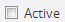

.. _manage-user-accounts:

====================================
Manage user accounts and user groups
====================================

This section describes how to manage **User accounts** and **User groups** in
AtoM. User accounts and user groups are used to define :term:`user roles <user
role>`, which define levels of access, or :term:`access privileges
<access privilege>` to functions in AtoM, ranging from view-only access to full
administration rights. Anyone who wishes to use and interact with AtoM *must*
have a user account, and only an authenticated (i.e. logged-in)
:term:`administrator` can add, edit and delete a user or a group in AtoM.

**Below you'll find instructions on how to:**

* :ref:`Add a new user <add-user>`
* :ref:`Edit an existing user <edit-user>`
* :ref:`Add a new group <add-group>`
* :ref:`Edit an existing group <edit-group>`
* :ref:`Mark a user "Inactive" <mark-user-inactive>`
* :ref:`Delete a user <delete-user>`
* :ref:`Delete a group <delete-group>`
* :ref:`Change login security <login-security>`

.. seealso::

   * :ref:`Edit user permissions <edit-user-permissions>`
   * :ref:`User roles <user-roles>`
   * :ref:`oai-pmh-api-key`
   * :ref:`api-intro-auth-key`

.. _add-user:

Add a new user
==============

.. |gears| image:: images/gears.png
   :height: 18
   :width: 18

.. |plus| image:: images/plus-sign.png
   :height: 18
   :width: 18

This section contains instructions on how to Add a new user in AtoM. There are
two ways to add a new user in AtoM - doing so via the |gears| :ref:`Admin
<main-menu-admin>` menu is the easiest, but to accommodate different
workflows, users can also be added from the :term:`view page` of another
:term:`user's profile <user profile>`. Below are instructions to add a new
user:

* :ref:`From the main menu <add-user-main>`
* :ref:`From the user profile view page <add-user-view>`

Every user who wishes to add, edit, or delete content within the database must
have a registered :term:`user account`. Only an authenticated (i.e. logged in)
:term:`administrator` can add a new user account.

For more information on user roles, see: :ref:`user-roles`.

.. _add-user-main:

Add a new user from the main menu
---------------------------------

A new user can be added in AtoM at any time, from anywhere in the
application, via the :term:`main menu`.

**To add a new user in AtoM:**

1. In the :term:`main menu` located in the :term:`header bar`, click the
   |gears| :ref:`Admin <main-menu-admin>` menu and select "Users" from the
   :term:`drop-down menu`. This will take you to a list of current user
   accounts.

.. image:: images/admin-users.*
   :align: center
   :width: 30%
   :alt: An image of the Admin menu

2. AtoM will redirect you to the List users page, where you can find, edit,
   and delete existing users, as well as add new users.

.. image:: images/browse-users.*
   :align: center
   :width: 80%
   :alt: An image of the List users page

.. NOTE::

   The List users page has two presentation options: "Show Active only" and
   "Show Inactive only" which allow the :term:`administrator` to view active
   users and inactive users in the system. For more information on inactive
   users, see below, :ref:`mark-user-inactive`.

   .. image:: images/users-active-inactive.*
      :align: center
      :width: 50%
      :alt: An image of Active/Inactive tabs in the Browse users page

3. Scroll to the bottom of the "List users" page and click the "Add new" button
   in the :term:`button block`. AtoM will direct you to a blank User 
   :term:`edit page`.

.. image:: images/add-new-user-blank.*
   :align: center
   :width: 80%
   :alt: An image of a new User page in edit mode

4. In the "Basic info" :term:`information area`, enter the following data:

* In :term:`"Username" <Username>`, enter the user's name;
* In "Email", enter the user's email address. The email address (rather than
  the username) is used when logging in. For more information on logging in,
  see: :ref:`log in <log-in>`;
* In :term:`"Password" <Password>`, enter the user's default password. Users
  can later change their own password. For more information, see:
  :ref:`change-password`.
* In "Confirm password" enter the :term:`password` again.

.. NOTE::

   Although only an authenticated (i.e. logged-in) :term:`administrator` can
   edit a user's profile, users can view their own :term:`profiles <user
   profile>` and change their :term:`passwords <password>`) by going through 
   the
   :term:`header bar`. For more information, see: :ref:`Change password
   <change-password>`.

.. NOTE::

   If your AtoM site has :ref:`CAS single sign-on <cas-enabling>` enabled then
   users will not be able to update their credentials from the profile page.
   An AtoM administrator will not be able to make username, email or password 
   changes either. To do so, you need to contact your CAS administrator.

5. In the "Access control" information area, type the appropriate "User 
   groups". As you type, matching results will load in a :term:`drop-down menu`
   below the field. See :ref:`below <add-group>` for more information on user 
   groups.

.. IMPORTANT::

   The user group, or :term:`user role` determines the user's :term:`access
   privileges <access privilege>`. This will control the way the user can
   interact with AtoM. The user role of a specific user can be changed at any
   time by an authenticated (i.e. logged-in) :term:`administrator`. For more
   information on user roles, see: :ref:`User roles <user-roles>`. For more
   information on editing user :term:`access privileges <access privilege>`
   and a list of the default permissions per group, see
   :ref:`Edit user permissions <edit-user-permissions>`.

.. NOTE::

   If your AtoM site has :ref:`CAS single sign-on <cas-enabling>` 3.0 enabled 
   then making changes to group membership will not take effect. You will need 
   to contact your CAS administrator to make any group membership changes.

.. SEEALSO::

   If you are using the :ref:`OAI repository <oai-pmh>` functionality in AtoM,
   you can also generate an API key per user account in this "Access control"
   area. For more information, see: :ref:`oai-pmh-api-key`.

6. Under the "Allowed languages for translation" section, type the appropriate
   "language" for translation. As you type, matching results will load in a
   :term:`drop-down menu` below the field. For more information on
   adding/removing languages, see: :ref:`Add/Remove languages
   <add-remove-languages>`. For more information on translating, see:
   :ref:`translate`.

.. TIP::

   Multiple :term:`user roles <user role>` and languages can be added to one
   user. A user may need to have both :term:`editor` and :term:`translator`
   :term:`access privileges <access privilege>`, or may be able to translate in
   both "English" and "Spanish".

   Once one user role has been selected, it will appear in bullet form under
   "User groups" and a second group can then be added. To remove a selected 
   user group, simply hover over the user group you would like to select;  
   click on the "**X**" that will appear next the group name. The same 
   instructions can be applied to the "Allowed languages for translation" 
   :term:`information area`.

7. You can quit the creation process at any time by clicking the "Cancel"
   button, or exiting (i.e. clicking "**X**") the window. Any changes made will
   not be saved.
8. When you have completed entering all information for your new user, click
   the :term:`"Create" button <Create button>` in the :term:`button block`.

.. image:: images/button-block-create.*
   :align: center
   :width: 60%
   :alt: An image of the button block on an edit page

9. Once the new user has been saved, AtoM will direct you to the
   :term:`user's profile <user profile>` :term:`view page`, where you can
   review your work. Clicking "Edit" in the :term:`button block` at the bottom
   of the user profile will re-open the user's profile in :term:`edit mode`.

.. image:: images/user-editor-view-page.*
   :align: center
   :width: 80%
   :alt: An image of a User page in view mode

10. The user profile will also display the following permission
    :term:`information areas <information area>`: "Information object
    permissions", "Actor permissions", "Taxonomy permissions", and "Archival
    institution permissions". You can navigate through these sections to
    customize the user's :term:`access privileges <access privilege>` if you
    are not satisfied with those established by the user group, or if a user
    group was not selected. For more information on user permissions, see
    :ref:`Edit user permissions <edit-user-permissions>`.

.. image:: images/permissions-tabs.*
   :align: center
   :width: 70%
   :alt: An image of the permissions tabs on a user view page

.. Note::

   By default, the user will be automatically *Active* once the new user 
   account has been created. You must enter :term:`edit mode` and un-check the 
   box next to "Active" |Inactive| in order to make a user "Inactive". For more
   information, see: :ref:`mark-user-inactive`.

   .. image:: images/user-active-inactive.*
      :align: center
      :width: 60%
      :alt: An image of the Active checkbox on a user page in edit mode

For more on user roles, see :ref:`user roles <user-roles>`. For more
information on user role (e.g. group) default permissions and how to customize
user :term:`access privleges <access privilege>`, see:
:ref:`edit-user-permissions`.

.. _add-user-view:

Add a new user from a user's profile view page
----------------------------------------------

A new user can also be added to AtoM from the :term:`view page` of any other
:term:`user's profile <user profile>` :term:`view page` via the
:term:`Add new button` in the :term:`button block`. To do so:

1. In the :term:`main menu` located in the :term:`header bar`, click the
   |gears| :ref:`Admin <main-menu-admin>` menu and select "Users" from the
   :term:`drop-down menu`. This will take you to a list of current user
   accounts.

.. image:: images/admin-users.*
   :align: center
   :width: 30%
   :alt: An image of the Admin menu

2. AtoM will redirect you to the List users page, where you can find, edit,
   and delete existing users, as well as add new users.

.. image:: images/browse-users.*
   :align: center
   :width: 80%
   :alt: An image of the List users page

3. Select a user from the list that appears on the page by clicking on the
   :term:`username`. AtoM will direct you to that :term:`user's profile <user
   profile>` :term:`view page`.

.. image:: images/user-editor-view-page.*
   :align: center
   :width: 80%
   :alt: An image of a User page in view mode

4. At the bottom of the user's profile :term:`view page`, you will see the
   :term:`button block` with several options (Edit, Delete, and Add new). Click
   the :term:`Add new button`.

.. image:: images/button-block-user.*
   :align: center
   :width: 60%
   :alt: An image of the button block on a user page

.. NOTE::

   If your AtoM site has :ref:`CAS single sign-on <cas-enabling>` enabled then
   you will not be able to add new users. You will need to contact your CAS 
   administrator to create new user accounts.

5. AtoM takes you to a blank :term:`edit page` for data entry. Enter data as
   required. For further guidance on specific fields, see steps 4-6 in the
   section :ref:`above <add-user-main>`.

.. image:: images/add-new-user.*
   :align: center
   :width: 80%
   :alt: An image of a new User page in edit mode

6. You can quit the creation process at any time by clicking the “Cancel” 
   button in the :term:`button block`; any data already entered will not be 
   saved, and no new user record will be created. Note that simply navigating 
   away from the page by any other means, **without first clicking "Create"** 
   will also result in no new record being created.
7. To save the new user record, click the :term:`"Create" button <Create
   button>` located in the :term:`button block` at the bottom of the record.

.. image:: images/button-block-create.*
   :align: center
   :width: 60%
   :alt: An image of the button block on an edit page

8. Once the new user has been saved, AtoM will direct you to the
   :term:`user's profile <user profile>` :term:`view page`, where you can
   review your work. Clicking "Edit" in the :term:`button block` at the bottom
   of the user profile will re-open the user's profile in :term:`edit mode`.

.. image:: images/user-editor-view-page.*
   :align: center
   :width: 80%
   :alt: An image of a User page in view mode

9. The user profile will also display the following permission
   :term:`information areas <information area>`: "Information object
   permissions", "Actor permissions", "Taxonomy permissions", and "Archival
   institution permissions". You can navigate through these sections to
   customize the user's :term:`access privileges <access privilege>` if you
   are not satisfied with those established by the user group, or if a user
   group was not selected. For more information on user permissions, see
   :ref:`Edit user permissions <edit-user-permissions>`.

.. image:: images/permissions-tabs.*
   :align: center
   :width: 70%
   :alt: An image of the permissions tabs on a user view page

:ref:`Back to top <manage-user-accounts>`

.. _user-modification-history:

View a user's description modification history
==============================================

AtoM has a basic audit log for archival descriptions that can be enabled by an
:term:`administrator` in |gears| **Admin > Settings > Global**. Once enabled, 
AtoM will capture basic information (including date, type, associated user, 
and/or associated description) when archival descriptions are created or 
modified. 

.. IMPORTANT:: 

   For :term:`archival description` modifications to be tracked by AtoM, an
   :term:`administrator` must **first** have enabled the 
   :ref:`enable-audit-logging` setting. Any description creation or modification 
   events prior to enabling the setting will not be tracked. 

Authenticated (i.e. logged in) users can see their own modification history by
navigating to their profile page. Additionally, an :term:`administrator` can 
see the description modification history of any user by navigating to their
:term:`user profile` page. 

**Jump to:**

* :ref:`view-own-mod-history`
* :ref:`view-user-mod-history`

.. SEEALSO::

   * :ref:`enable-audit-logging`
   * :ref:`view-modification-history`

.. _view-own-mod-history:

Viewing your own modification history
-------------------------------------

If you are logged in, and the audit log has been enabled by an 
:term:`administrator` in |gears| **Admin > Settings > Global**, then you can 
view a log of all your creation and modification events associated with archival 
descriptions in AtoM. To do so: 

1. Click your :term:`username` in the :term:`header bar`, at the upper
   right-hand corner of the page
2. A :term:`drop-down menu` will appear with the option to log out, or
   navigate to your :term:`user profile` - click on "Profile"

.. image:: images/click-profile.*
   :align: center
   :width: 85%
   :alt: An image of a user clicking on the Profile option

3. You will be redirected to your user profile :term:`view page`. If 
   description logging has been enabled, then you will see a section at the 
   bottom of the profile labelled "Editing history" - click the heading to 
   expand the section.
4. When expanded, the Editing history :term:`area <information area>` will
   display information about recent creation and modification events
   associated with your :term:`username`, organized into a table. The Title 
   column will include a hyperlink to the related description. The Date column 
   will show the date and time the modification was made. The Type column has 
   2 possible values - "creation" and "modification."

.. image:: images/audit-log-editor.*
   :align: center
   :width: 85%
   :alt: An image of the Editing history of a user account

.. TIP::

   The date and time values are determined based on the PHP time zone
   settings, which can be modified by a system administrator in the
   ``apps/qubit/config/settings.yml`` configuration file. For more
   information, see:

   * :ref:`customization-config-files`

5. The number of results included in the Editing history pane is determined by
   the :ref:`results-page` setting in **Admin > Settings > Global**. If there
   are more results than the results per page setting, AtoM will display 
   "Previous" and "Next" buttons at the bottom of the table for navigation. 

.. image:: images/audit-log-admin.*
   :align: center
   :width: 85%
   :alt: An image of the Editing history of a user account

.. _view-user-mod-history:

Viewing other user's modification histories
-------------------------------------------

If the audit log has been enabled by an :term:`administrator` in |gears| 
**Admin > Settings > Global**, then an administrator can view the 
:term:`archival description` editing history of any :term:`user account` in 
AtoM. To do so: 

1. In the :term:`main menu` located in the :term:`header bar`, click the
   |gears| :ref:`Admin <main-menu-admin>` menu and select "Users" from the
   :term:`drop-down menu`. This will take you to a list of current user
   accounts.

.. image:: images/admin-users.*
   :align: center
   :width: 30%
   :alt: An image of the Admin menu

2. AtoM will redirect you to the List users page, where you can find, edit,
   and delete existing users, as well as add new users.

.. image:: images/browse-users.*
   :align: center
   :width: 80%
   :alt: An image of the List users page

3. Select a user from the list that appears on the page by clicking on the
   :term:`username`. AtoM will direct you to that :term:`user's profile <user
   profile>` :term:`view page`.
4. If description logging has been enabled, then at the bottom of the user's 
   profile :term:`view page`, you will see a section labelled "Editing history" 
   - click the heading to expand the section.
5. When expanded, the Editing history :term:`area <information area>` will
   display information about recent creation and modification events
   associated with the selected user, organized into a table. The Title 
   column will include a hyperlink to the related description. The Date column 
   will show the date and time the modification was made. The Type column has 
   2 possible values - "creation" and "modification."

.. image:: images/audit-log-editor.*
   :align: center
   :width: 85%
   :alt: An image of the Editing history of a user account

.. TIP::

   The date and time values are determined based on the PHP time zone
   settings, which can be modified by a system administrator in the
   ``apps/qubit/config/settings.yml`` configuration file. For more
   information, see:

   * :ref:`customization-config-files`

5. The number of results included in the Editing history pane is determined by
   the :ref:`results-page` setting in **Admin > Settings > Global**. If there
   are more results than the results per page setting, AtoM will display 
   "Previous" and "Next" buttons at the bottom of the table for navigation. 

.. image:: images/audit-log-admin.*
   :align: center
   :width: 85%
   :alt: An image of the Editing history of a user account

:ref:`Back to top <manage-user-accounts>`

.. _edit-user:

Edit an existing user
=====================

This section contains instructions on how to edit an existing user, after they
have been :ref:`created <add-user>`.

.. NOTE::

   Only an authenticated (i.e. logged in) :term:`administrator` user can edit or
   update a user. For more information on edit privileges and
   user roles see: :ref:`user-roles`.

A user can be edited at any time by an authenticated administrator.

**To edit a user in AtoM:**

1. First, navigate to an existing user in AtoM. You can do this by click the
   |gears| :ref:`Admin <main-menu-admin>` menu in the :term:`main menu` located
   in the :term:`header bar` and selecting "Users" from the
   :term:`drop-down menu`. This will take you to a list of current user groups.

.. image:: images/admin-users.*
   :align: center
   :width: 30%
   :alt: An image of the Admin menu

2. Select the user you wish to edit from the list of users that appears on the
   page. If you have many users, AtoM may limit the results per page; you can
   navigate through the list of users by scrolling to the bottom of the "List
   users" page and clicking through the page numbers.

.. image:: images/browse-users.*
   :align: center
   :width: 80%
   :alt: An image of the List users page

.. NOTE::

   The List users page has two presentation options: "Show Active only" and
   "Show Inactive only" which allow the :term:`administrator` to view active
   users and inactive users in the system. For more information on inactive
   users, see below, :ref:`mark-user-inactive`.

   .. image:: images/users-active-inactive.*
      :align: center
      :width: 50%
      :alt: An image of Active/Inactive tabs in the Browse users page

3. By clicking on the :term:`username` of the user you wish to edit, AtoM will
   direct you to that :term:`user's profile <user profile>` :term:`view page`.

.. image:: images/user-contrib-view-page.*
   :align: center
   :width: 80%
   :alt: An image of a User page in view mode

4. Switch from :term:`view mode` to :term:`edit mode` by clicking the
   :term:`"Edit" button <Edit button>` in the :term:`button block`, or by
   clicking on the "User details" heading; this takes you to the user's
   :term:`edit page`.

5. On loading, the :term:`edit page` displays the :term:`user profile`
   :term:`information areas <information area>`; add and/or revise data as
   required.
6. You can quit the process at any time by clicking the "Cancel" button
   in the :term:`button block`; any changes made will not be saved. Note that
   simply navigating away from the page by any other means, **without first
   clicking "Save"** will also result in no changes being saved to the user
   profile.
7. To save your edits, click the "Save" button located in the :term:`button
   block`.

.. image:: images/button-block-save.*
   :align: center
   :width: 60%
   :alt: An image of the button block on an edit page

You will be redirected to the :term:`view page` for the edited user where
you can review your work. Follow steps 3 through 6 if you are not satisfied
with your changes.

.. SEEALSO::

   If you are using the :ref:`OAI repository <oai-pmh>` functionality in AtoM,
   you can also generate an API key per user account in this "Access control"
   area. For more information, see: :ref:`oai-pmh-api-key`.

:ref:`Back to top <manage-user-accounts>`

.. _add-group:

Add a new group
===============

This section contains instructions on how to Add a new user group in AtoM. There
are two ways to add a new user group in AtoM - doing so via the
|gears| :ref:`Admin <main-menu-admin>` menu is the easiest, but to accommodate
different workflows, user groups can also be added from the :term:`view page`
of another group's :term:`view page`. Below are instructions on how to add a
new group:

* :ref:`From the main menu <add-group-main>`
* :ref:`From the group view page <add-group-view>`

In AtoM, only an authenticated (i.e. logged in) :term:`administrator` may add a
new "Group" or "user group" to the database. Administrators are then able to
link these groups with  users, either at the point a user is :ref:`created
<add-user>` or at a later time, by :ref:`editing the user <edit-user>`. These
user groups determine user :term:`access privileges <access privilege>`; linking
a user to a specific user group thus establishes the user's :term:`access
privileges <access privilege>` within AtoM. This will control the way the user
can interact with the system.

The following 5 :term:`user roles <user role>` are established as default
"Groups" in AtoM:

* :term:`Researcher`
* :term:`Administrator`
* :term:`Editor`
* :term:`Contributor`
* :term:`Translator`

When :ref:`creating a new user <add-user>` in AtoM, :term:`administrators
<administrator>` can select from these 5 groups by default, as well as other
"Groups" that may have been added by an administrator. These default "Groups"
contain default :term:`access privileges <access privilege>` that define levels
of access to functions in AtoM; for more information on these, see
:ref:`edit-user-permissions`.

These default groups can be deleted at any time by an
authenticated (i.e. logged-in) administrator, and new user groups can also be
added at any time.

For more information on user roles, see: :ref:`User roles <user-roles>`.

.. _add-group-main:

Add a new user group from the main menu
---------------------------------------

A new group can be added in AtoM at any time, from anywhere in the
application, via the :term:`main menu`. To do so, follow these instructions:

1. In the :term:`main menu` located in the :term:`header bar`, click the
   |gears| :ref:`Admin <main-menu-admin>` menu and select "Groups" from the
   :term:`drop-down menu`.

.. image:: images/admin-groups.*
   :align: center
   :width: 25%
   :alt: An image of the Admin menu

2. AtoM will redirect you to a list of current groups and the number of members
   within each group.

.. image:: images/list-groups.*
   :align: center
   :width: 80%
   :alt: An image of the List groups page

3. Scroll to the bottom of the "List groups" page and click the "Add new"
   button in the :term:`button block`. AtoM will direct you to a blank Group
   :term:`edit page`.

.. image:: images/create-group-blank.*
   :align: center
   :width: 90%
   :alt: An image of a blank edit page for a new Group

4. In the "Main area" :term:`information area`, enter the "Name" and the
   "Description" of the group, and select whether or not the group will have
   the :term:`access privilege` permission to "Translate". For more information
   on user roles, see: :ref:`user-roles`.

.. image:: images/create-group.*
   :align: center
   :width: 80%
   :alt: An image of a blank edit page for a new Group

5. You can quit the process at any time by clicking the "Cancel" button, or
   exiting (i.e. clicking "**X**") the browser tab. Any changes made will not
   be saved.
6. When you have completed your data entry, click the
   :term:`"Create" button <Create button>` in the :term:`button block` at the
   bottom of the page. AtoM will be direct you to a :term:`view page` where the
   new :term:`user profile` will be displayed. Clicking "Edit" in the
   :term:`button block` at the bottom of the group profile will re-open the
   group in :term:`edit mode` if you need to make changes.

.. image:: images/view-group.*
   :align: center
   :width: 90%
   :alt: An image of the view page for a new Group

The group profile will also display the following permission :term:`information
areas <information area>`: "Information object permissions", "Actor
permissions", "Taxonomy permissions", and "Archival institution permissions".
Navigate through these sections to customize the group's :term:`access
privileges <access privilege>`. For more information on user permissions,
see :ref:`Edit user permissions <edit-user-permissions>`.

.. image:: images/group-permissions.*
   :align: center
   :width: 90%
   :alt: An image of the Group permissions tabs

.. _add-group-view:

Add a new group from the view page
----------------------------------

A new group can also be added to AtoM from the :term:`view page` of any other
user group via the :term:`Add new button` in the :term:`button block`. To do so:

1. Navigate to an existing group in AtoM. You can do this by click the
   |gears| :ref:`Admin <main-menu-admin>` menu in the :term:`main menu` located
   in the :term:`header bar` and selecting "Groups" from the
   :term:`drop-down menu`. This will take you to a list of current user groups.

.. image:: images/list-groups.*
   :align: center
   :width: 80%
   :alt: An image of the List groups page

2. Select a group from the list that appears on the page by clicking on the
   group name. AtoM will direct you to that user group's :term:`view page`.
3. At the bottom of the group's :term:`view page`, you will see the
   :term:`button block` with several options (Edit, Delete, Add new, and
   Return to group list). Click the :term:`Add new button`.

.. image:: images/add-new-from-group.*
   :align: center
   :width: 80%
   :alt: Clicking the Add new button from a group view page

4. AtoM takes you to a blank :term:`edit page` for data entry. Enter data as
   required.

.. image:: images/create-group-blank.*
   :align: center
   :width: 80%
   :alt: An image of a blank edit page for a new Group

5. You can quit the creation process at any time by clicking the "Cancel" button
   in the :term:`button block`; any data already entered will not be saved, and
   no new user record will be created. Note that simply navigating away from the
   page by any other means, **without first clicking "Create"** will also result
   in no new record being created.
6. To save the new user record, click the :term:`"Create" button <Create
   button>` located in the :term:`button block` at the bottom of the record.

.. image:: images/button-block-create.*
   :align: center
   :width: 80%
   :alt: An image of the button block on a new Group edit page

Once the new user has been saved, AtoM will direct you to the :group's
:term:`view page`, where you can review your work. Clicking "Edit" in the
:term:`button block` at the bottom of the user profile will re-open the user in
:term:`edit mode`.

:ref:`Back to top <manage-user-accounts>`

.. _edit-group:

Edit an existing user group
===========================

This section contains instructions on how to edit an existing group, after they
have been :ref:`created <add-group>` in AtoM.

.. NOTE::
   Only an authenticated (i.e. logged in) :term:`administrator` user can edit or
   update a user group. For more information on edit privileges and
   user roles see: :ref:`user-roles`.

A user group can be edited at any time by an authenticated administrator.

**To edit a group in AtoM:**

1. First, navigate to an existing group in AtoM. You can do this by click the
   |gears| :ref:`Admin <main-menu-admin>` menu in the :term:`main menu` located
   in the :term:`header bar` and selecting "Groups" from the
   :term:`drop-down menu`. This will take you to a list of current user groups.

.. image:: images/list-groups.*
   :align: center
   :width: 80%
   :alt: An image of the List groups page

2. Select the user group you wish to edit from the list that appears on the page
   by clicking on the group name. AtoM will direct you to that user group's
   :term:`view page`.
3. Switch from :term:`view mode` to :term:`edit mode` by clicking the
   :term:`"Edit" button <Edit button>` in the :term:`button block`, or by
   clicking on the "Group details" heading; this takes you to the group's
   :term:`edit page`.
4. On loading, the :term:`edit page` displays the user group's
   :term:`information areas <information area>`; add and/or revise data as
   required.

.. image:: images/edit-group.*
   :align: center
   :width: 80%
   :alt: An image of a Group edit page

5. You can quit the process at any time by clicking the "Cancel" button
   in the :term:`button block`; any changes made will not be saved. Note that
   simply navigating away from the page by any other means, **without first
   clicking "Save"** will also result in no changes being saved.
6. To save your edits, click the "Save" button located in the :term:`button
   block`.

.. image:: images/button-block-save.*
   :align: center
   :width: 80%
   :alt: An image of the button block on a Group edit page

You will be redirected to the :term:`view page` for the edited user group where
you can review your work. Follow steps 3 through 6 if you are not satisfied
with your changes.

:ref:`Back to top <manage-user-accounts>`

.. _mark-user-inactive:

Mark a user "Inactive"
======================

By default, all users created in AtoM are set as "Active" users. Marking a user
as "Inactive" will block the user from being able to access the system (i.e.
he/she will not be able to sign in to AtoM). An authenticated (i.e. logged-in)
:term:`administrator` may still edit that :term:`user's profile <user profile>`,
and the user can be changed back to an "Active" status at any time.

Users can either be marked as "Inactive" at the point that their :term:`profile
<user profile>` is :ref:`created <add-user>`, or later, by navigating to that
user's :term:`edit page`. A user can only be marked as "Active" or "Inactive" by
an authenticated (i.e. logged-in) :term:`administrator` user. For more
information on user roles, see: :ref:`user-roles`.

**To mark a user "Inactive" in AtoM:**

1. First, navigate to the In the :term:`main menu` located in the :term:`header
   bar`, click the |gears| :ref:`Admin <main-menu-admin>` menu and select
   "Users" from the :term:`drop-down menu`. This will take you to a list of
   current users accounts (i.e. the "List users" page). By default, the list
   that appears will be of all "Active" users (i.e. "Show Active only").

.. image:: images/browse-users.*
   :align: center
   :width: 80%
   :alt: An image of List users page

2. Select the user you wish to mark as "Inactive" from the list of users that
   appears on the page. You can navigate through the list of users by scrolling
   to the bottom of the "List users" page and clicking through the page numbers.

.. image:: images/users-active-inactive.*
   :align: center
   :width: 50%
   :alt: An image of Active/Inactive tabs in the Browse users page

3. Click on the :term:`username` of the user you wish to mark as "Inactive";
   AtoM will direct you to that :term:`user's profile <user profile>`
   :term:`view page`.
4. Switch from :term:`view mode` to :term:`edit mode` by clicking the
   :term:`"Edit" button <Edit button>` in the :term:`button block`, or by
   clicking on the "User details" heading; this takes you to the user's
   :term:`edit page`.
5. Mark the user as "Inactive" by unchecking the box next to "Active" |Inactive|
   in the "Basic info" :term:`information area` of the :term:`user's profile
   <user profile>`; a blank box will set that user's status as "Inactive".

.. image:: images/mark-inactive.*
   :align: center
   :width: 90%
   :alt: An image of marking an existing user inactive

.. TIP::

   To mark a new user as "Inactive" at the point that their :term:`profile <user
   profile>` is :ref:`created <add-user>`, follow the instructions in
   **Step 5**.

6. You can quit the process at any time by clicking the "Cancel" button
   in the :term:`button block`; any changes made will not be saved. Note that
   simply navigating away from the page by any other means, **without first
   clicking "Save"** will also result in no changes being saved to the user
   profile.
7. To save your edits, click the "Save" button located in the :term:`button
   block`.

.. image:: images/button-block-save.*
   :align: center
   :width: 80%
   :alt: An image of the button block on a User edit page

AtoM will be redirected to the :term:`view page` for the edited user where
you can review your work. You'll note the big red warning at the top of
the page indicating that the user is now inactive. Inactive users will
no longer be able to log in with their existing credentials, until an
administrator marks their account as active again. Follow steps 3 through 7 if
you would like to reverse the changes made.

.. image:: images/inactive-user.*
   :align: center
   :width: 90%
   :alt: An image of an inactive user's profile view page

:ref:`Back to top <manage-user-accounts>`

.. _delete-user:

Delete a user
=============

Follow the instructions below to delete a user in AtoM:

.. WARNING::

   If you delete a user from AtoM, you are deleting them **permanently** from
   the system; both the user and the :term:`user profile` will be deleted.
   It might be better suited to render a user's status as "Inactive" rather than
   deleting them from AtoM permanently. For more information on marking a
   user's status as "Inactive", see: :ref:`mark-user-inactive`.

1. Navigate to the user you wish to delete from AtoM. You can do this by
   clicking the |gears| :ref:`Admin <main-menu-admin>` menu in the :term:`main
   menu` located in the :term:`header bar`, and selecting "Users" from the :term
   :`drop-down menu`. This will take you to a list of current users accounts
   (i.e. the "List users" page).

.. image:: images/browse-users.*
   :align: center
   :width: 80%
   :alt: An image of the list user page

2. Select whether you wish to view "Active" users (i.e. "Show Active only") or
   "Inactive" users (i.e. "Show Inactive only").
3. The list will appear in alphabetical order. Find and click on the
   :term:`username` of the user you wish to delete. You can navigate through the
   list of users by scrolling to the bottom of the "List users" page and
   clicking through the page numbers.
4. Once you click on the username, AtoM will direct you to the :term:`user's
   profile <user profile>` :term:`view page`. To **delete** the user, click the
   :term:`Delete button` in the :term:`button block`.
5. AtoM prompts you to confirm the delete request: click "Delete" to proceed
   (or you can click "Cancel" to return to the user's profile
   :term:`view page`).

.. image:: images/user-delete-confirm.*
   :align: center
   :width: 80%
   :alt: An image of the confirmation message when deleting a user

6. AtoM will delete the user and redirect you to the "List users" page.

:ref:`Back to top <manage-user-accounts>`

.. _delete-group:

Delete a group
==============

Follow the instructions below to delete a user group in AtoM:

.. WARNING::

   Deleting a user group in AtoM will remove that group from any
   :term:`user profile` it has been linked to. Be careful, as this might alter
   a user's :term:`access privileges <access privilege>` in AtoM.

1. Navigate to the group you wish to delete from AtoM. You can do this by
   clicking the |gears| :ref:`Admin <main-menu-admin>` menu in the :term:`main
   menu` located in the :term:`header bar`, and selecting "Groups" from the
   :term:`drop-down menu`. This will take you to a list of current groups
   (i.e. the "List groups" page).
2. Click on the name of the group you wish to delete.
3. AtoM will direct you to the group's :term:`view page`. To **delete** the
   group, click the :term:`Delete button` in the :term:`button block`.
4. AtoM prompts you to confirm the delete request: click "Delete" to proceed
   (or you can click "Cancel" to return to the group's :term:`view page`).
5. AtoM will delete the user and redirect you to the "List groups" page.

.. _login-security:

Login security features
=======================

:term:`Administrators <administrator>` have the ability require logged-in
users to have strong passwords, as well as limit administrator functionality
by IP address or require SSL for all administrator functionality. These
settings are found in Admin -> Settings -> Security.
See :ref:`Security panel <security-panel>` for more information.

:ref:`Back to top <manage-user-accounts>`
