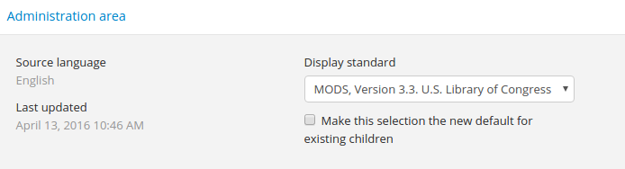

.. _mods-template:

=========================================
Metadata Object Description Schema (MODS)
=========================================

On this page you will find:

* Link to downloadable CSV template using
  `ISAD(G) General International Standard Archival Description <http://www.ica.org/10207/standards/isadg-general-international-standard-archival-description-second-edition.html>`_
* Description of fields used when entering or importing
  :term:`archival descriptions <archival description>` using MODS
  in a :term:`CSV` file or entering the data manually.

.. seealso::

   * :ref:`archival-descriptions`
   * :ref:`csv-testing-import`
   * :ref:`import-descriptions-terms`
   * :ref:`export-descriptions-terms`

.. _mods-and-csv:

MODS and the ISAD CSV template
==============================

At present, there is no MODS-based CSV template for importing descriptions
into  AtoM. However, because MODS is based on the `International Council
on Archives <http://www.ica.org/>`_ ' ISAD(G) standard (see:
:ref:`ISAD <isad-template>`), the ISAD CSV template
can be used for import, as all templates have been crosswalked in AtoM where
possible.

To test this, we recommend creating a full MODS description in AtoM, and then
changing the display template to ISAD, to determine where field in MODS map to
ISAD. For more information on changing the display template for a description,
see: :ref:`change-display-standard`. If desired, all templates in AtoM can be
changed at the  same time using the *Default template* setting available in
**Admin > Settings** - see :ref:`default-templates`.

The CSV mappings below will provide guidance on which ISAD CSV fields can be
used to import your MODS-based descriptions into AtoM.

To download the ISAD(G) CSV template for AtoM, please visit our `wiki page <https://wiki.accesstomemory.org/Resources/CSV_templates>`_.

Field descriptions
==================

The MODS standard, maintained by the US Library of Congress `Network
Development and MARC Standards Office <http://www.loc.gov/marc/ndmso.html>`__,
is available at:

* http://www.loc.gov/standards/mods/mods-outline.html.

Currently AtoM supports the Digital Library Federation second level of adoption
for MODS version 3.3 (see `DLF Aquifer MODS Guidelines Levels of Adoption
<https://wiki.dlib.indiana.edu/display/DLFAquifer/MODS+Guidelines+Levels+of+Adoption>`__).

Information below includes:

* **Template Field** refers to the default label for that field in AtoM
* **ISAD CSV Column** refers to the title of the related column in the (ISAD) CSV
  template
* **MODS Rule** refers to the rule from the applicable standard and/or the
  instructions provided by AtoM
* **MODS XML** refers to the field mapping to MODS XML for import/export

**Skip to**:

* :ref:`mods-elements-area`

  * :ref:`mods-identifier`
  * :ref:`mods-title`
  * :ref:`mods-names-origin-info`
  * :ref:`mods-type`
  * :ref:`mods-child-levels`
  * :ref:`mods-language`
  * :ref:`mods-subject`
  * :ref:`mods-places`
  * :ref:`mods-names`
  * :ref:`mods-access-conditions`
  * :ref:`mods-repository`
  * :ref:`mods-description`

* :ref:`mods-admin`

  * :ref:`mods-admin-displaystandard`
  * :ref:`mods-admin-pubstatus`

.. _mods-elements-area:

Elements area
==================

.. figure:: images/mods-elements-area.*
   :align: center
   :figwidth: 50%
   :width: 100%
   :alt: An image of the data entry fields in the MODS template.

   The data entry fields for the MODS archival description edit template.

.. _mods-identifier:

Identifier
----------

**Template Field** Identifier

**ISAD CSV Column** ``identifier``

**MODS Rule** Contains a unique standard number or code that distinctively
identifies a resource.

**MODS XML**

.. code-block:: xml

   <identifier type="local">

.. _mods-title:

Title
-----

**Template Field** Title

**ISAD CSV Column** ``title``

**MODS Rule** A word, phrase, character, or group of characters, normally
appearing in a resource, that names it or the work contained in it. Choice
and format of titles should be governed by a content standard such as the
Anglo-American Cataloguing Rules, 2nd edition (AACR2), Cataloguing Cultural
Objects (CCO), or Describing Archives: A Content Standard (DACS). Details
such as capitalization, choosing among the forms of titles presented on an item,
and use of abbreviations should be determined based on the rules in a content
standard. One standard should be chosen and used consistently for all records
in a set.

**MODS XML**

.. code-block:: xml

   <titleInfo>
     <title>

.. _mods-names-origin-info:

Names and Origin Info
---------------------

Name
^^^^

**Template Field** Name

**ISAD CSV Column** ``eventActors``

**MODS Rule** Use the actor name field to link an authority record to this
description. Search for an existing name in the authority records by typing
the first few characters of the name. Alternatively, type a new name to create
and link to a new authority record.

**MODS XML**

.. code-block:: xml

   <name>
     <namePart>

Event Type
^^^^^^^^^^

**Template Field** Event type

**ISAD CSV Column** ``eventTypes``

**MODS Rule** Select the type of activity that established the relation between
the authority record and the resource.

**MODS XML**

.. code-block:: xml

   <name>
     <role>
       <roleTerm>Creator</roleTerm>

Place
^^^^^

**Template Field** Place

**ISAD CSV Column** ``eventPlaces``

**MODS Rule** Use the actor name field to link an authority record to this
description. Search for an existing name in the authority records by typing
the first few characters of the name. Alternatively, type a new name to create
and link to a new authority record.

**MODS XML**

.. code-block:: xml

   <originInfo>
     <place>
       <placeTerm>

Date
^^^^

**Template Field** Date

**ISAD CSV Column** ``eventDates``

**MODS Rule** Enter free-text information, including qualifiers or typographical
symbols to express uncertainty, to change the way the date displays. If this field
is not used, the default will be the start and end years only.

**MODS XML**

.. code-block:: xml

   <originInfo>
      <dateCreated>

Start
^^^^^

**Template Field** Start

**ISAD CSV Column** ``eventStartDates``

**MODS Rule** Enter the start year. Do not use any qualifiers or typographical
symbols to express uncertainty. Acceptable date formats: YYYYMMDD, YYYY-MM-DD,
YYYY-MM, YYYY.

**MODS XML**

.. code-block:: xml

   <originInfo>
     <dateCreated point="start">

End
^^^

**Template Field** End

**ISAD CSV Column** ``eventEndDates``

**MODS Rule** Enter the end year. Do not use any qualifiers or typographical
symbols to express uncertainty. Acceptable date formats: YYYYMMDD, YYYY-MM-DD,
YYYY-MM, YYYY.

**MODS XML**

.. code-block:: xml

  <originInfo>
    <dateCreated point="end">

Event Note
^^^^^^^^^^^

**Template Field** Event note

**ISAD CSV Column** ``eventDescriptions``

**MODS Rule** N/A

**MODS XML** N/A

.. _mods-type:

Type of Resource
----------------

**Template Field** Type of resource

**ISAD CSV Column** N/A

**MODS Rule** A term that specifies the characteristics and general type of
content of the resource. Assign as many types as are applicable. The Type of resource
options are limited to the values in the MODS typeOfResource top-level element.

**MODS XML**

.. code-block:: xml

   <typeOfResource>

.. _mods-child-levels:

Child levels
------------

These two fields can be used to add lower levels to a collection level
description. Click "Add new" to create as many child levels as necessary.

**Identifier:** The unambiguous reference code used to uniquely identify the
child-level resource.

**Title:** The name given to the child-level resource.

.. _mods-language:

Language
--------

**Template Field** Language

**ISAD CSV Column** ``language``

**MODS Rule** A designation of the language in which the content of the resource
is expressed. Select as many languages as required.

**MODS XML**

.. code-block:: xml

  <language>

.. _mods-subject:

Subject
-------

**Template Field** Subject

**ISAD CSV Column** ``subjectAccessPoints``

**MODS Rule** A term or phrase representing the primary topic(s) on which a work
is focused. Search for an existing term in the Subjects taxonomy by typing the first
few characters of the term name. Alternatively, type a new name to create and link to
a new subject term.

**MODS XML**

.. code-block:: xml

   <subject>
      <topic>

.. _mods-places:

Places
------

**Template Field** Places

**ISAD CSV Column** ``placeAccessPoints``

**MODS Rule** Search for an existing term in the Places taxonomy by typing the first
few characters of the term name. Alternatively, type a new term to create and link to
a new place term.

**MODS XML**

.. code-block:: xml

   <subject>
      <geographic>

.. _mods-names:

Names
-----

**Template Field** Names

**ISAD CSV Column** ``nameAccessPoints``

**MODS Rule** "Choose provenance, author, and other non-subject access points from
the archival description, as appropriate. All access points must be apparent from
the archival description to which they relate." (RAD 21.0B) The values in this field are
drawn from the Authorized form of name field in authority records. Search for an
existing name by typing the first few characters of the name. Alternatively, type
a new name to create and link to a new authority record.

**MODS XML**

.. code-block:: xml

   <subject>
      <name>

.. _mods-access-conditions:

Access Conditions
-----------------

**Template Field** Names

**ISAD CSV Column** ``accessConditions``

**MODS Rule** Information about restrictions imposed on access to a resource. See
MODS accessCondition top-level element for more information on how to use this field.

**MODS XML**

.. code-block:: xml

   <accessCondition type="restriction on access">

.. _mods-repository:

Repository
----------

**Template Field** Repository

**ISAD CSV Column** ``repository``

**MODS Rule** Identifies the institution or repository holding the resource. Search
for an existing repository name by typing in the first few letters of the name.
Alternatively, type a new name to create and link to a new repository record.

**MODS XML**

.. code-block:: xml

   <location>
      <physicalLocation>

.. _mods-description:

Description
-----------

**Template Field** Description

**ISAD CSV Column** ``scopeAndContent``

**MODS Rule** An abstract, table of contents, or description of the resource's scope
and contents.

**MODS XML**

.. code-block:: xml

   <abstract type="description">

:ref:`Back to the top <mods-template>`

.. _mods-admin:

Administration area
===================

   The data entry fields for the Administration area.

.. _mods-admin-displaystandard:

Display standard
----------------

**Template Field**: Display standard

**ISAD CSV Column**: N/A

**MODS Rule**: N/A

**MODS XML**: N/A

.. NOTE::

   This fields allows the user to choose a different display standard
   from the :ref:`default template <default-templates>`
   for the shown archival description only, with the option to also change the
   display standard for all existing children of the description. See:
   :ref:`change-display-standard`.

   .. _mods-admin-pubstatus:

Publication status
------------------

**Template field** Publication status is available under the More tab located on the object view screen.

**CSV column** publicationsStatus

**RAD Rule** N/A

**EAD**

.. code-block:: xml

  <odd type="publicationStatus">
     

.. note::

  The :term:`publication status` refers to the public visibility of a
  description for unauthenticated (e.g. not logged in) users. The default
  terms available are "Published" (i.e. visible to public users), and "Draft"
  (e.g. not visible to public users). See: :ref:`publish-archival-description`.

  In the :ref:`Global Site Settings <global-settings>`, if the default
  publication status is set to draft, all imported descriptions will be set to
  draft and the EAD file will have the value "draft" in the
  <odd type="publicationStatus"> tag.

:ref:`Back to the top <dc-template>`
