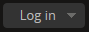

.. _getting-started-all:

===============
Getting Started
===============

.. |globe| image:: images/globe.png
   :height: 18
   :width: 18
.. |info| image:: images/info-sign.png
   :height: 18
   :width: 18

This section describes how to start using AtoM once it has been installed. It
provides a quick orientation to the :ref:`home page <home-page>`, how to log
in and log out, the various :ref:`user roles <user-roles>` in the system, the
main page types a user will encounter, and how to switch languages.

**JUMP TO:**

* :ref:`Home page <home-page>`
* :ref:`Log in <log-in>`
* :ref:`User roles <user-roles>`
* :ref:`Page types <page-types>`
* :ref:`Choose language <choose-language>`
* :ref:`Change password <change-password>`

.. seealso::

   * :ref:`Navigation in AtoM <navigate>`
   * :ref:`Entity types <entity-types>`
   * :ref:`Search <search-atom>`
   * :ref:`Browse <browse>`
   * :ref:`Context menu <context-menu>`

.. _home-page:

Home page
=========

.. figure:: images/home-page-ac.*
   :align: right
   :figwidth: 40%
   :width: 100%
   :alt: Example of a customized homepage in AtoM

   An example of a customized home page: the ArchivesCanada theme in AtoM,
   prepared for the `Canadian Council on Archives
   <http://www.cdncouncilarchives.ca/>`__ as Canada's new national archival
   portal.

The :term:`home page` is the first thing that a user will see when opening the
AtoM application. :term:`Administrators <administrator>` can customize this to
be a landing page, and from here, users can :ref:`search <search-atom>`,
:ref:`browse <browse>`, log in as authenticated users (gaining access to the
:term:`main menu`), change the language of the application interface, and more.

By default, the :term:`home page` includes:

* An editable :term:`static page` area - users with sufficient :term:`access
  privileges <access privilege>` can customize the home page by adding and
  editing content (including, if desired, raw HTML and inline CSS) through
  the :term:`user interface` - for more information, see: :ref:`Manage static
  pages <manage-static-pages>`.
* A :term:`browse menu` that will take users to a :ref:`browse page
  <page-type-browse>` for some of the core :ref:`entity types
  <entity-types>`, including :term:`archival descriptions
  <archival description>`, :term:`authority records <authority record>`
  (listed by default as "People & organizations"), :term:`archival
  institutions <archival institution>`, :term:`subjects <subject>`,
  :term:`places <place>`, and :term:`digital objects <digital object>` (i.e.,
  a dedicated browse page for archival descriptions with linked digital
  objects). For more information on the browse menu, see: :ref:`browse-menu`.
* A "Popular this week" listing of the most visited (i.e. most number of page
  views) resources in the past week. See :ref:`popular-this-week` below for
  more information.

.. TIP::

   A :term:`developer` can customize the look and feel of the AtoM home page
   by editing the CSS files associated with it. This can be done to match
   institutional theming, include images and other content. For more
   information, see in the Administrator's Manual:
   :ref:`customization-theming`.

Like all pages in AtoM the :term:`home page` also includes the AtoM
:term:`header bar`, providing access to a :ref:`search box <search-box>`,
:ref:`browse menu <browse-menu>`, :ref:`log-in button <log-in-button>`,
|globe| :ref:`language menu <language-menu>`, and |info|
:ref:`quick links menu <quick-links-menu>`. For more information on using the
header bar in AtoM, see: :ref:`atom-header-bar`.

**USING THE HOME PAGE IN AtoM:**

#. Open your web browser and enter the URL of the web server hosting your AtoM
   application. This takes you to your application's :term:`home page`.
#. On opening, AtoM displays the home page in the configured :term:`default
   language`. In the |globe| :ref:`language menu <language-menu>` (top
   right-hand corner of your page, the  globe icon in the :term:`header bar`),
   a user can change the display language. For choosing languages, see
   :ref:`Choose language <choose-language>`.
#. On opening, AtoM provides view-only access, so that any user can
   immediately begin searching or browsing the contents of the application,
   using the :term:`search box` or :term:`browse menu`, both located in the
   :term:`header bar`. Any user can also use the :term:`advanced search` link.
   For searching and browsing, see :ref:`Access content <access-content>`.
#. The home page provides a welcome message that can be customized by the
   :term:`administrator`. For customizing the welcome message, see
   :ref:`manage-static-pages`.
#. The home page also provides users with an additional :term:`browse menu`
   and a list of the most popular recently visited records in the application.
#. Once a user logs in via the log-in button in the right-hand corner of the
   :term:`header bar`, more options will become available in the :term:`main
   menu`, depending on the user's edit permissions, which are set by an
   :term:`administrator`.
#. To add or edit content, you must have a :term:`user account` and log in.
#. For logging in, see :ref:`log in <log-in>`.
#. For adding and editing, see :ref:`Add/edit content <add-edit-content>`.

.. _popular-this-week:

Popular this week listing
-------------------------

.. image:: images/popular-this-week.*
   :align: right
   :width: 20%
   :alt: An image of the Popular this week listing

The "Popular this week" listing, found on the left-hand side of the AtoM
homepage, includes a list of links to the 10 most visited resources available
to public users in the last 7 days. Resources listed in the "Popular this
week" menu include: :term:`archival descriptions <archival description>`,
:term:`authority records <authority record>`, and
:term:`archival institutions <archival institution>`.

There is no specific week-based start date to the aggregation of these
statistics - they are calculated based on the last 7 days of activity.
Similarly, the statistics are calculated only on a count of page views -
meaning that a single user returning to a resource twice in the same
visit will be counted as 2 views.

Currently there is no way to configure the Popular this week settings.
Administrators who are interested in more granular analytics information are
encouraged to use a third-party analytics tool - for more information, see:
:ref:`maintenance-web-analytics` in the Administrator's Manual.

.. IMPORTANT::

   To populate the results shown in the "Popular this week" widget, AtoM's 
   database has an ``access_log`` table that is automatically updated every 
   time an :term:`archival description`, :term:`authority record`, or 
   :term:`archival institution` is viewed. This data is **not automatically 
   cleared** over time, but a system administrator can use the command-line
   ``tools:expire-data`` task to clear old data from the access log. For more 
   information, see: 

   * :ref:`tools-expire`

.. TIP::

   A :term:`developer` who wishes to hide the Popular this week menu from
   view can do so by commenting out Line 23 in
   ``/apps/qubit/modules/staticpage/templates/homeSuccess.php``. 

:ref:`Back to top <getting-started-all>`

.. _log-in:

|login| Log in
==============

To add or edit content and access the :term:`main menu` in AtoM, you need to
log in:

.. figure:: images/log-in.*
   :align: right
   :figwidth: 20%
   :width: 100%
   :alt: An image of the log in button in AtoM

   The log-in button in AtoM, when clicked by a user

* Click the log in link in the :term:`header bar`, located in the upper right-
  hand corner of the page. A :term:`drop-down menu` will appear with two
  :terM:`fields <field>` for an email, and a password.
* Enter your email address
* Enter your :term:`password`
* Click the "log in" button in the drop-down

AtoM re-loads the :term:`home page`, now customized to your :term:`user role`.
The :term:`main menu` is now visible. Your :term:`username` will appear where
the log in button was, giving you access to your :term:`user profile`.

.. figure:: images/logged-in.*
   :align: right
   :figwidth: 20%
   :width: 100%
   :alt: An image of the log in drop-down after a user has logged in

   After logging in, an option to view and edit your user profile is
   available in the log-in button drop-down

To log out, click on your username in the user menu (top right-hand corner). A
:term:`drop-down menu` will appear, with a link to your :term:`user profile`,
and the option to log out. When the profile option is selected, a user can
update their own user name, email, and password - see below,
:ref:`change-password`. When the log out option is selected, AtoM returns
you to the :term:`home page` (view-only access).

.. note:: AtoM automatically logs you out after thirty minutes of inactivity.
   To resume editing, you will have to log back in

.. figure:: images/cas-login.*
   :align: right
   :figwidth: 20%
   :width: 100%
   :alt: An image of the log in drop-down with a CAS link button

   The log-in button in AtoM when CAS single sign-on is enabled

If your AtoM site has :ref:`CAS single sign-on <cas-enabling>` enabled, you
will be presented with a link to log in via your institution's CAS server.
You will be able to view but not edit your user profile in AtoM. You will need to
contact your CAS administrator to make any changes to your profile.
When you log out of AtoM you will also be logged out of the CAS domain.

AtoM also has an :ref:`LDAP <ldap-enabling>` module that can change how 
authentication is handled. For more information on both CAS and LDAP 
authentication configuration, see: 

* :ref:`customization-authentication`

:ref:`Back to top <getting-started-all>`

.. _user-roles:

User roles
==========

User roles define levels of access to functions in AtoM, ranging from view-
only access to full administration rights. Your user account in AtoM is tied
to one of five user roles, each representing a different level of access to
the system. User roles are defined by groups that an :term:`administrator` can
add and edit - see :ref:`manage-user-accounts` and
:ref:`edit-user-permissions`.

.. _user-researcher:

Researcher
----------

A researcher is any public user who is not logged in (sometimes called an
unauthenticated user) and therefore has view-only access to the application. A
researcher can search and browse descriptions (published :term:`archival
descriptions <archival description>`, :term:`authority records <authority
record>`, :term:`archival institutions <archival institution>`)

.. seealso::

   * :ref:`researcher-default`

.. _user-contributor:

Contributor
-----------

By default a contributor can search, browse, create, edit/update, view draft
and export descriptions. The contributor cannot change the :term:`publication
status` of an :term:`information object`. A contributor can access the
:term:`reference <reference display copy>` and :term:`master digital object`.

.. seealso::

   * :ref:`contributor-default`

.. _user-editor:

Editor
------

By default an editor can search, browse, create, edit/update, view draft,
delete and export descriptions and edit :term:`controlled vocabulary`
:term:`terms <term>`. An editor can also change the :term:`publication status`
of an :term:`information object`. An editor can access the :term:`reference
<reference display copy>` and :term:`master digital object`. An editor is also
the only user group besides the :term:`administrator` who can access the
:term:`accessions <accession record>` module.

.. seealso::

   * :ref:`editor-default`

.. _user-translator:

Translator
----------

A translator can search and browse :term:`published <published record>`
descriptions and can translate :term:`user interface` elements and
:term:`database content`.

A translator should be able to view :term:`draft descriptions <draft record>`,
but not edit them.

.. seealso::

   * :ref:`translator-default`

.. _user-administrator:

Administrator
-------------

An administrator can import, export, create, read, update, publish and delete
any record in the system, can customize application to institution specific
requirements, and can manage :term:`user accounts <user account>` and
:term:`profiles <user profile>`.

Administrators can also create new user roles , set granular permissions
for that role, and then assign or unassign users from the new role. For
more information on creating a new user role, see :ref:`Add a new group
<add-group>`.

.. seealso::

   * :ref:`administrator-default`

:ref:`Back to top <getting-started-all>`

.. _page-types:

Page types
==========

This section describes the main page types users of AtoM will encounter. The
main page types are:

* :ref:`Home page <page-type-home>`
* :ref:`View <page-type-view>`
* :ref:`Edit <page-type-edit>`
* :ref:`Edit digital object <page-type-edit-object>`
* :ref:`Search results <page-type-search>`
* :ref:`Browse results <page-type-browse>`
* :ref:`Error <page-type-error>`

.. SEEALSO::

   * :ref:`navigate`
   * :ref:`Search <search-atom>`

.. _page-type-home:

Home page
---------

.. figure:: images/home-page-demo.*
   :align: right
   :figwidth: 30%
   :width: 100%
   :alt: Example of the AtoM demo site home page

   An example of the AtoM online demo home page as it appears to a logged-in
   administrator

The :term:`home page` is the first page the user sees when opening the
application. It provides basic information about the application, and links
and buttons for user actions (search, browse, log in, log out, get help,
switch language). When the user logs in, the :term:`main menu` becomes visible
in the :term:`header bar`.

The home page is accessible from any other page by clicking the :term:`site
logo` in the :term:`header bar`.

For further information on the features of the :term:`home page`, see the
:ref:`Home page <home-page>` section above.

.. _page-type-view:

View
----

.. figure:: images/view-page.*
   :align: right
   :figwidth: 30%
   :width: 100%
   :alt: Example of an archival description view page

   An example of a view page for an archival description

A :term:`view page` displays an individual :term:`record` in full in
:term:`view mode`, showing only those :term:`fields <field>` that contain
data. Logged in users can toggle between :term:`edit mode` and :term:`view
mode` by clicking the :term:`area header` of an :term:`information area`, and
can also use the :term:`button block` to edit or add to the record (i.e. to
upload :term:`digital objects <digital object>`, add :term:`physical storage`,
etc).

View pages also include ellipses in text boxes that have a large number of
characters (e.g., scope and content, Administrative/biographical history,
Related units of description, etc.). The ellipses, represented in AtoM as 3
dots (...) followed by a |expand| "expand" button, allow the User to expand
the text box to read the entire body of text. The collapsed position provides
a concise and tidy look to the record so users don't have to scroll down to
understand what they are viewing.

.. _page-type-edit:

Edit
----

.. figure:: images/edit-page.*
   :align: right
   :figwidth: 30%
   :width: 100%
   :alt: Example of an authority record edit page

   An example of an edit page for an authority record

* Displays an individual record in :term:`edit mode` for data entry.
* Shows all :term:`fields <field>`, including the :term:`administration area`.
* Groups :term:`fields <field>` by collapsible :term:`information areas
  <information area>` - :term:`fields <field>` can be hidden or displayed by
  section.
* Provides :term:`button block` that contains buttons for saving or cancelling
  changes.
* Accessible to :term:`contributors <contributor>`, :term:`editors <editor>`,
  and :term:`administrators <administrator>`; not accessible to
  :term:`researchers <researcher>` (for more information on these types of
  users, see :ref:`User roles <user-roles>`)

.. _page-type-edit-object:

Edit digital object
-------------------

.. figure:: images/edit-digital-object.*
   :align: right
   :figwidth: 30%
   :width: 100%
   :alt: Example of the edit digital object page

   An example of the edit page for a digital object. Access this page
   through the "More" button in the :term:`button block` of the related
   description.

The Edit digital object page allows the authorized (i.e. logged in) User with
edit privileges to control the rights applied to the :term:`master digital
object`, the :term:`reference display copy`, and the :term:`thumbnail`
representation (copy used within the database for search results, image
gallery, :term:`carousel` etc.), as well as upload a new :term:`reference
display copy` or :term:`thumbnail` associated with a :term:`master digital
object`.

.. SEEALSO::

   * :ref:`upload-digital-object`

.. _page-type-search:

Search results
--------------

.. figure:: images/search-results-objects.*
   :align: right
   :figwidth: 30%
   :width: 100%
   :alt: Example of a search results page

   An example of an :term:`archival description` search results page, limited
   to only show results with :term:`digital objects <digital object>`.

A search results page displays set of records that match search criteria,
based on a user's query entered into the :term:`search box` or the
:term:`advanced search` menu. Users can click on the title of a record listed
in the search results page to open the record in :term:`view mode`. For more
information on search in AtoM, see: :ref:`search-atom`.

.. _page-type-browse:

Browse results
--------------

.. figure:: images/browse-digital-smaller.*
   :align: right
   :figwidth: 30%
   :width: 100%
   :alt: Example of a browse page for digital objects

   An example of the browse page for :term:`digital objects <digital object>`.

Browse results show lists of descriptions retrieved by clicking on an item in
the :term:`browse menu`. By default when the application is installed, results
for :term:`archival descriptions <archival description>`, :term:`authority
records <authority record>`, :term:`archival institutions <archival
institution>` and :term:`functions <function>` are sorted by most recently
updated for authenticated (i.e. logged in) users, and alphabetically for non-
logged in users such as :term:`researchers <researcher>`; however, a
:term:`drop-down menu` at the top-right of the browse results allows a user to
change the sort order. Additionally, an :term:`administrator` can change the
default sort order for both types of users via the Settings menu (see:
:ref:`Settings <settings>`). Users can also browse by :term:`subject`,
:term:`place`, and :term:`digital object` type. For more information on
browsing in AtoM, see: :ref:`browse <browse>`.

.. _page-type-error:

Error
-----

An :term:`error message` displays when AtoM is unable to execute an action.
The following are typical types of :term:`error messages <error message>`:

* **Page not found:** usually implies a broken link; report to system
  :term:`administrator` and to AtoM support team.

.. image:: images/page-not-found.*
   :align: center
   :width: 70%
   :alt: An image of a Page Not Found message

* **No access permission:** your user account does not give you access
  privileges to the requested page.

.. image:: images/no-permission.*
   :align: center
   :width: 70%
   :alt: An image of a No access permission message

* **No translation permission:** you do not have :term:`translator` access in
  the current language, or to the specific description
* **System error (500 internal server error):** indicates a fairly major
  system-wide problem, or problem with data corruption; report to
  :term:`administrator`.

.. image:: images/500-error.*
   :align: center
   :width: 70%
   :alt: An image of a 500 error message

* **Blank page:** indicates a fairly major system-wide problem, or problem
  with data corruption; report to administrator and to AtoM support team.

:ref:`Back to top <getting-started-all>`

.. _choose-language:

Choose language
===============

Any user can change the :term:`current language` to one of AtoM's
:term:`supported languages <supported language>` by clicking on a language in
the |globe| :ref:`Language menu <language-menu>`, located in the AtoM
:term:`header bar`. AtoM switches the :term:`user interface` to the preferred
language, and:

* if a translation of the database content into the preferred language exists,
  AtoM switches to the translation;
* if **no** translated version exists, AtoM displays the description in its
  original source version.

.. image:: images/choose-language.*
   :align: center
   :width: 85%
   :alt: An image of a user choosing a language via the language menu

.. note::

   See :ref:`Add/remove languages <add-remove-languages>` for
   information on how an :term:`administrator` can remove or restore languages
   in the :term:`language menu`, and :ref:`Translate <translate>` for how
   to translate content and :term:`user interface` elements in AtoM.

For more information on the language menu, see: :ref:`language-menu`

:ref:`Back to top <getting-started-all>`

.. _change-password:

Change password
===============

Users can change their own :term:`passwords <password>`. If a user forgets their
:term:`password`, the system :term:`administrator` must reset it (see
:ref:`manage-user-accounts`).

1. Click your :term:`username` in the :term:`header bar`, at the upper
   right-hand corner of the page
2. A :term:`drop-down menu` will appear with the option to log out, or
   navigate to your :term:`user profile` - click on "Profile"

.. image:: images/click-profile.*
   :align: center
   :width: 85%
   :alt: An image of a user clicking on the Profile option

3. You will be redirected to your user profile :term:`view page`. To change
   your password, click the "Change password" button in the center of the
   page.

.. image:: images/password-change.*
   :align: center
   :width: 85%
   :alt: An image of a user's profile page in view mode

.. TIP::

   If you are an :term:`administrator`, you will have full access to edit
   your user profile. To change your password or edit other account
   details, click the "Edit" button in the :term:`button block` at the
   bottom of the page.

   .. image:: images/profile-view.*
      :align: center
      :width: 85%
      :alt: An image of a administrator's profile page in view mode

4. Enter your new :term:`password` under "New password" and enter it again
   under "Confirm password". The green bar on the right will offer you an
   indication of your password strength - use a mixture of upper and lower
   case letters, numbers, and special characters (e.g. ! $ % & # etc) to
   create a stronger password.

.. image:: images/reset-password.*
   :align: center
   :width: 85%
   :alt: An image of a user's profile page in edit mode

5. If the two passwords entered in "Change password" and "Confirm password"
   do not match, AtoM will indicate so below the "Confirm password" field. If
   you try to save the page with with mismatched password entries, AtoM will
   clear both fields, and reload the page with an error message. You can now
   re-enter your password - make sure it's the same in both fields!

.. image:: images/no-pass-match.*
   :align: center
   :width: 85%
   :alt: An image of the profile edit page reloaded after a password mismatch

6. When you have updated your password, click the "Save" button in the
   :term:`button block` at the bottom of the profile :term:`edit page`.

Your password has now been updated. You will be redirected to the profile
:term:`view page`, and the new password will be in effect next time you
:ref:`log in <log-in>` to the application.

.. seealso::

   * :ref:`log-in-button`
   * :ref:`navigate`
   * :ref:`manage-user-accounts`

:ref:`Back to top <getting-started-all>`
