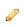

.. _upload-digital-object:

=================================
Upload and manage digital objects
=================================

:term:`Digital objects <digital object>` objects are computer files that can be
uploaded into and displayed by AtoM; they can include scanned images, digital
photographs, sound and moving image files, and other scanned or born-digital
items. AtoM allows the user to link a single :term:`digital object` to an
:term:`archival description` or an an :term:`authority record`, or import
multiple digital objects to new lower :term:`levels of description <level of
description>`. In AtoM, there is a 1:1 relationship between a digital object and
an :term:`information object` - meaning every digital object must be associated
with an :term:`archival description`, typically at the file or item level (see
:term:`level of description`), or an :term:`authority record`.

For every object uploaded, AtoM creates two derivative objects from the
:term:`master <master digital object>`: a :term:`thumbnail` image and a
:term:`reference display copy` of the object. The master digital object is the
unaltered version of a :term:`digital object` that has been uploaded to
AtoM. Note that only authenticated (i.e. logged-in) users may view master
digital objects by default (though this can be changed by editing the
permissions of unauthenticated users - for more information, see:
:ref:`edit-user-permissions`).

.. IMPORTANT::

   By default, **all** users can view the :term:`master digital object` of an
   uploaded PDF, regardless of the "View master" settings in the Archival
   description permissions tab. This is because the reference display copy is
   not large enough to be useful without access to the full PDF, while the
   reference copy might be perfectly serviceable for an image (and restricting
   access to the master may be part of the required copyright conditions).
   Note that users could still restrict public access to uploaded PDFs using
   the PREMIS actionable rights module - for more information, see:
   :ref:`rights`.

.. image:: images/carousel.*
   :align: center
   :width: 70%
   :alt: A image of the carousel in AtoM

At higher :term:`levels of description <level of description>`, the
:term:`view page` of a :term:`parent record` will include
:term:`thumbnails <thumbnail>` of all digital objects registered at lower levels.
The thumbnails are displayed using a :term:`carousel viewer <carousel>` so you
can easily scroll through the set using your mouse or keyboard's arrow keys.
Clicking on a thumbnail will redirect you to the :term:`view page` for the
:term:`description <archival description>` associated with that digital
object. If more than 10 digital objects appear at lower levels, AtoM will
display the first 10 in the :term:`carousel` and provide a link to a digital
object browse page to explore the rest if desired. For more information,
see the :ref:`recurring-carousel` entry in :ref:`navigate`.

.. TIP::

   The digital object carousel can also be disabled by an
   :term:`administrator` via **Admin > Settings > Default page elements**. For
   more information, see: :ref:`default-page-elements`.

See below for more information on:

* :ref:`Linking single digital objects to archival descriptions <link-digital-object>`
* :ref:`Digital object metadata <digital-object-metadata>`
* :ref:`Digital object metadata for preservation files <digital-object-preservation>`
* :ref:`Linking single digital objects to authority records <link-to-authority>`
* :ref:`Uploading multiple digital objects <upload-multiple-objects>`
* :ref:`Uploading PDFs <upload-pdf>`
* :ref:`Editing digital objects <edit-digital-object>`
* :ref:`digital-object-map`
* :ref:`rename-digital-object`
* :ref:`Deleting digital objects <delete-digital-object>`
* :ref:`digital-object-watermark`
* :ref:`Digital object storage <digital-object-storage>`
* :ref:`Supported file formats <file-formats>`

.. seealso::

   * :ref:`rights`
   * :ref:`rights-digital-object`
   * :ref:`manage-digital-object-storage`
   * :ref:`upload-limit`
   * :ref:`rename-title-slug`

.. _link-digital-object:

Link a single digital object to an archival description
=======================================================

A single :term:`digital object` can be linked directly to an existing
:term:`archival description` in AtoM via the "Link digital object" option.
Users can either upload a digital object, or link to an existing resource
available on the web. Instructions on how to do both are included below.

.. NOTE::

   Only **one** digital object can be linked to an archival description at a
   time. If you wish to upload or link multiple digital objects, you will
   need to create lower levels of description. AtoM includes a workflow to
   automate the creation of these lower levels - see
   :ref:`upload-multiple-objects` for more information.

.. image:: images/link-digital-object.*
   :align: center
   :width: 80%
   :alt: A image of the link digital object edit page

To link a single :term:`digital object`:

1. Navigate to the :term:`view page` of an existing
   :term:`archival description` in AtoM. You can do this by
   :ref:`browsing <browse>` or by :ref:`searching <search-atom>` for a specific
   archival description - see :ref:`access-content` for more information on
   navigation in AtoM.
2. Click on the "More" button in the :term:`button block`; from the menu that
   appears, select "Link digital object".

.. image:: images/more-menu-link.*
   :align: center
   :width: 80%
   :alt: A image of the more menu, with the Link digital object option selected

3. AtoM will redirect you to the link digital object :term:`edit page`. Users
   can either upload a digital object, or link to an existing digital object
   available on the internet.

.. image:: images/link-digital-object.*
   :align: center
   :width: 80%
   :alt: A image of the link digital object edit page

4. **To upload a digital object locally**, click the "Choose File" button to
   navigate to and select a file on your computer or device. Click "Open" once
   the item has been selected from the window that will appear.
5. **To link to an object on the internet**, enter the URL to the external
   object to which you wish to link.

.. IMPORTANT::

   To link to a digital object via the web, you **must** enter a URL that
   ends with the file extension of the resource to which you are trying to
   link - for example, to link to an image, the URL should end with .jpg,
   .png, etc. You can usually get to this URL by clicking on the resource
   directly, or by right-clicking and selecting "View image" etc in your
   browser.

   .. image:: images/link-external-example.*
      :align: center
      :width: 90%
      :alt: An example of linking to an external digital object

6. Click the "Create" button in the :term:`button block`. When you return to the
   :term:`view page`, the :term:`reference display copy` will be displayed in
   the digital object field, above the other fields linked to that
   :term:`archival description`.

   .. NOTE::

      Users can view or play the :term:`reference display copy` (depending on
      the type of digital object). Authenticated (i.e. logged-in) users can also
      download the :term:`master digital object`.

7. Objects with multiple pages, such as multi-page TIFFs or PDF files, will by
   default be displayed with single-page reference display copies. To have them
   viewed with a pager to allow the user to browse through the pages, go to
   **Admin > Settings > Global > Upload multi-page files as multiple
   descriptions** and select "Yes"; this will also cause all pages of a multi-
   page object to appear individually as child records of the description to
   which the object was uploaded. (See: :ref:`settings <upload-multi-files>`).

.. TIP::

   If you are comfortable with users accessing the
   :term:`master digital object` (e.g. the original full-resolution upload)
   for viewing multi-page files such as PDFs in their browser, you can change
   the default permissions to grant anonymous users (e.g. unauthenticated, or
   not logged in) access to the master via **Admin > Groups** - select the
   "anonymous" group, edit the archival description permissions, and change
   the "Access master" field to "Grant". Users will then be able to click on
   the :term:`reference display copy` to view the original upload. For more
   information, see: :ref:`edit-user-permissions`.

You can upload any file format, but only supported formats can be viewed or
played directly in AtoM. For a list of formats, see
:ref:`File formats <file-formats>`. Formats that are not supported can still be
uploaded: clicking the object will download it to the user's desktop where
(assuming the user has the required software) it can be viewed or played.

See :ref:`below <edit-digital-object>` for more information on making changes to
your :term:`digital object`.

:ref:`Back to top <upload-digital-object>`

.. _digital-object-metadata:

Digital object metadata
=======================

When you link a digital object to an :term:`archival description`, the "Digital
object metadata" section on the archival description :term:`view page` will 
include an "Access Copies" subsection.

.. NOTE::

   An unauthenticated user will not see a digital object and its "Access
   copies" metadata if the archival description it is attached to has a
   "draft" instead of "published" status.

1. Clicking on the "Access copies" subsection label link will collapse or 
   expand the subsection. 

2. The "Access Copies" subsection will include metadata about the "Master
   file", "Reference copy", and "Thumbnail copy" representations of the
   digital object. Specifically: filename, media type, mime-type, filesize,
   and uploaded (the timestamp for when the digital object was uploaded to
   AtoM).

   .. image:: images/access-copies-section.*
      :align: center
      :width: 90%
      :alt: digital object metadata with access enabled for all representations

3. An administrator user can toggle the display of specific "Digital object 
   metadata" section fields on or off in the **Admin > Visible elements >
   Digital object metadata area** section. This only affects display for 
   unauthenticated users. Any authenticated users will see all metadata 
   elements in each section as long as those fields contain a value. For more 
   information, see: :ref:`visible-elements`. 

4. If the Reference representation or Thumbnail representation is deleted via
   the "Edit digital object" page, then the "Reference copy" and/or "Thumbnail 
   copy" metadata is no longer displayed on the archival description view 
   page. Additionally, the thumbnail is not show on Browse pages and the 
   reference copy is not displayed on view pages.

5. The filename for each representation is either shown as plain text or as a
   hyperlink. If it is a hyperlink, it indicates that this user has explicit 
   download permission for this representation.

6. The icon underneath the "Master file", "Reference copy", and "Thumbnail copy" 
   label is coloured black or grey. If it is grey it indicates that the user does
   not have access to that representation. Note that in the case of unauthorized
   users, the default setting is to display the reference copy at the top of the
   archival description view page. Therefore, the icon is coloured black for 
   reference copies by default. However, an explicit hyperlink is not provided
   in the digital object metadata section for unauthorized users. This is to 
   respect institutional policies around displaying a copyright access statement 
   for downloaded digital materials. That feature only works for Master file 
   representations. See :ref:`copyright-pop-up`.

   .. image:: images/digital-object-no-master-access.*
      :align: center
      :width: 90%
      :alt: digital object without access to master representation 

   .. TIP::

      Access to the "Master file", "Reference copy", and "Thumbnail copy" can 
      be configured per user group. The "Access master", "Access reference", 
      and/or "Access thumbnail" permission can be set to "Grant" or "Deny" for 
      any user group, including unauthenticated ("anonymous") users. 
      See: :ref:`edit-user-permissions`. 

8. Access to the "Master file", "Reference copy", and "Thumbnail copy" may be
   overridden by actionable PREMIS rights configured for individual archival 
   descriptions and their digital object. See: 

   * :ref:`rights-digital-object`
   * :ref:`disallow-statements`

   For example, if a PREMIS right is added to an archival description where 
   the "Act" is "Disseminate" and the "Restriction" is "Disallow", then the 
   hyperlinks in the "Digital object metadata" section are no longer active, 
   all the document icons are coloured grey, and the reference copy of the 
   digital object is no longer displayed on the archival description view 
   page. Instead the customizable text of the "Disallow statement" is
   displayed at the top of the page as well as in a "Permissions" field for 
   each Access copy representation, e.g. "Access to this record is restricted 
   because it contains personal or confidential information. Please contact 
   the Reference Archivist for more information on accessing this record.". 

   .. image:: images/digital-object-premis-disallow.*
      :align: center
      :width: 90%
      :alt: digital object PREMIS rights set to disallow

   .. NOTE::

      If the "Restriction" were to be changed to "Conditional" and the default 
      permission settings are enabled then the "Reference copy" and "Thumbnail 
      copy" become available again on the AtoM template. The customizable text 
      for the "Condition Statement" is displayed in a "Permissions" field for the 
      "Master file" representation, e.g. "This record has not yet been 
      reviewed for personal or confidential information. Please contact the 
      Reference Archivist to request access and initiate an access review.".

:ref:`Back to top <upload-digital-object>`

.. _digital-object-preservation:

Digital object metadata for preservation files
==============================================

.. _Archivematica: https://www.archivematica.org/

If you or another user of a preservation system (e.g. 
`Archivematica`_) has sent a :ref:`DIP upload <archivematica:upload-atom>` to 
an :term:`archival description` :term:`slug` in AtoM then thumbnails for the 
digital objects in that Dissemination Information Package (DIP) will be 
displayed in the archival description's digital object :term:`carousel`.

.. NOTE::

   An unauthenticated user will not see a digital object and its metadata 
   if the archival description it is attached to has a "draft" instead of 
   "published" status.

When selecting one of the digital objects included in the DIP upload, the 
"Digital object metadata" section on the archival description view page will 
include a "Preservation Copies" and "Access Copies" subsection.

.. NOTE::

   When the preservation system uploads a DIP with digital objects to AtoM, 
   it will generate "Master file", "Reference copy", and "Thumbnail copy" 
   representations with their metadata displayed in the "Access copies" 
   subsection.

1. Clicking on either of these subsection label links will collapse or expand 
   the subsection. See the :ref:`digital-object-metadata` above for more about
   the "Access copies" section.

2. The "Preservation Copies" subsection will include metadata about the
   "Original file" and "Preservation copy" representations that are stored in 
   the preservation system. 

.. NOTE::

   If the preservation system did not generate a preservation copy then 
   only the "Original file" section is shown.

3. The "Preservation copy" metadata includes filename, filesize, and a 
   timestamp for when the preservation system normalized (i.e. transcoded) the 
   preservation copy from the original file.  

4. The "Original file" metadata may include filename, file format name, file 
   format version, format registry key (the unique key assigned to the file 
   format by a format registry), format registry name (e.g. PRONOM), filesize, 
   and ingested (the timestamp for when the preservation system received the 
   original file).

5. If the preservation action system statement option is enabled, you will
   also see a "Permissions" field with custom text that is populated by an 
   :term:`administrator` via **Admin > Settings > Permissions > Preservation 
   system access statement** (e.g. "Access only provided on research room 
   computer"). For more information, see: :ref:`preservation-access-statement`.

   .. image:: images/digital-object-preservation-copies-no-access.*
      :align: center
      :width: 90%
      :alt: digital object preservation copy display, without access

6. An administrator user can toggle the display of specific "Digital object 
   metadata" section fields on or off via **Admin > Visible elements > Digital 
   object metadata area**. This only affects display for unauthenticated users. 
   Any authenticated users will see all metadata elements in each section as 
   long as those fields contain a value. For more 
   information, see: :ref:`visible-elements`. 

7. If you are logged in and belong to the "authenticated" group, then you will 
   also see the File UUID and AIP UUID for the Original file. The file UUID is 
   the preservation system's universally unique identifier for the file and 
   the Archival Information Package (AIP) UUID is the universally unique 
   identifier for the preservation system package which contains the file 
   along with other related files.

8. If the preservation copies came from the Archivematica preservation system 
   and AtoM has enabled the "arStorageServicePlugin" to allow for AIP 
   download, then users that belong to a group with Download AIP permissions 
   (by default Administrators only) will also see a "Download file" and 
   "Download AIP" link next to each UUID. Clicking on them will fetch the file 
   or the full AIP from the preservation system. See 
   :ref:`Storage service settings <storage-service>`.

   .. image:: images/digital-object-preservation-copies-with-access.*
      :align: center
      :width: 90%
      :alt: digital object preservation copy display, with access

9. If the user has "Download file" and "Download AIP" permissions then the box 
   icon under the "Original file" label will be coloured black. Otherwise it 
   is coloured grey.

.. NOTE::

   By default, access to the preservation copy is only available via the 
   preservation system, therefore the box icon under the "Preservation 
   copy"  label is always coloured grey for all users.

:ref:`Back to top <upload-digital-object>`

.. _link-to-authority:

Link a single digital object to an authority record
===================================================

The process to link a :term:`digital object` to an :term:`authority record` is
similar:

1. Navigate to the :term:`view page` of an existing
   :term:`authority record` in AtoM. You can do this by
   :ref:`browsing <browse>` or by :ref:`searching <search-atom>` for a specific
   authority record - see :ref:`access-content` for more information on
   navigation in AtoM.

2. Click on the "More" button in the :term:`button block` and select "Link
   digital object".

.. image:: images/link-do-authority.*
   :align: center
   :width: 80%
   :alt: A image of the more menu, with the Link digital object option selected

3. AtoM will redirect you to the link digital object :term:`edit page`. Users
   can either upload a digital object, or link to an existing digital object
   available on the internet.

4. **To upload a digital object locally**, click the "Choose File" button to
   navigate to and select a file on your computer or device. Click "Open" once
   the item has been selected from the window that will appear.
5. **To link to an object on the internet**, enter the URL to the external
   object to which you wish to link.

.. IMPORTANT::

   To link to a digital object via the web, you **must** enter a URL that
   ends with the file extension of the resource to which you are trying to
   link - for example, to link to an image, the URL should end with .jpg,
   .png, etc. You can usually get to this URL by clicking on the resource
   directly, or by right-clicking and selecting "View image" etc in your
   browser.

6. Click the "Create" button in the :term:`button block`. When you return to the
   :term:`view page`, the :term:`reference display copy` will be displayed in
   the digital object field, above the other fields linked to that
   :term:`authority record`.

   .. image:: images/authority-image.*
      :align: center
      :width: 80%
      :alt: Authority record with linked image

.. NOTE::

   Unauthenticated users (i.e. not logged in) cannot download digital
   objects associated with authority records.

As with :term:`archival descriptions <archival description>`, you can upload any
file format to :term:`authority records<authority record>`, but only supported
formats can be viewed or played directly in AtoM.  For a list of formats, see
:ref:`File formats <file-formats>`. Formats that are not supported can still be
uploaded: clicking the object will download it to the user's desktop where
(assuming the user has the required software) it can be viewed or played.

See :ref:`below <edit-digital-object>` for more information on making changes to
your :term:`digital object`.

:ref:`Back to top <link-to-authority>`

.. _upload-multiple-objects:

Upload multiple digital objects to archival descriptions
========================================================

In AtoM, there is a 1:1 relationship between
:term:`archival descriptions <archival description>` and
:term:`digital objects <digital object>` - that is, only one digital object
may be associated with an archival description, and all digital objects
require an associated description. However, to enable a rapid workflow where
users can upload multiple digital objects without first having to create
associated descriptions, AtoM includes an option to upload multiple digital
objects at once, as :term:`children <child record>` of a selected archival
description. Users can choose what :term:`level of description` is used when
the placeholder descriptions are created; a title can also be added to each
uploaded digital object, which will then be used as the title for the related
description.

.. image:: images/upload-multiple-images.*
   :align: center
   :width: 70%
   :alt: A image of the upload multiple images edit page

**To upload multiple digital objects in AtoM:**

1. Navigate to the :term:`view page` of an existing
   :term:`archival description` in AtoM. You can do this by
   :ref:`browsing <browse>` or by :ref:`searching <search-atom>` for a specific
   archival description - see :ref:`Access content <access-content>` for more
   information on navigation in AtoM.
2. Click on the "More" button in the :term:`button block`; from the menu that
   appears, select "Import digital objects".

.. image:: images/import-digi-objects.*
   :align: center
   :width: 80%
   :alt: An image of the options in the More button located in the button block

3. Select a default title for the objects  - this will be used as the title
   for the associated :term:`archival description` that will be created for
   each object uploaded. Each object will also have its own title field that
   can be customized later in the process, but if you do not wish to
   individually name each object's associated description, an automated title
   can be added to all objects using the title field at the top of the upload
   page. The ``%dd%`` in the default title provided represents an incrementing
   2-digit number - that is to say, the default will use image 01, image 02,
   etc. However, this can be customized as needed:

.. image:: images/import-objects-title.*
   :align: center
   :width: 80%
   :alt: Choosing the default title added to child descriptions

4. Choose a default :term:`level of description`. Unlike the
   :ref:`link-digital-object` option, which attaches the :term:`digital object`
   directly to the :term:`archival description` at that level, the "Import
   multiple objects" option requires the user to designate a level of
   description (e.g.: Fonds, Subfonds, Collection, Series, Subseries, File,
   Item, Record group, Part, etc). This level of description will be used for
   the new :term:`children <child record>` that are generated as part of the
   upload.

.. image:: images/import-objects-select.*
   :align: center
   :width: 80%
   :alt: Selecting a level of description for the child descriptions

.. TIP::

   For users wishing to include multiple individual images as "views" of a
   single item, AtoM now includes "Part" as a level of description included at
   installation. An :term:`administrator` can customize the levels of 
   description available in AtoM - for more information, see: 

   * :ref:`terms`

5. Add your digital objects. You can drag and drop a selection onto the pane
   provided (as shown in the image below), or you can click the "browse" link
   and use your computer's file explorer to find and select the digital
   objects you would like to load.

.. image:: images/import-objects-drag.*
   :align: center
   :width: 80%
   :alt: Dragging digital objects into AtoM's multi-uploader

6. Once selected, the page will show previews of all the objects. If you like,
   you can edit the title for each description that will be created, by
   clicking the pencil icon under to the preview. However, once we click the
   "Upload" button, a separate page dedicated to customizing the description
   titles will be provided (see step 9 below). Remember, the title you enter 
   here will be the title used for the associated :term:`archival description` 
   that will be created for each :term:`digital object` uploaded.

.. image:: images/import-objects-title2.*
   :align: center
   :width: 80%
   :alt: Customizing individual description titles for each object uploaded

7. If necessary, you can click the black "X" icon on the top right of the
   thumbnail generated to remove an object from the upload. You can also add
   additional objects either by dragging them in, or by using the "Add more" link 
   provided in the top right corner of the upload area.

.. NOTE::

   The ``%dd%`` incremental counter used in the default Title field will
   **only** ever increment up to the next number - even if you remove
   previously added objects!

   For example, if you added 3 images using the default title (i.e. image 01,
   image 02, image 03), then removed one and uploaded a different image, this
   new image would **not** be image 03 - it would be added as "image 04."

   Any discrepancies can be easily reviewed and modified on the next page of
   the importer, where each image will be shown next to an editable title
   field.

8. You can quit the upload process at any time by clicking the "Cancel" button
   in the :term:`button block`; any digital objects already uploaded will not be
   saved. Note that simply navigating away from the page by any other means,
   **without first clicking "Upload"** will also result in no new digital
   objects being uploaded.
9. Click the "Upload" button in the :term:`button block` when you are satisfied
   with your changes. AtoM will upload the images using the default description 
   titles provided, but will immediately redirect you to a page where you can 
   individually customize those default titles if desired: 

.. image:: images/import-objects-title-change.*
   :align: center
   :width: 80%
   :alt: Customizing the description titles of the uploaded digital objects

10. When you are satisfied with the associated description titles, click the
    "Save" button in the :term:`button block` at the bottom of the page. When
    you return to the :term:`view page`, you will see that the objects have
    all been attached to the :term:`archival description` as :term:`child
    records <child record>` of that description. If the digital object
    :ref:`recurring-carousel` is enabled (see :ref:`default-page-elements` for 
    instructions on enabling or disabling the carousel), you will also see the 
    thumbnails of your uploaded digital objects in the carousel.

.. image:: images/import-objects-children.*
   :align: center
   :width: 70%
   :alt: An image of a description after uploading multiple digital objects

:ref:`Back to top <upload-digital-object>`

.. _upload-pdf:

Upload PDF
==========

A user can link a single PDF and import multiple PDFs into AtoM. A full-text
search of the content of the PDF is available through the main search box. PDFs
that have a text layer will work, including all OCR PDFs and born-digital PDFs
that include a text layer (e.g., exported Word documents) will work. Search
results will refer users to the PDF that contains the search term(s), but will
not reveal the location of the term(s) within the PDF.

Currently, AtoM 2.x truncates PDF text after the first 65,535 bytes.

As mentioned above, it is possible to upload multi-page TIFFs or PDF files to
be displayed with a page viewer and to upload each page as a child object of
the parent. To enable this feature, see :ref:`settings <upload-multi-files>`.

Otherwise, the process for uploading PDFs is the same as described above.

:ref:`Back to top <upload-digital-object>`

.. _edit-digital-object:

Edit digital objects
====================

Any :term:`digital object` that has been uploaded and linked to an
:term:`archival description` or :term:`authority record` can be edited at any
time by an authenticated (i.e. logged-in) user. Accessing the digital object
:term:`edit page` is the same for all of the following options: 

1. Navigate to the :term:`view page` of an existing :term:`archival description`
   or :term:`authority record` that has an associated :term:`digital object`.
2. Click on the "More" button in the :term:`button block`; from the menu that
   appears, select "Edit digital object".
3. You will be redirected to the digital object's :term:`edit page`. On this
   page, all representations (i.e. :term:`master <master digital object>`
   representation, :term:`reference <reference display copy>` representation and
   :term:`thumbnail` representation) of the :term:`digital object` will be
   listed, along with information on their Filename, Filesize, Media Type, and 
   other options.

From this edit page, you can perform the following actions:

**Jump to**

* :ref:`edit-do-metadata`
* :ref:`edit-do-derivs`
* :ref:`edit-do-srt-vtt`
* :ref:`edit-do-save`

.. SEEALSO::

   * :ref:`Upload settings <upload-settings>`
   * :ref:`Digital object derivative settings <digital-object-derivatives>`
   * :ref:`DIP upload settings <dip-upload-settings>`

.. _edit-do-metadata:

Edit the digital object metadata
--------------------------------

The top part of the digital object :term:`edit page` will include basic
metadata about the original digital object in the "Master" 
:term:`information area`. Basic technical metadata such as Filename and Filesize
are display only, and cannot be edited. However, you can change other metadata
elements such as the Media type, Alt text, and latitude/longitude values 
associated with the digital object.

.. image:: images/edit-digi-object-master.*
   :align: center
   :width: 80%
   :alt: An image of the metadata fields shown below the master digital object
         in the digital object edit page

The Media type is used by the Media type facet in the search/browse pages -
in some cases, AtoM might not properly detect the media type, and you can
adjust it here for better results. Values include: Audio, Image, Video, Text,
and Other. For more information on filter facets in AtoM, see:
:ref:`recurring-facet-filters`.

In the "Alt text" :term:`field`, you can add alternative text to display if
the image cannot be displayed in your browser. This text will also be used by
accessibility supports such as screen readers.

You can also add latitude and longitude values to the Master digital object's
metadata for basic geolocation support. This can configured to display a 
dynamic Google map in AtoM - for more information, see below:

* :ref:`digital-object-map`

.. _edit-do-derivs:

Edit reference and thumbnail representations
--------------------------------------------

Below the Master :term:`information area` on the digital object 
:term:`edit page`, you will also find sections for the various derivatives 
created upon upload - the :term:`reference display copy` and the 
:term:`thumbnail`. While these derivatives are typically automatically created
by AtoM during digital object upload, you can delete them, and either 
re-generate them or upload your own versions. Since thumbnails are used in 
search and browse results and the reference copy is displayed on the related
:term:`archival description` view page, this can be a useful way to customize
the display of your digital objects. 

.. image:: images/edit-thumbnail.*
   :align: center
   :width: 90%
   :alt: The Reference and Thumbnail representation areas in the Digital object
         edit page

If you wish to use a different image as the :term:`thumbnail` or 
:term:`reference <reference display copy>`, first click the "Delete" link in 
the relevant :term:`area <information area>`. 

AtoM will ask you to confirm that you would like to delete the derivative. 
After confirming, the Edit digital object screen will then give you the option 
to upload a new derivative by clicking Browse and selecting a file from your 
local computer, or else auto-generate a new representation from the master image.

.. image:: images/upload-thumbnail.*
   :align: center
   :width: 90%
   :alt: Upload or create a new thumbnail or reference image.

.. TIP::

   Somewhat confusingly, the digital object :term:`edit page` will use the 
   thumbnail to provide a preview of both the :term:`thumbnail` and 
   :term:`reference <reference display copy>` derivatives, and the reference
   copy to provide a preview of the :term:`master digital object`. 

   Because of this, don't be alarmed if, for example, you are trying to replace
   the thumbnail and after confirming the deletion of the current version, you
   see the preview of the reference copy missing! The original reference copy
   will remain unchanged until you edit it, even if the preview shown in this
   page is no longer correct once your derivatives have been customized. 

.. _edit-do-srt-vtt:

Add subtitle, caption, and/or chapter files to audio and video
--------------------------------------------------------------

.. _WebVTT: https://en.wikipedia.org/wiki/WebVTT
.. _SubRip Text: https://en.wikipedia.org/wiki/SubRip#SubRip_file_format
.. _UTF-8: https://en.wikipedia.org/wiki/UTF-8

AtoM also supports the ability to upload `WebVTT`_ (``.vtt``) or `SubRip Text`_ 
(``.srt``) files to audio and video :term:`digital objects <digital object>` as
a means of adding chapter markers, captions, or subtitles to your content. 
Captions and subtitles can also be added in multiple languages. 

.. image:: images/edit-do-chapters-captions.*
   :align: center
   :width: 90%
   :alt: The Chapters and Caption/Subtitles upload options in the digital object
         edit page

Files used should be in ``.vtt`` or ``.srt`` format, and should use `UTF-8`_ 
character encoding. 

Click the "Choose file" button to open a local file explorer, and select the
file you wish to upload from your device. If you're adding Caption or Subtitle
files, be sure to select the correct language from the Language 
:term:`drop-down menu` before uploading. 

.. IMPORTANT::

   Currently, the largest file size supported for these file uploads is 64 MiB.

Once you have :ref:`saved your changes <edit-do-save>`, you will be re-directed
to the view page of the related :term:`archival description` or 
:term:`authority record`.

When captions or subtitles are correctly added, they will appear under the "CC"
icon on the media player: 

.. image:: images/edit-do-cc-example.*
   :align: center
   :width: 75%
   :alt: An image of the media player showing the captions menu

When chapters are correctly added, they will appear under the menu icon on
the media player:

.. image:: images/edit-do-chapter-example.*
   :align: center
   :width: 75%
   :alt: An image of the media player showing the chapter menu

You can re-enter :term:`edit mode` to make further changes as needed, or to
add additional subtitles or captions in other languages. Basic metadata about
the files will be shown, including the file name and size, as well as an option
to delete the current uploads. Note that you can only have one chapter file
per digital object, but multiple subtitle or caption files for multilingual
support: 

.. image:: images/edit-do-chapters-captions-2.*
   :align: center
   :width: 90%
   :alt: The Chapters and Caption/Subtitles upload options in the digital object
         edit page, when files have previously been uploaded

.. _edit-do-save:

Save your changes
-----------------

You can quit the edit process at any time by clicking the "Cancel" button
in the :term:`button block`; any edits made to digital objects will not be
saved. Note that simply navigating away from the page by any other means,
**without first clicking "Save"** will also result in no new digital objects
being uploaded.

Once all your changes have been made, click the "Save" button in the
:term:`button block`. You will be redirected back to the related record's 
:term:`view page`.

All changes made can be edited once again, at any time, by following the steps
outlined above.

:ref:`Back to top <upload-digital-object>`

.. _digital-object-map:

Add dynamic maps to your digital object metadata
================================================

To support basic geolocation, AtoM has the ability to associate latitude and
longitude coordinates with a digital object. If desired, you can also display
a dynamic Google map in the digital object metadata
:term:`area <information area>` showing the location of the coordinates. To do
so, an :term:`administrator` will first need to configure certain settings so
the map can be visible.

.. image:: images/digi-object-map.*
   :align: center
   :width: 90%
   :alt: The map displayed in the digital object metadata area

**Enabling the display of digital object maps**

Two separate settings must be changed to enable the display of the digital
object maps in AtoM. First, in **Admin > Settings > Global**, an API key must
be added to the :ref:`maps-api-key`.

You can request a Google Maps API key free of charge - all you need is a
Google account. For more information, see:

* https://developers.google.com/maps/documentation/javascript/get-api-key

Additionally, in **Admin > Settings > Default page elements**, the "Digital
object map" setting checkbox must be checked. Remember to save your changes in
the Settings area!

.. image:: images/digi-map-setting.*
   :align: center
   :width: 90%
   :alt: The Digital object map checkbox in Default page elements

For more information, see:

* :ref:`maps-api-key`
* :ref:`default-page-elements`

**Adding latitude and longitude values to a digital object**

Once the above settings are configured, then any time a digital object has
latitude and longitude values added to it, it will display a dynamic, zoomable
map in the Digital object metadata area. To add your latitude and longitude
values to an existing digital object (Examples show this process for
:term:`archival description` - the instructions are the same for
:term:`authority record`):

1. Navigate to the :term:`archival description` or :term:`authority record`
   linked to the :term:`digital object` you want to edit. You can do this by
   :ref:`searching <search-atom>` or :ref:`browsing <browse>` - for more
   information on navigation in AtoM, see: :ref:`access-content`.

.. image:: images/view-digi-object.*
   :align: center
   :width: 90%
   :alt: The view page of an archival description with a digital object

2. When you are on the :term:`view page` of the related description, scroll
   down the :term:`button block` at the bottom of the page, and in the "More"
   menu, select "Edit digital object"

.. image:: images/edit-digi-object.*
   :align: center
   :width: 90%
   :alt: The Edit digital object option in the More menu at the bottom of the
         page

3. AtoM will redirect you to the :term:`edit page` for the digital object. In
   the :term:`information area` for the :term:`master digital object`, add your
   latitude and longitude values to the fields provided.

.. image:: images/lat-longs.*
   :align: center
   :width: 90%
   :alt: Adding latitute and longitude values to a digital object

.. IMPORTANT::

   For **all** latitude and longitude :term:`fields <field>` in AtoM, you need
   to use the Signed degrees format (e.g. DDD.dddd) for the data to work!
   Degree and cardinal based formats (e.g. DDD MM SS + compass direction)
   **will not work** and the map will not be generated properly.

   When only one field is provided, latitude values should be entered first,
   followed by a comma before the longitude values.

   Here is an example of the latitude and longitude for Vancouver, BC, Canada:

   **Correct format:** (signed degrees)

   * 49.246292, -123.116226

   **Will not work in AtoM:** (DMS cardinal)

   * 49° 14' 46.6512" N, 123° 6' 58.4136" W

4. When you save the record, AtoM will return you to the archival
   description's :term:`view page`. In the Digital object metadata area, you
   should now see a Google map showing your coordinates with a pin. You can
   zoom, pan, change the map type, and click to view a full Google map in a new
   tab.

.. image:: images/digi-object-map.*
   :align: center
   :width: 90%
   :alt: The map displayed in the digital object metadata area

.. TIP::

   Not sure how to find out the coordinates of a location? You can use Google
   maps!

   Find your location on a map - zoom in to make it as precise as possible. If
   you right-click and select the "What's here?" option that will appear in
   the context menu that appears, Google Maps will display the latitude and
   longitude values, along with any additional information it has:

   .. image:: images/google-lat-longs.*
      :align: center
      :width: 90%
      :alt: Finding lat and long values with Google Maps

   You can then use this information in AtoM following the steps described
   above!

:ref:`Back to top <upload-digital-object>`

.. _rename-digital-object:

Edit the filename of a digital object linked to an archival description
=======================================================================

For locally uploaded digital objects, you can edit the file name of the digital
object after it has already been uploaded, using the "Rename" module.  Once
edited, AtoM will automatically update all related file paths to ensure that the
link between the digital object and the associated :term:`archival description`
is maintained.

Note: this is not available for :term:`digital objects <digital
object>` linked to :term:`authority records <authority record>`.

.. IMPORTANT::

   This feature is best used for **locally** uploaded digital objects, **not**
   digital objects linked via URL to an external location, such as the web.

   Technically the feature will work with external links, but all you are
   renaming in AtoM is the filename stored in the database associated with the
   :term:`master digital object`, and the filenames of any locally generated
   derivatives such as the :term:`reference display copy` and the
   :term:`thumbnail`. When linking a digital object in AtoM via URL, the
   master is not stored in AtoM, but local derivatives are created for use in
   search/browse results and the :term:`view page` of the linked description.
   For more on linking digital objects in AtoM, see above:
   :ref:`link-digital-object`. If you do edit the filename of an external
   linked digital object, AtoM will store the filename locally, and use it to
   update the filenames of the derivatives - but the external object will not
   be affected, and the link displayed in the digital object metadata area
   will be unchanged.

The Rename module used to edit the linked digital object filename can also be
used to edit the title of the associated :term:`archival description`, and its
:term:`slug` - detailed instructions on how to use it for these other purposes
are included on the :ref:`archival-descriptions` documentation page - see:
:ref:`rename-title-slug`.

**To change the filename of a linked digital object:**

1. Navigate to the :term:`view page` of an existing
   :term:`archival description` with a linked digital object in AtoM. You can
   do this by :ref:`browsing <browse>` or by :ref:`searching <search-atom>`
   for a specific  archival description - see :ref:`access-content` for more
   information on navigation in AtoM.
2. Scroll down to the :term:`button block` at the bottom of the page, and
   click on the "More" button - a menu will open with further options. Click
   on "Rename" to open the Rename module.

.. image:: images/rename-button.*
   :align: center
   :width: 80%
   :alt: An image of the More button menu opened on an archival description

3. AtoM will redirect you to the Rename module page. You will see 3
   :term:`fields <field>` - one for the title of the description, one for
   the slug; the third field is for the filename of the digital object
   linked to the description.

.. image:: images/rename-page.*
   :align: center
   :width: 80%
   :alt: An image of the Rename module's available fields

.. SEEALSO::

   For more information on editing the :term:`slug` and/or title of a
   description with the rename module, see: :ref:`rename-title-slug`.

4. To the right of the edit fields, there is a checkbox corresponding to each
   field. By default, the title and slug checkboxes will be checked, and the
   filename field will be unchecked. The checkbox associated with a field must
   be checked to enable editing. You can uncheck these fields at any time to
   disable them - doing so will undo any changes made and prevent the field from
   updating when the "Update" button is clicked. To edit the filename of the
   linked :term:`digital object`, check the "Update filename" box. You also
   might wish to uncheck the Title and Slug boxes, to prevent any accidental
   edits.

5. Place your cursor in the filename :term:`field` and make changes as necessary.
   For reference, the original value before  your changes is displayed below
   the field.

.. image:: images/rename-filename.*
   :align: center
   :width: 80%
   :alt: An image of the filename being edited in the Rename module

.. IMPORTANT::

   AtoM will automatically sanitize a filename you submit, including:

   * Replacing spaces with hyphens
   * Stripping uppercase characters to lower
   * Removing special characters (e.g. ! @ # $ % ^ & etc)
   * Removing stopwords (e.g. a, an, the, etc)

   This is similar to how a :term:`slug` is sanitized - for more information,
   see: :ref:`slugs-in-atom`.

   **However**, unlike when editing a slug (see :ref:`rename-title-slug`),
   AtoM will **not** give you any warning or notification when making these
   changes after you submit the new filename. You will have to look at the
   digital object metadata area to review the sanitized filename, and repeat
   the above steps if needed.

   We recommend using lowercase alphanumeric characters with no spaces or
   stopwords when choosing your new filename.

6. If you do **not** wish to save your changes, you can click the "Cancel"
   button in the :term:`button block` at the bottom of the Rename module page.
   Note that navigating away from the Rename page will also result in no changes
   being saved.

7. When you are finished making your edits, save your changes by clicking the
   "Update" button located in the :term:`button block` at the bottom of the
   Rename module page. AtoM will redirect you to the :term:`view page` for the
   related :term:`archival description`. A notification banner at the top of
   the page will let you know that the description has been updated.

.. image:: images/rename-notification.*
   :align: center
   :width: 80%
   :alt: An image of the notification banner after a successful rename

8. You can see the updated filename in the Digital object metadata
   :term:`area <information area>` at the bottom  of the record. If you are
   unhappy with the results, you can repeat steps 1-7 as necessary.

.. image:: images/object-metadata-area.*
   :align: center
   :width: 80%
   :alt: An image of the digital object metadata area on an archival description

:ref:`Back to top <upload-digital-object>`

.. _delete-digital-object:

Delete digital objects
======================

To delete a :term:`digital object` that has been uploaded and linked to an
:term:`archival description` or :term:`authority record`:

1. Navigate to the :term:`view page` of an existing :term:`archival description`
   or :term:`authority record` that has an existing :term:`digital object`.
2. Click on the "More" button in the :term:`button block`; from the menu that
   appears, select "Edit digital object". You will be redirected to the digital
   object's :term:`edit page`.
3. Scroll to the bottom of the page and click "Delete". You will be prompted to
   confirm that you wish to "Delete" the digital object; click "Delete" once
   again. You will be redirected to the archival description's :term:`view
   page`.

:ref:`Back to top <upload-digital-object>`

.. _digital-object-watermark:

Adding a watermark to reference images
======================================

A system administrator can place a watermark file in AtoM's root directory, so
a digital watermark is overlayed over all :term:`reference display copy` images
generated when a digital object is uploaded.

For more information, see the Administrator's manual:

* :ref:`customization-watermarking`

:ref:`Back to top <upload-digital-object>`

.. _digital-object-storage:

Digital object storage
======================

In AtoM, administrators can track digital object storage per :term:`repository`.
Storage limits may be placed on individual repositories by in-house server
capacity or on hosted server agreements.

If you are utilizing a multi-institutional / portal instance of AtoM, you will
need to check with the site administrator to learn the digital object storage
limitations.

For more information, see :ref:`Managing digital object storage
<manage-digital-object-storage>`.

.. _file-formats:

Files formats
=============

A number of file formats are supported as digital objects in AtoM. Files in
other formats can still be uploaded to AtoM; they just cannot be directly
accessed or streamed within AtoM itself. In these cases the user must
download the file from AtoM to his or her desktop and (assuming the user
has the requisite software) access the content there.

The table below shows image, audio and video formats which can be viewed in
AtoM:

+----------------+--------------------------------+--------------------------+
| Image          | Audio                          | Video                    |
+================+================================+==========================+
| PDF            | 8SVX                           | AVS                      |
+----------------+--------------------------------+--------------------------+
| BMP            |  AC-3                          | BFI                      |
+----------------+--------------------------------+--------------------------+
| GIF            | Apple Lossless                 | CamStudio CSCD           |
+----------------+--------------------------------+--------------------------+
| PNG            | ATRAC3                         | Cinepak                  |
+----------------+--------------------------------+--------------------------+
| JPEG           | Cook Codec                     | Creative YUV (CYUV)      |
+----------------+--------------------------------+--------------------------+
| V.Flash PTX    | EA ADPCM                       | DNxHD                    |
+----------------+--------------------------------+--------------------------+
| SGI            | FLAC                           | Flash Screen Video       |
+----------------+--------------------------------+--------------------------+
| Sun Rasterfile | Intel Music Coder              | FFV1                     |
+----------------+--------------------------------+--------------------------+
| FLIC           | Monkey's Audio                 | H.261                    |
+----------------+--------------------------------+--------------------------+
| TIFF           | MP2                            | H.263                    |
+----------------+--------------------------------+--------------------------+
| PNM            | MP3                            | H.264/MPEG-4 AVC         |
+----------------+--------------------------------+--------------------------+
|                | Nellymoser Asao Codec in Flash | Huffyuv                  |
+----------------+--------------------------------+--------------------------+
|                | QDM2                           | id Software RoQ Video    |
+----------------+--------------------------------+--------------------------+
|                | RealAudio 1.0                  | Intel Indeo 2            |
+----------------+--------------------------------+--------------------------+
|                | RealAudio 2.0                  | Intel Indeo 3            |
+----------------+--------------------------------+--------------------------+
|                | Shorten                        | LOCO                     |
+----------------+--------------------------------+--------------------------+
|                | Truespeech                     | Mimic[3]                 |
+----------------+--------------------------------+--------------------------+
|                | TTA                            | MJPEG                    |
+----------------+--------------------------------+--------------------------+
|                | TXD                            | MPEG-4 Part 2            |
+----------------+--------------------------------+--------------------------+
|                | Vorbis                         | Apple Computer QuickDraw |
+----------------+--------------------------------+--------------------------+
|                | WavPack                        | Quicktime Graphics SMC   |
+----------------+--------------------------------+--------------------------+
|                | Windows Media Audio 1          | RealVideo RV10           |
+----------------+--------------------------------+--------------------------+
|                | Windows Media Audio 2          | RL2                      |
+----------------+--------------------------------+--------------------------+
|                |                                | Smacker video            |
+----------------+--------------------------------+--------------------------+
|                |                                | Snow                     |
+----------------+--------------------------------+--------------------------+
|                |                                | Sorenson SVQ1            |
+----------------+--------------------------------+--------------------------+
|                |                                | Sorenson SVQ3            |
+----------------+--------------------------------+--------------------------+
|                |                                | Theora                   |
+----------------+--------------------------------+--------------------------+
|                |                                | Asus V1                  |
+----------------+--------------------------------+--------------------------+
|                |                                | Asus V2                  |
+----------------+--------------------------------+--------------------------+
|                |                                | VMware VMnc              |
+----------------+--------------------------------+--------------------------+
|                |                                | On2 VP3                  |
+----------------+--------------------------------+--------------------------+
|                |                                | On2 VP5                  |
+----------------+--------------------------------+--------------------------+
|                |                                | On2 VP6                  |
+----------------+--------------------------------+--------------------------+
|                |                                | Westwood Studios VQA     |
+----------------+--------------------------------+--------------------------+
|                |                                | Microsoft WMV            |
|                |                                | v 7, 8 and 9             |
+----------------+--------------------------------+--------------------------+
|                |                                | Wing Commander/Xan Video |
+----------------+--------------------------------+--------------------------+

.. note::

   AtoM uses FFmpeg to handle audio-visual files. The table above shows
   the file formats supported by FFmpeg.

:ref:`Back to top <upload-digital-object>`
