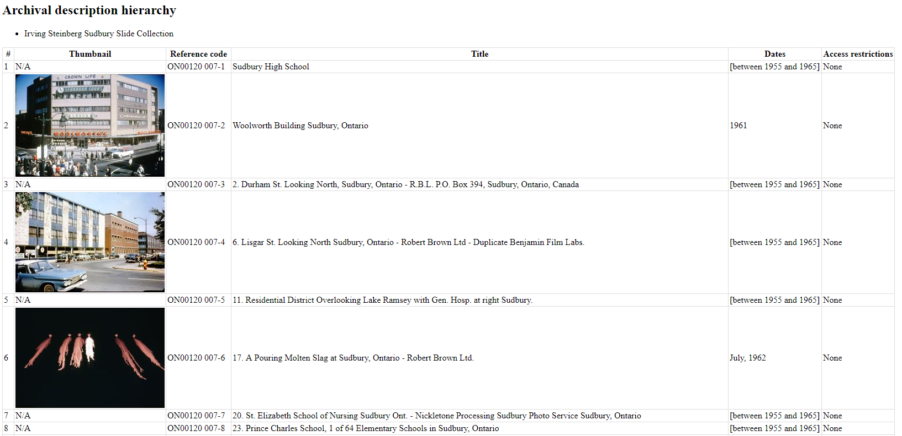

.. _create-file-list-report-print:

==========================
File list report and print
==========================

AtoM offers users the ability to print lists of files and items. Both public
users and logged-in users have access to printing lists of files and items.
The printer ICON is presented alongside the hyperlink Reports in the top,
right-hand corner of the Archival description view page.

.. TIP::

   Before you click on Reports, make sure that the archival description you
   are viewing has children levels that correspond to files and items. If the
   the archival description does not have any information at the file-level,
   you will not be successful printing a file list. If the archival
   description does not have any information at the item-level, you will not
   be successful printing an item list.

1. Click on the Reports hyperlink.
2. The Reports page is loaded for public users.

.. image:: images/file-list.png
   :align: center
   :width: 80%
   :alt: Reports view to the public user.

.. image:: images/file-list-loggedin.png
   :align: center
   :width: 80%
   :alt: Reports view to the logged-in user with Admin privileges

3. Select the Continue button, and AtoM presents a report criteria page.

.. image:: images/file-report-criteria-loggedin.png
   :align: center
   :width: 80%
   :alt: Report criteria view to the logged-in user with Admin privileges.

.. image:: images/file-report-criteria.png
   :align: center
   :width: 80%
   :alt: Report criteria view to the public user.

4. Choose your preference for sorting the list and click on the radial button.
5. Select the Continue button and AtoM loads the print preview page.

.. image:: images/file-report-preview-admin.png
   :align: center
   :width: 80%
   :alt: Print preview to the logged-in user with Admin privileges.

:ref:`Back to top <create-file-list-report-print>`
