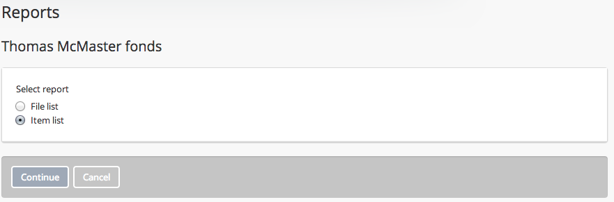
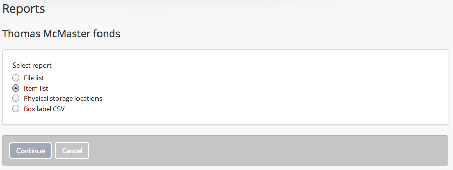
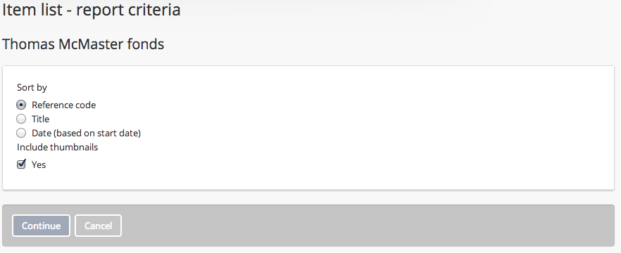
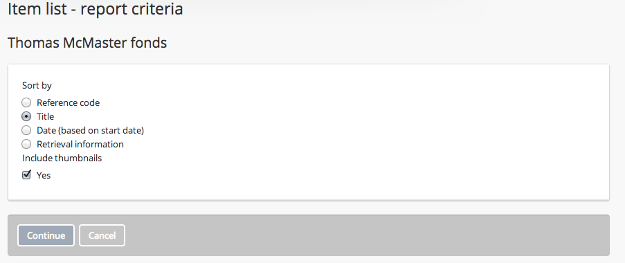
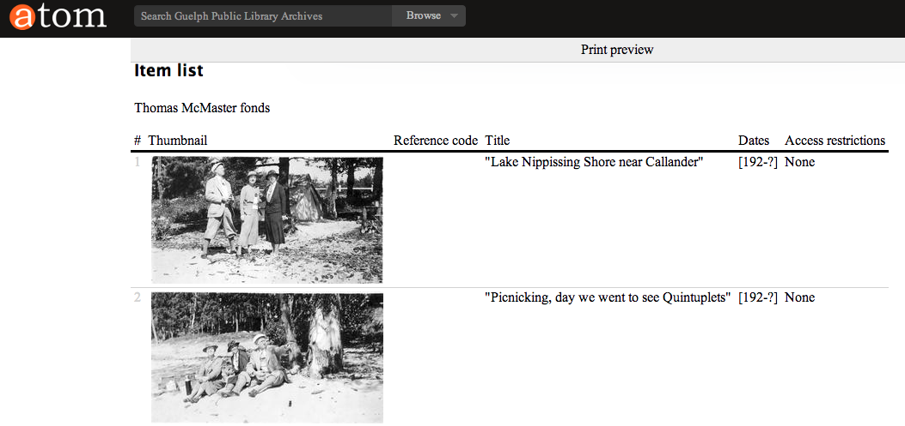
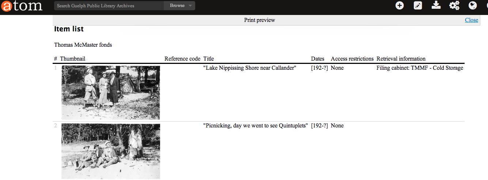

.. _create-item-list-report-print:

==========================
Item list report and print
==========================

.. |print| image:: images/print-icon.png
   :height: 30
   :width: 30

AtoM offers users the ability to print lists of files and items. Both public
users and logged-in users have access to printing lists of files and items.
The printer icon |print| is presented alongside the hyperlink Reports in the
top, right-hand corner of the :term:`Archival description` view page.

.. TIP::

   Before you click on Reports, make sure that the
   :term:`archival description`  you are viewing has
   :term:`children levels <child record>`that correspond to files and items. If
   the the archival description does not have any information at the file-level,
   you will not be successful at printing a file list.

.. |report| image:: images/reportslink.png
   :height: 18

1. Click on the |report| Reports hyperlink.
2. The Reports page is loaded for public users:

3. Alternatively, if you are logged-in, AtoM will load the page with
   the additional options: physical storage locations and box label :term:`CSV`.

4. After selecting ITEM, click on the Continue button, and AtoM presents a
   report criteria page for the public user, which provides the following
   sort options: reference code, title and date (based on start date). Atom
   also lets the user include thumbnails in the item list report. If the
   public user clicks on the yes :term:`radio button`, small thumbnails of
   images at the item-level will be included in the report.

5. If you are logged-in, selection of the Continue button will take you to a
   report criteria page, which provides the following sort options: reference
   code, title, date (based on start date) AND retrieval information. AtoM
   lets the logged-in user include thumbnails in the item list report. If the
   logged-in user clicks on the yes :term:`radio button`, small thumbnails of
   images at the item-level will be included in the report.

6. Choose your preference for sorting the list by clicking on the
   appropriate radio button.
7. Select the Continue button and AtoM will load the print preview page for
   the item list report.
8. The example below shows the item list report for a public user:

9. The example below shows the item list report for a logged-in user. Notice
   the extra column with retrieval information, which is the physical storage
   location.

:ref:`Back to top <create-item-list-report-print>`
