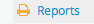
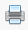

.. _create-physical-storage-report:

======================================================
Create physical storage location and Box label reports
======================================================

.. |gears| image:: images/gears.png
   :height: 17
   :width: 17

This page of the user manual focuses on printing storage location reports, as
well as Box label :term:`CSV` files. To learn about linking
:term:`physical storage` containers to an :term:`archival description` or an 
:term:`accession record`, please see :ref:`Physical storage <physical-storage>`. 
For file and item report generation, see: :ref:`file-item-reports`.

The following sections require either :term:`Administrator` or (in some cases) 
Editor access and :term:`permissions <access privilege>`. For more 
information on user roles and permissions, see:

* :ref:`user-roles`
* :ref:`edit-user-permissions`

**Jump to:**

* :ref:`global-storage-report`
* :ref:`storage-report-view`
* :ref:`storage-report-manage`
* :ref:`box-label-report`

.. _global-storage-report:

Create a global physical storage report
=======================================

AtoM includes a global physical storage report that can be generated via the 
:term:`user interface` from the :term:`Physical storage` module and downloaded
as a CSV file from the :ref:`Jobs <manage-jobs>` page. This report is focused
on container relations (i.e. physical storage containers linked to other 
:term:`entity` types in AtoM, such as 
:term:`archival description <archival description>` and 
:term:`accession records <accession record>`), and can also be used to identify
unlinked containers. Export options on the report generation page allow users to 
choose which of these criteria should be included when creating the report:

.. image:: images/storage-report-config.*
   :align: center
   :width: 80%
   :alt: An image showing the configuration options on the storage report export 
         page

The report will include 1 row for every relation - meaning that a single 
container might appear in multiple rows of the CSV report, showing each time
the storage container has been linked to a description or acccession. 

The image below shows 3 rows from an example report, as an example. The first
row below the column headers displays an unlinked container - that is, a
container in the physical storage module that is not linked to any
descriptions or accessions. The second and third rows show a single container
(named "X40") linked to an accession record and a description:

.. image:: images/storage-report-example.*
   :align: center
   :width: 90%
   :alt: Example rows from a global storage report CSV

.. TIP::

   One of the ways this report can be used is to identify unlinked physical
   storage containers. AtoM also has a command-line task that can be used to 
   delete unlinked storage containers - for more information, see: 

   * :ref:`cli-normalize-physical-object`

**Report columns**

Below is a summary of the columns included in the global physical storage report. 

* **physicalObjectName**: The name assigned to the :term:`physical storage` 
  container.
* **physicalObjectLocation**: The location assigned to the storage container. In 
  AtoM's data entry for the physical storage module, this is a free-text field. 
* **physicalObjectType**: The type of storage container. These values are derived
  from the Physical Object Types :term:`taxonomy` in AtoM's data entry for the 
  physical storage module.
* **holdingType**: Describes the type of relation in this row. If the container
  is not linked to any other entities, this will be blank. If the row describes
  a relation with an :term:`archival description`, the value will be 
  ``description``. If the row describes a relation with an 
  :term:`accession record`, the value will be ``accession``. 
* **holdingIdentifier**: The identifier of the related record. If ``holdingType``
  is "description", then this value will be an :term:`archival description` 
  identifier. If ``holdingType`` is "accession" then this value will be an 
  :term:`accession's <accession record>` primary accession number. If the 
  container is unlinked, this column will be blank.
* **holdingTitle**: The title of the related resource (either 
  :term:`archival description` or :term:`accession record`). If the container is 
  unlinked, this column will be blank.
* **levelOfDescription**: Applies only to related archival descriptions. Will 
  show the level of description assigned to the related record.  
* **holdingSlug**: The :term:`slug` of the related record. If the container is 
  unlinked, this column will be blank.

.. IMPORTANT::

   This CSV is intended as a report, and **cannot** be re-imported into AtoM
   as metadata. AtoM has separate CSV templates for importing accessions, 
   archival descriptions, and physical storage data. For more information, see 
   :ref:`csv-import`.

**To export a global report of physical storage container relations**:

1. Click on the "Manage" menu and Select "Physical storage" from the drop-down
   list.

.. image:: images/navigate-physical-storage.*
   :align: center
   :width: 60%
   :alt: Using the manage menu to navigate to Physical Storage.

2. AtoM will take you to the Browse physical storage screen. 

.. image:: images/browse-physical-storage.*
   :align: center
   :width: 80%
   :alt: Browsing the physical storage locations.

3. At the bottom of the page in the :term:`button block`, click the button that 
   says "Export storage report".

.. image:: images/storage-button-block.*
   :align: center
   :width: 80%
   :alt: An image of the button block at the bottom of the Physical storage 
         browse page.

4. AtoM will redirect you to a report configuration page, with three options:

   * **Include unlinked containers**: containers that are not currently linked
     to any other :term:`entity` will be included in the report when checked.
   * **Include containers linked to accessions**: containers that are linked to
     :term:`accession records <accession record>` will be included in the report
     when checked.
   * **Include containers linked to descriptions**: containers that are linked
     to :term:`archival description` records will be included in the report when
     checked.
  
   You can uncheck options as desired - for example, if you only want to identify
   what storage containers are not currently being used in AtoM, you could check
   only "Include unlinked containers" and uncheck the other two options. When 
   you have configured your choice, click the "Export" button to begin the report
   generation.

.. image:: images/storage-report-config.*
   :align: center
   :width: 80%
   :alt: An image showing the configuration options on the storage report export 
         page

.. NOTE:: 

   You must choose at least one of the three configuration options, or the 
   report will not export. Instead, AtoM will show a warning notification and
   direct you back to the configuration options to update your selection. 

   .. image:: images/storage-report-warning.*
      :align: center
      :width: 80%
      :alt: 

5. Once the Export button has been clicked, AtoM will reload the page and display
   a notification letting you know that the report is being generated. The 
   notification includes a hyperlink to the :ref:`Jobs <manage-jobs>` page, where
   the report can be downloaded once finalized. You can click this link now
   to go to the Jobs page, or navigate there anytime via **Manage > Jobs**. 

.. TIP::

   Remember, the resulting report is focused on container **relations**, and 
   not just on the containers themselves. Because of this, the same physical 
   storage container might be described in multiple rows of your export. Each
   row in the CSV report represents a relation (or for unlinked containers, a 
   lack of one), so if a single storage container is linked to 5 
   :term:`archival description` records and 5 
   :term:`accession records <accession record>`, that storage container would 
   appear in 10 rows in the exported report. 

   These options are designed to be inclusive by default. For example, if a
   container named "X1" is linked to both a description and an accession record,
   and you check only "*Include containers linked to accessions*" in the 
   configuration options before exporting, then X1 would still be included in 
   the resulting report. The same would be true if exporting only containers 
   linked to descriptions. 

:ref:`Back to top <create-physical-storage-report>`

.. _storage-report-view:

Create a physical storage report for an archival unit
=====================================================

Users can create a :term:`physical storage` report from any
:term:`archival description` :term:`view page`, assuming that physical
locations have been associated with those archival descriptions. Reports
generated will apply to any descendant records - i.e. lower-level descriptions
from the current level. If you want a report for all lower-level descriptions,
start from the top-level description and generate the report there.

.. NOTE::

   Physical storage location reports are **only** available to authenticated
   (logged-in) users. However, all users can view and generate file and item
   reports - see: :ref:`file-item-reports`. Depending on a setting controlled
   by an :term:`administrator` in |gears| **Admin > Settings**, these file and
   item reports may or may not include physical storage information. For more
   information, see: :ref:`reports-public-setting`.

Reports generated this way are particular to the selected :term:`archival
unit` - for storage location reports that show all related descriptions
associated with a storage location, see below, :ref:`storage-report-manage`.

Physical storage reports generated with this particular workflow in AtoM are
generated asynchronously in the background using `Gearman <http://gearman.org>`__,
AtoM's job manager. You will need to make sure that Gearman is properly
configured during installation to be able to generate reports - for more
information, see: :ref:`maintenance-asynchronous-jobs`. Additional information
about the status of any report generation :term:`job` can also be seen via
**Manage > Jobs** - for more information on the Jobs management page in AtoM,
see: :ref:`manage-jobs`.

**To generate a physical storage report for an archival unit:**

1. Navigate to the highest :term:`level of description` for which you wish to
   create a physical storage report (e.g, for the physical storage locations
   of an entire :term:`fonds`, view the fonds level description, etc). You can
   do so by :ref:`searching <search-atom>` or :ref:`browsing <browse>` to find
   the description you want - for more information on navigation in AtoM, see:
   :ref:`access-content`.

2. On the :term:`view page` of the :term:`archival description` for which you
   wish to generate a report, click on the |report| Reports button, found in
   the right-hand :term:`context menu` under the "Explore" heading:

.. image:: images/reports-menu.*
   :align: center
   :width: 80%
   :alt: The reports menu link in the right-hand context menu of a description

3. AtoM will reload the page to display report generation options. Options
   available will depend on a) whether you are authenticated (i.e. logged
   in), and b) the lower-level descriptions available in this
   :term:`archival unit`. For more information on file and item list reports,
   see: :ref:`file-item-reports`.

   If there are existing reports previously generated, they will be available
   for immediate download or viewing. Click on one to view or download it:

.. image:: images/existing-reports-physdesc.*
   :align: center
   :width: 80%
   :alt: Report configuration page with existing reports showing above

4. To generate a new report, click on the Physical storage locations
   :term:`radio button`, and then click the "Continue" button in the
   :term:`button block` at the bottom of the page.

.. image:: images/physical-storage-report-create.*
   :align: center
   :width: 80%
   :alt: Report printing options including Physical storage locations

5. Next AtoM will ask you what format you want the report to be generated in.
   Available options are :term:`CSV` or HTML. The CSV option will be provided
   as a download to be viewed locally, while the HTML option will be opened
   immediately in your web browser, and can be used for printing (you can
   always save a local copy by right-clicking and using the "Save page"
   option).

.. image:: images/physical-storage-report-format.*
   :align: center
   :width: 80%
   :alt: Report format options for the Physical storage locations report

6. Once you have selected a report format and clicked "Continue," AtoM will
   reload the page and return you to the :term:`view page` for the related
   :term:`archival description`. A notification will appear at the top of the
   page, letting you know that report generation has started.

   .. image:: images/phys-report-notification.*
      :align: center
      :width: 80%
      :alt: The notification shown after generating a report

   To check on the status and retrieve your report when it is ready, you can
   either click on the |report| Reports button in the right-hand
   :term:`context menu` again, or you can use the link to the reports page
   provided in the notification. When completed, your reports will appear in
   the "Existing reports" section of the Reports page, as shown in Step 5.

.. TIP::

   Logged in users can always check on the status of any job by navigating to
   the **Manage > Jobs** page. For more information, see: :ref:`manage-jobs`.

For HTML reports, clicking them will open them immediately in your web
browser. You can use the "Back" button to return to the reports page, and if
you wish to save a local copy, Right-click anywhere on the page and use the
"Save as" option in your browser to save a local copy.

For CSV reports, clicking them will trigger a download. You will need a local
application to view the file - we recommend a spreadsheet application such as
LibreOffice Calc.

The example below shows a Physical storage report generated as HTML, and
opened in a web browser. You can select "print" from your browser and print the
report, or you can use your browser's "Back" button to exit the report view
page.

.. image:: images/physical-storage-print.*
   :align: center
   :width: 80%
   :alt: Print preview of a physical storage report.

In the HTML report, users can click on a hyperlink container name
and AtoM will take you to the related View physical storage screen.

.. image:: images/physical-location.*
   :align: center
   :width: 80%
   :alt: Screen showing contents of physical storage location

You can choose to edit the physical storage by selecting the "edit" button in
the button block,see Edit current container. You can choose to delete the
physical storage by selecting the "delete" button in the :term:`button block`.
For more information on working with physical storage locations, see:
:ref:`physical-storage`.

You can also click on the |print| print icon in the title bar and AtoM will
take you to a print preview page, showing all the contents of that physical
storage location.

.. image:: images/physical-storage-report.*
   :align: center
   :width: 80%
   :alt: Physical storage location print report

Alternatively, on the View physical storage screen you can click on the
hyperlink associated with a specific record and AtoM will take you to the
View archival description screen for that record.

.. SEEALSO::

   * :ref:`box-label-report`

:ref:`Back to top <create-physical-storage-report>`

.. _storage-report-manage:

Create physical storage report for a single container
=====================================================

AtoM also provides a simple report that lists all :term:`archival description`
records associated with a particular storage location. This report is
optimized for printing, and can be accessed via the Physical storage module. For
more information on working with the Physical storage module, see: 

* :ref:`physical-storage`

.. IMPORTANT::

   While storage locations can be linked to :term:`accessions <accession record>`,
   at present accession records are **not** included in this container report. 
   This report will only include a list of linked :term:`archival description` 
   records. 

**To view the container physical storage report:**

1. Click on the "Manage" menu and Select "Physical storage" from the drop-down
   list.

.. image:: images/navigate-physical-storage.*
   :align: center
   :width: 60%
   :alt: Using the manage menu to navigate to Physical Storage.

2. AtoM will take you to the Browse physical storage screen. All containers
   are listed by name, location and type. You can sort by Name or Location.

.. image:: images/browse-physical-storage.*
   :align: center
   :width: 80%
   :alt: Browsing the physical storage locations.

3. Click on the hyperlink container name and AtoM takes you to the
   View Physical storage screen.

.. image:: images/physical-location.*
   :align: center
   :width: 80%
   :alt: Screen showing contents of physical storage location

4. To view the storage report, click on the |print| print icon in the
   title bar and AtoM will take you to a print preview page, showing all the
   contents of that physical storage location.

.. image:: images/physical-storage-report.*
   :align: center
   :width: 80%
   :alt: Physical storage location print report

Alternatively, on the View physical storage screen you can click on the
hyperlink associated with a specific record and AtoM will take you to the
View :term:`archival description` screen for that record.

:ref:`Back to top <create-physical-storage-report>`

.. _box-label-report:

Generate a box label report via the Reports module
==================================================

Users can create a simple :term:`physical storage` report that can be used
to create box labels for your physical storage, via the Reports module 
associated with an :term:`archival description`. The report includes columns for 
the following:

* :term:`Reference code`
* Physical object name (i.e. container name)
* Title of the related :term:`archival description`
* Creation date of the archival description

This report can be generated from any :term:`archival description`
:term:`view page`, assuming that physical storage locations have been
associated with those archival descriptions. Reports generated will apply to
any descendant records - i.e. lower-level descriptions from the current level.
If you want a report for all lower-level descriptions, start from the top-level
description and generate the report there.

.. NOTE::

   Box label reports are **only** available to authenticated (logged-in) users.
   However, all users can view and generate file and item reports - see:
   :ref:`file-item-reports`. Depending on a setting controlled by an
   :term:`administrator` in |gears| **Admin > Settings**, these file and
   item reports may or may not include physical storage information. For more
   information, see: :ref:`reports-public-setting`.

Reports generated this way are particular to the selected
:term:`archival unit` - for storage location reports that show all related
descriptions associated with a storage location, see above,
:ref:`storage-report-manage`.

Box label reports in AtoM are generated asynchronously in the background using
`Gearman <http://gearman.org>`__, AtoM's job manager. You will need to make sure
that Gearman is properly configured during installation to be able to generate
reports - for more information, see: :ref:`maintenance-asynchronous-jobs`.
Additional information about the status of any report generation :term:`job` can
also be seen via **Manage > Jobs** - for more information on the Jobs management
page in AtoM, see: :ref:`manage-jobs`.

**To generate a box label report for an archival unit:**

1. Navigate to the highest :term:`level of description` for which you wish to
   create a box label report (e.g, for the box labels of an entire :term:`fonds`,
   view the fonds level description, etc). You can do so by
   :ref:`searching <search-atom>` or :ref:`browsing <browse>` to find the
   description you want - for more information on navigation in AtoM, see:
   :ref:`access-content`.

2. On the :term:`view page` of the :term:`archival description` for which you
   wish to generate a report, click on the |report| Reports button, found in
   the right-hand :term:`context menu` under the "Explore" heading:

.. image:: images/reports-menu.*
   :align: center
   :width: 80%
   :alt: The reports menu link in the right-hand context menu of a description

3. AtoM will reload the page to display report generation options. Options
   available will depend on a) whether you are authenticated (i.e. logged
   in), and b) the lower-level descriptions available in this
   :term:`archival unit`. For more information on file and item list reports,
   see: :ref:`file-item-reports`.

   If there are existing reports previously generated, they will be available
   for immediate download or viewing. Click on one to view or download it:

.. image:: images/existing-reports-physdesc.*
   :align: center
   :width: 80%
   :alt: Report configuration page with existing reports showing above

4. To generate a new report, click on the Box labels :term:`radio button`, and
   then click the "Continue" button in the :term:`button block` at the bottom of
   the page.

.. image:: images/box-label-report-create.*
   :align: center
   :width: 80%
   :alt: Report printing options including the Box label report

5. Next AtoM will ask you what format you want the report to be generated in.
   Available options are :term:`CSV` or HTML. The CSV option will be provided
   as a download to be viewed locally, while the HTML option will be opened
   immediately in your web browser, and can be used for printing (you can
   always save a local copy by right-clicking and using the "Save page"
   option).

.. image:: images/box-label-report-format.*
   :align: center
   :width: 80%
   :alt: Report format options for the Box label report

6. Once you have selected a report format and clicked "Continue," AtoM will
   reload the page and return you to the :term:`view page` for the related
   :term:`archival description`. A notification will appear at the top of the
   page, letting you know that report generation has started.

   .. image:: images/phys-report-notification.*
      :align: center
      :width: 80%
      :alt: The notification shown after generating a report

   To check on the status and retrieve your report when it is ready, you can
   either click on the |report| Reports button in the right-hand
   :term:`context menu` again, or you can use the link to the reports page
   provided in the notification. When completed, your reports will appear in
   the "Existing reports" section of the Reports page, as shown in Step 3.

.. TIP::

   Logged in users can always check on the status of any job by navigating to
   the **Manage > Jobs** page. For more information, see: :ref:`manage-jobs`.

For HTML reports, clicking them will open them immediately in your web
browser. You can use the "Back" button to return to the reports page, and if
you wish to save a local copy, Right-click anywhere on the page and use the
"Save as" option in your browser to save a local copy.

For CSV reports, clicking them will trigger a download. You will need a local
application to view the file - we recommend a spreadsheet application such as
LibreOffice Calc.

The example below shows a Box label report generated as HTML, and
opened in a web browser. You can select "print" from your browser and print the
report, or you can use your browser's "Back" button to exit the report view
page.

.. image:: images/box-label-report.*
   :align: center
   :width: 90%
   :alt: Print preview of a box label report.

.. SEEALSO::

   * :ref:`storage-report-view`

:ref:`Back to top <create-physical-storage-report>`
