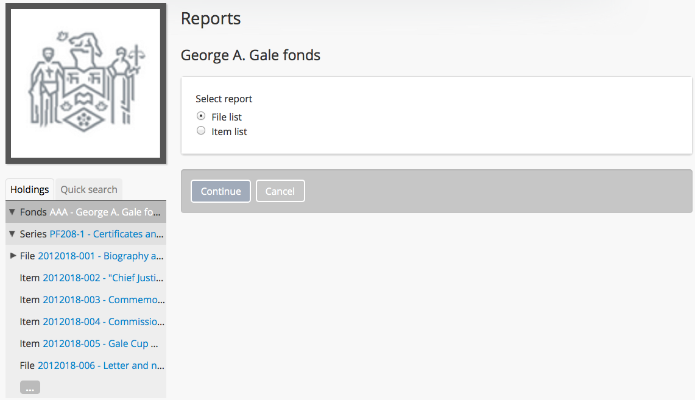
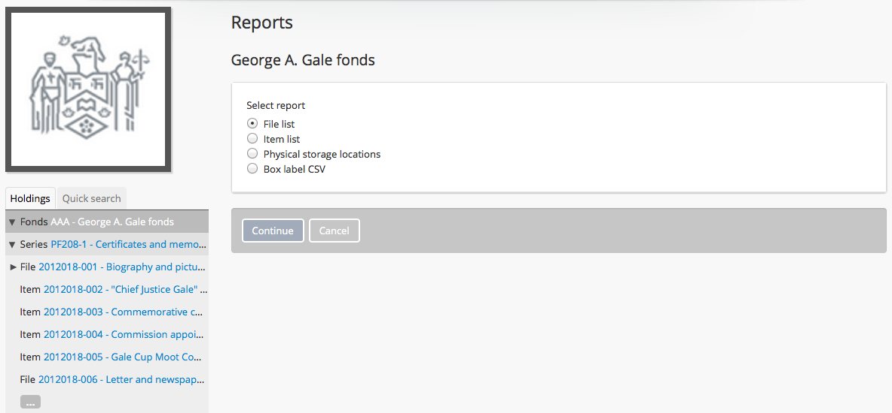
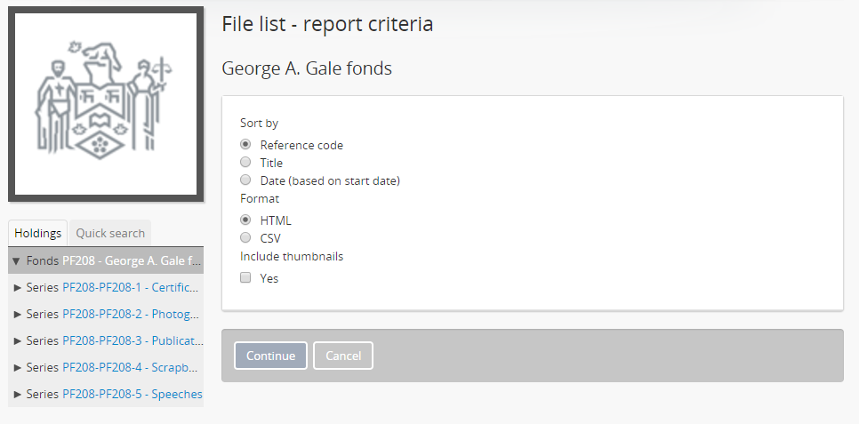
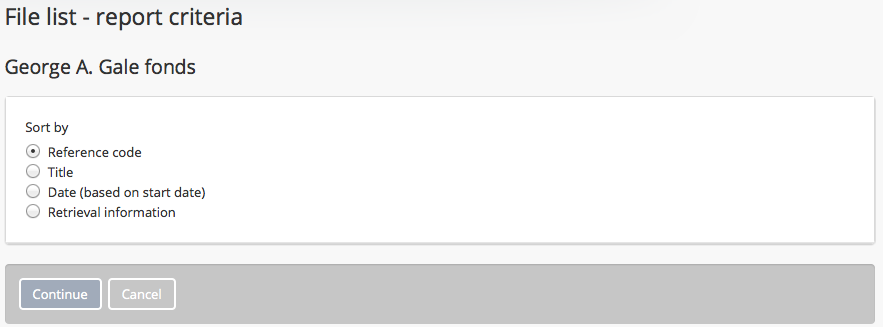
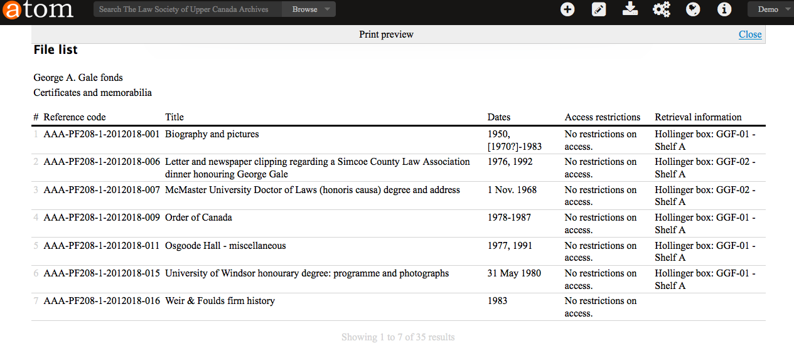

.. _file-item-reports:

=======================================
File and item list reports and printing
=======================================

.. |report| image:: images/reportslink.png
   :height: 18

.. |gears| image:: images/gears.png
   :height: 17
   :width: 17

AtoM offers users the ability to generate lists of files and items associated
with an :term:`archival unit`. Both public users and logged-in users have access
to these reports, and can generate new ones on demand.

Reports can be generated in either CSV format, or as HTML - in both cases,
files are available to users for download. The HTML files can also be opened
in a web browser and used for printing.

Report generation is managed by AtoM's job scheduler, so it is performed
asynchronously in the background. To work, a system administrator must have
installed and configured all job scheduler requirements - for more
information, see: :ref:`maintenance-asynchronous-jobs`.

Once generated, reports are saved in a ``reports`` subdirectory of the
``downloads`` directory, until new reports are generated to replace them.

An :term:`administrator` can also determine whether or not reports should
include Retrieval information - that is, any :term:`physical storage`
information associated with the file or item, such as container name, type,
and location. For more information on configuring this setting, see:
:ref:`reports-public-setting`.

.. SEEALSO::

   For more information on linking :term:`physical storage` information to an
   :term:`archival description`, see:

   * :ref:`physical-storage`

The following will outline how to generate file and item-level reports. Note
that for an authenticated (i.e. logged in) :term:`administrator`, there are
other report options (for physical locations and box label CSV creation). For
more information on these options, see: :ref:`create-physical-storage-report`.

.. SEEALSO::

   There are numerous other options for exploring the lower-level records of
   an :term:`archival unit` hierarchy in AtoM. Some of these need to be
   configured in advance by an Administrator, while others can be accessed
   immediately. To explore more of these options, see:

   * :ref:`browse-hierarchy`

Reports are generated based on where in an archival unit's hierarchy they are
triggered. For example, a file-list report generated from the
:term:`view page` of a Series-level :term:`archival description` will **only**
include files from that series - not from the entire :term:`archival unit`. If
there are **no** files beneath the selected series, then the option to
generate a file-level report will not be shown.

.. WARNING::

   AtoM's file and item list reports are hard-coded to use the "File" and
   "Item" level of description :term:`term` in the "Levels of description"
   :term:`taxonomy`. If you have edited or removed the "File" or "Item" term
   from the taxonomy, the report may not work!

**To generate a file or item report:**

1. Navigate to the :term:`parent record` description for which you wish to
   generate a report. For example, if you wish to see all the items in a
   particular series, then navigate to the :term:`view page` of that series -
   but if you wish to see an item-level report for all items in the top-level
   :term:`fonds`, then navigate to the view page of the fonds.

   You can navigate to the parent description either by
   :ref:`searching <search-atom>` or :ref:`browsing <browse>` - for more
   information on navigation in AtoM, see: :ref:`access-content`.

2. In the right-hand :term:`context menu`, in the "Explore" section, find
   the |report| Reports hyperlink, and click on it. AtoM will redirect you to
   the Reports page.
3. The Reports page is loaded for public users:

4. Alternatively, if you are logged-in as an :term:`administrator`, AtoM will
   load the page with additional report options: physical storage locations
   and box label :term:`CSV`. For more information on these options, see:

   * :ref:`create-physical-storage-report`

5. If there are existing reports that have already been generated, they will
   be listed above the report generation options. The type of report (file or
   item list), and the format of the report (:term:`CSV` or HTML) will be
   included. To download one of the existing reports, simply click on it.

.. image:: images/existing-reports.*
   :align: center
   :width: 80%
   :alt: An image of existing reports in the Reports area

6. If you prefer to generate a new report, ensure that the :term:`radio button`
   is set to your preferred report type - "File list" or "Item list." Click on
   the Continue button, and AtoM presents a report criteria page for
   the public user, which provides the following sort options: reference
   code, title and date (based on start date).

7. If you are logged-in, an additional sort option is presented - sort by
   Retrieval information (i.e. :term:`physical storage` information).

.. IMPORTANT::

   There is a setting in |gears| **Admin > Settings > Global** that determines
   whether or not Retrieval information - i.e. :term:`physical storage`
   container name, type, and location information - is included in the
   reports. For more information, see: :ref:`reports-public-setting`.

   If the report is set to generate as a public user (i.e. setting is set to
   "Yes", so that physical storage information is excluded), then sorting by
   Retrieval information won't do anything! Be aware of this as you configure
   your report options.

8. Choose your preference for sorting the list by clicking on the
   appropriate :term:`radio button`. This determines which column in the
   report will be used to order the contents of the list generated.

   Select your preferred format: available options are :term:`CSV` or HTML.
   The CSV option can be viewed as raw data in a text editor, or as structured
   data in a spreadsheet application such as LibreOffice Calc or Microsoft
   Excel. The HTML version can also be looked at in a text editor, or as a
   print layout by opening it with your web browser.

   Finally, if there are :term:`digital objects <digital object>` associated
   with the files or items, you can choose to include a :term:`thumbnail`
   column in the report produced - **note**: this option only works with the
   HTML report.

7. When you are finished configuring the report, click the Continue button in
   the :term:`button block` at the bottom of the page.

8. Once submitted, AtoM will reload the page and return you to the
   :term:`view page` for the related :term:`archival description`. A
   notification will appear at the top of the page, letting you know that
   report generation has started.

   .. image:: images/report-notifcation.*
      :align: center
      :width: 80%
      :alt: The notification shown after generating a report

   To check on the status and retrieve your report when it is ready, you can
   either click on the |report| Reports button in the right-hand
   :term:`context menu` again, or you can use the link to the reports page
   provided in the notification. When completed, your reports will appear in
   the "Existing reports" section of the Reports page, as shown in Step 5.

.. TIP::

   Logged in users can always check on the status of any job by navigating to
   the **Manage > Jobs** page. For more information, see: :ref:`manage-jobs`.

For HTML reports, clicking them will open them immediately in your web
browser. You can use the "Back" button to return to the reports page, and if
you wish to save a local copy, Right-click anywhere on the page and use the
"Save as" option in your browser to save a local copy.

For CSV reports, clicking them will trigger a download. You will need a local
application to view the file - we recommend a spreadsheet application such as
LibreOffice Calc.

The example below shows a item list report generated as HTML, with thumbnails,
with the :ref:`reports-public-setting` Admin setting set to "Yes" (so
retrieval information is excluded), and sorted by :term:`reference code`:

.. image:: images/file-report-preview.*
   :align: center
   :width: 80%
   :alt: Print preview to the public user.

Now here is the same item list report, but with the :ref:`reports-public-setting`
Admin setting set to "No" (so retrieval information is *included* this time),
and sorted by Retrieval information. Notice the additional column to the
right, called "Retrieval information," that includes :term:`physical storage`
information:

:ref:`Back to top <file-item-reports>`
