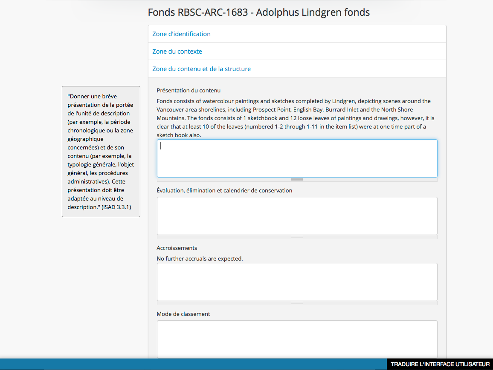

.. _translate-content:

=================
Translate Content
=================

.. |globe2| image:: images/globe.png
   :height: 18
   :width: 18

To translate the content of an :term:`archival description`,
:term:`authority record`, :term:`archival institution`, or :term:`term`, a user
with translation privileges will open the translate user interface dialog and
work within it.

1. Log in with an account that has translation privileges. For more
   information, see: :ref:`user-roles`, :ref:`manage-user-accounts`, and
   :ref:`edit-user-permissions`.
2. Start in your default language (e.g., English). Navigate to the content
   you want to translate into another language (e.g., archival description).
   For more information on navigation in AtoM, see: :ref:`access-content`.
3. You have two choices for doing the same thing:

   * click :term:`edit button` and then navigate to the |globe2|
     :ref:`language menu <language-menu>` in the :term:`header bar` and select
     the language you wish to translate your content into or,
   * navigate to the |globe2| :ref:`language menu <language-menu>` in the
     :term:`header bar` and then click the :term:`edit button`

4. In the above example, the language selected for translation is French and the
   user is translating content in an :term:`archival description`. Note the
   :term:`translation bar` is visible at the bottom of the page.
   Ignore it for now.
5. Begin translating the content of the archival description in
   :term:`edit mode` by selecting one of the :term:`information area` and
   typing into the data entry :term:`fields <field>`. Note that the content is
   shown in the source language above the data entry :term:`field`.

.. TIP::

   The tooltips (e.g., ISAD) will be shown in the new language because they
   have been translated as part of the AtoM application using
   `Transifex instructions <https://www.accesstomemory.org/community/translate/>`__.

6. Repeat for each field as required.
7. Click the save button in the :term:`button block`
8. AtoM returns the user to the :term:`view mode`. The translated fields will
   now appear in the new language of translation. Any content not yet
   translated will continue to appear in the source language.

:ref:`Back to top <translate-content>`
