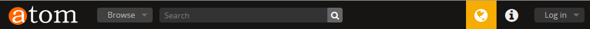
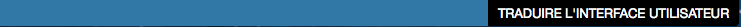
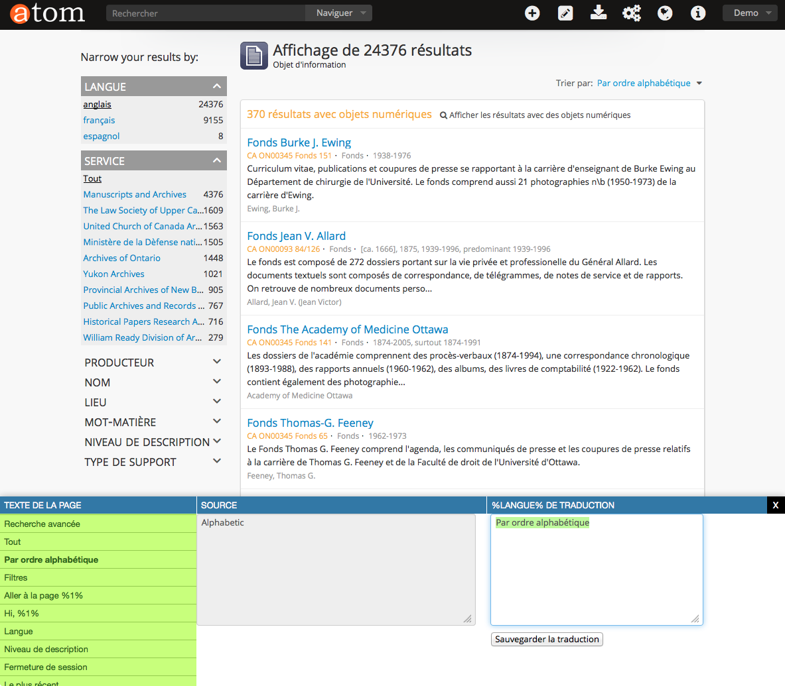

.._translate-interface:

-------------------
Translate Interface
-------------------

To translate the :term:`user interface` it is important to understand that
the :term:`user interface` is the set of elements that allow the user to
interact with the AtoM application. These elements includ the :term:`main
menu`, :term:`drop-down menu`, :term:`context menu`, :term:`title bar`,
:term:`column header`, :term:`button block`, :term:`field label`, and other
elements that are used to navigate AtoM or to search for, view, add, modify,
and delete the :term:`database content`.

1. Log in with an account that has translation privileges.
2. Start in your default language (e.g., English). Navigate to the language
   icon in the header bar and select the language you want to translate the
   :term:`user interface` into.

3. AtoM will reload the page with the :term:`translation bar` at the bottom
   of the page. This example shows the :term:`translation bar` in French.

5. Click on the Translate User Interface button in the :term:`translation bar`
   to open the :term:`translation panel` in the lower frame of the page.

6. The :term:`translation panel` is organized into three columns:
*  First column: Page text lists all the elements that are translated, or
   available fortranslation.

* Second column: Source is the name of the element in the source language. In
  this example it is shown in English.

* Third Column: Translation shows the translated element, or it is empty and
  waiting for the user to type a translation into it.

7. Select an element for translation from the first column.
8. Provide the translation for the lement in the third column.
9. Click on the Save Translation button when you are finished. AtoM will
   close the :term:`translation panel`. All :term:`user interface` elements
   on the page should now appear as translated.

..NOTE:
  Some element names include a number enclosed by percent sign (e.g., %1%).
  this is a template token indicating a variable whose value is dynamically
  generated by the context in which the termplate is displayed. Tokens are
  represented by a number enclosed in percent signs. Tokens must be included
  in the translation, but because different languages have different grammar
  rules, translators ned to be aware of the type of information being handled
  in any given variable in any given context.

=============  ===================   ========================================
Element name   Variable              Context
=============  ===================   ========================================
%1% profile    User's account name   Return user's account name in user menu
                                     and clicked by the user to edit the user
                                     profile, appears on all pages
List all %1%   Entity type           Return type of entity viewed on current
                                     page and appears as part of text on the
                                     list all button on edit pages
Edit %1%       Entity type           Return type of entity viewed on current
                                     page and appears as part of page title
                                     on edit pages
List %1%       Entity type           Return type of entity viewed on current
                                     page and appears as part of the page
                                     title on list pages
View %1%       Entity type           Return type of entity viewed on current
                                     page and appears as part of the page
                                     title on view pages

:ref:`Back to top <translate-interface>`
